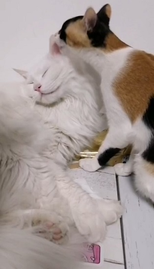
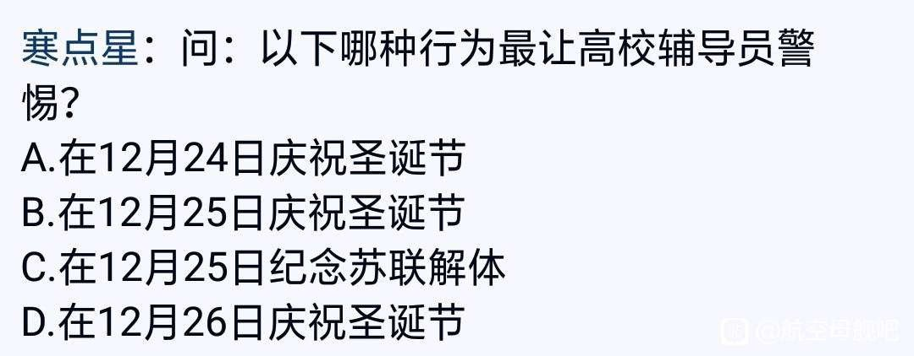
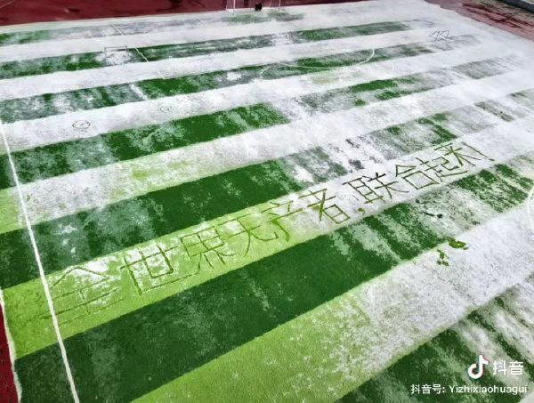

# 2020 生生不息  
  
下笔今年的总结的时候，我有个感觉就是今年相比起世界的变化，个人的事件看起来不值一提  
用流行语来说就是“今年啥都没干，光忙着见证历史了”  
2020应该会是一个将来被记录在历史教科书中的年份，而且笔墨应该不止于同样暴发SARS病毒的2003年  
新冠疫情的突然出现改变了很多事，叠加上经济周期，也许我们要再过好多年才能完整地给2020一个定义  
  
所以我今年都经历了什么不值一提的事件呢  
去掉搬砖的时间，年初沉迷游戏，后来做了一两个也不算太成功的项目，又自学了一点游戏引擎，也没做出成品  
生活上，工作地回到了南方，然后也算是结了一件人生大事，其它也没啥了  
噢，如果猫也算是家庭成员的话，旺财有了一个伴，叫布丁，出生一个月大概是只半放养的野猫崽子  
到家里养了半年还是挺野的，最近已经开始给旺财舔毛，犹如家里的大姐大  

  
  
如前文所叙，今年的主题就不是我个人的主题了，而是这个世界的变化  
看上去可能有些反常，毕竟今年的主题应该是死亡或者隔离  
我的想法是，矫情一点引用下刺猬乐队的歌词：一代人终将老去，但总有人正年轻  
死去的不是我，年轻的也不是我，但总有人这样  
现在给2020下定义还太早了，未来教科书上可能会将其定义成某个标志性的节点  
至于是什么的标志性节点，我不知道，是所谓的“大变局”？还是“大争之世”？  
或者冷战结束以来建立的国际秩序面临着“礼崩乐坏”？  
总有人正年轻，他们会知道的  
  
好的今年没有像去年那样罗嗦，然后由于众所周知的原因下面一段要放到github上了  
  
---  
  
今年突然发觉似乎过去对二代的负面声音已经渐渐被对资本家的批判声掩盖过去了  
说实话挺惊讶的，吊路灯表情包都能整出来，这整个网络舆论风向是怎么突然变了  
结果前几天一篇《他接过了他的旗，他们拿起了他的书》从庙堂角度给出了答案，原来是上意啊  
不过，既然是上意的话，为什么两年前那些同学们可都消失了呢，难道渔村独走有那么厉害么  
  
  
  
这个月还见识到了一封遗书，“资本家，白匪军，官僚，保守主义的老棺材瓤子以及它们的走狗们”  
看这用语还以为是个身殉理想的达瓦里希，却被评论说这是知乎键政看魔怔了  
  
话说回来20世纪的左翼青年的道路似乎是明确的，早几年是井冈山，晚几年去延安  
到了21世纪，或者说过了1989年圣诞节之后，整个世界就变了，如果要走回20世纪的老路，寻求武器的批判的话  
似乎也只能去印度或者菲律宾山沟里打游击了  
要么就是整天在网上刷这种梗图  
  
  
  
实际上每天又联合了几个无产阶级呢？甚至问出上面这个问句之后，还有点搞传销的感觉  
我在想21世纪的左翼青年们是否也在总结提炼着一份行动指南  
毕竟时代不同了，不能一切照抄20世纪的老路  
那么所谓的新路线是啥呢  
今年的我并不能回答这个问题，我可能需要一点时间去学习和经历，所谓没有调查就没有发言权嘛  
  
其实今年有很多延伸出去的想法都没有付诸行动  
举国抗疫的时候我除了遵守防疫守则之外，有发挥什么额外的作用吗  
11月某公寓平台暴雷的时候，我有对什么无产阶级租房人伸出援手吗  
本科毕业之后我就逐渐和世界疏远了，在芬兰的两年更强化了我精神芬兰人的一面  
但这基本上就是固步自封，我会失去进步的空间，想想还是挺恐怖的  
  
不过可能还是得向20世纪的前辈们学习一下他们的精神  
虽然我们都知道这条路的终点很可能是失去自由和死亡  
对他们来说死亡的可能性更高一些，可他们还是义无反顾的去了  
而我的态度相对就消极很多了，似乎是慢性自杀一般  
我需要找回十年前那种勇气和毅力……可是十年前的我还不知道我要面对的是什么呢  
  
---  
  
总而言之今年虽然没有完成什么令人得意的成果    
但是比起2019年给个人生活打出了不合格评价，今年算是勉强合格了  
下一年我还要面临工作对自由时间更多的挤占，需要解决的问题也还很多  
希望明年可以给出比合格更好的评价吧，如果还有明年的话  
