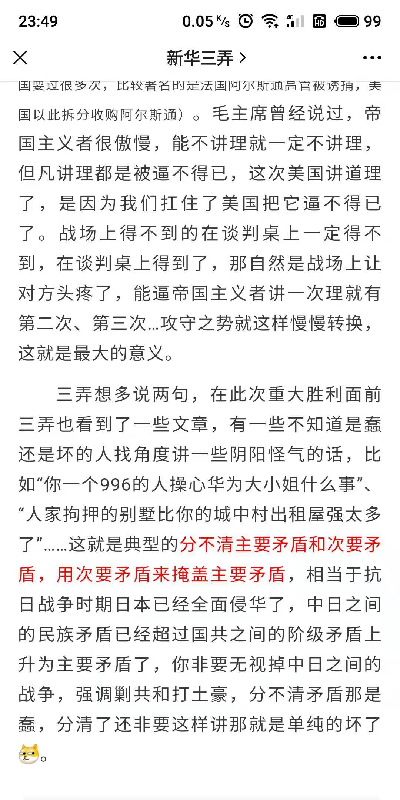
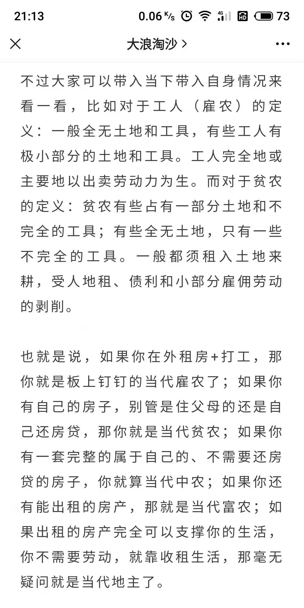

# 人间观察笔记 2021.09 | 主次矛盾

9月份看到一则新闻，我用混迹煎蛋几年练就的本能反应了下如何反向解读，然后这篇文章居然自己就已经提出来了，而且直接一个评论：没有分清主次矛盾，好家伙，直接预判了我的预判。

这个类比就有点意思了，也就是说现在美国为首的西方国家集团与我国的斗争已经可以类比成日军侵华了，人民日益增长的美好生活需要和不平衡不充分的发展之间的矛盾也需要退居二线成为次要矛盾，现在还是要团结一切可以团结的阶级来应对国际矛盾。然后这个月还看到这么一篇文章：

好的我的雇农身份实锤了，我又想起了一段网上的论调，这里自行做了一个表情包：

不过我这图也就是个梗，好事只是说当年的贫富差距小，但是阶级差距还是在的，而且还有其他的部分不太清楚，只当个梗图看就好。

把所有资本家挂上路灯，共产主义就实现了吗？首先奴隶社会和封建社会的人会反对，其次那个时代的人也会反对。忘了在哪篇文章里看到这么一句话，不能把复杂的阶级斗争看的太简单。我感觉现在的情况也是，不能整天口嗨买绳子修路灯，实质性的斗争工作也是很复杂的。最近看到一条走法律路线的尝试，一份[骑手谜云法律报告](https://mp.weixin.qq.com/s/FIdsv8K-tESolDNLlXGMog)，让社会大众发现平台是怎么在骑手不知情的情况下将他们变成个体工商户从而规避了雇佣劳动关系责任的。虽然不能说一石惊起千层浪，但也获得了一些关注度，甚至引出了一些央媒的转发评论。这个路线能持续多久还有待观察，希望做这些事的人不要像那些融入工人的学生一样消失了。

9月底10月初终于凑了一个长假到北疆自驾游了一圈，前半段还算顺利，到边疆喀纳斯看了一圈，骑了一趟马，结果腿没事，腰快断了。到了10月3号中午从禾木回克拉玛依的时候，惊闻伊犁霍尔果斯新增了2例无症状感染者，但我们的行程没有途径伊犁，还以为没啥问题。从山路里开出来，到魔鬼城附近的出口的时候就开始麻烦了，高速出口封闭，加油站近在咫尺但是不让前往，多走了50公里用最后一格油开到服务区的加油站。加完油后下一个出口又有麻烦，我们请的司机师傅是伊宁人，有14天伊犁州旅居史，在出口检查被拦下了，被告知要么往回开返回伊犁隔离，要么就地在克拉玛依隔离。这个突增的变数让我们10月4号的返程计划突然不确定了起来。好在我们两辆车里有3个司机，在高速服务区商量对策的时候，所有密接者已经定位的新闻也出了。因此我们的策略是两个司机开两台车进克拉玛依还车，伊宁师傅下车去隔离，于是在出口堵了一两个小时之后我们几个游客成功进城了，师傅因为有伊犁行程被隔离了，应该是免费的吧……4号早上坐城轨到乌鲁木齐，本来时间安排应该是够的，但是到站后，检疫人员留了我们40多分钟检查行程和证件，而且查完一个车厢还不能放人。不过估计的确有管进不管出的政策，凡是要换成或者有机票的旅客都可以提前下车，也就这样我们成功赶上了下午4点起飞的航班。新疆7日游有惊无险地结束了。

在高速出口被防疫人员劝返的时候，小哥拿着司机师傅的身份证还说了句，“你也是新疆人，你还不知道政策吗”。站在管理者角度想想，在全部高速出口设置检查点，人力资源可能安排不过来，所以需要封闭出口，出现破口要付出的资源更大，统一隔离的操作也是小心驶得万年船的做法。这次在伊犁境内的旅客是真的为疫情防控工作付出了很大代价了，我在想如果不是伊犁，是我们前几天路过的城市，那……我十一过后还得让人把工作电脑寄到新疆隔离点去不然我直接就旷工了😂近距离体验了一下不惜一切代价清零中的代价，非常感谢有这些人付出的代价，让全国其他人民可以生活在病毒清零的环境中。
