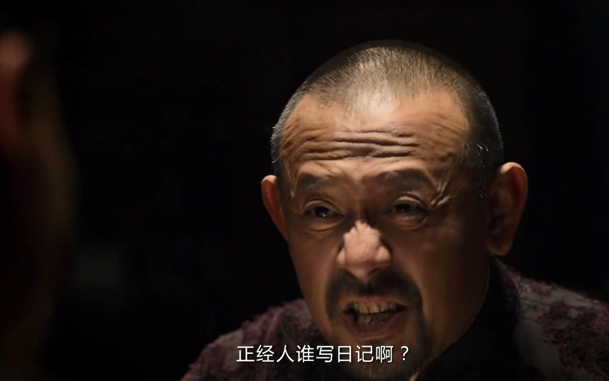

# 人间观察笔记 2021.10 | 飞云鸳鸯

上个月刚刚做了个自嘲梗图说文革回来了还有这种好事，这个月就看到了一篇2008年的文章[《刘鹤：甚至到了今天，还有人怀念文革带来的平均主义贫困和那时享有的精神特权》](https://mp.weixin.qq.com/s/hD0bupS5yaVv6j0hk1LOTg)

真的牛逼，两枪全中，既怀念平均又怀念精神，说的就是我，然而文章论点也很有道理，饿着肚子的时候，可能大部分人是不会去想解放全人类的。2008年的文章，说的事情放到现在依然不过时。可是为什么还会有人怀念呢？这篇文章并没有回答这方面问题，但每一个“遭受过社会毒打”的人应该或多或少有答案。

在现在这种网络环境下处理这种矛盾其实很麻烦，比如我很喜欢的一个视频博主括弧笑（不知道他为啥改名字了，现在叫“蘑菇的刮弧笑”）这人游戏视频的节目效果一流不说，夹带的政治私货可是左右均沾，就跟索尔仁尼琴一样，在苏联骂苏联，到美国骂美国，导致两边人都不待见他。尤其是现在的网络环境极端程度比当年更加恐怖，魔怔的网民恨不得一见面就给对方打上敌对标记，然后号召自己人群起攻之，我们这种怀念文革的人都感到恐怖.jpg。完了我甚至都有点害怕未来有没有人挖出这篇东西来把我鞭尸，我也有点好奇像括弧笑这种算是什么状态，是美分吧但又会唧唧歪歪苏联问题，是五毛吧那又各种批判资本主义，看样子真的物以类聚了，我也是个两边都不待见的人，而且我战斗力还没有人家括弧笑那么强。所以其实最好的方式就是躲起来。现在也不需要每天喊价值观了，这也给了我一点不怀念文革的理由。也希望我这个小Github记录点不要被人翻出来示众吧，毕竟你姜大爷说过：

这个月又有几件戏子家事天下知的情况，其中一件有文章认为是一步大棋：

> 于是孙权背盟，于是蜀汉不得不放出来一个音乐家的新闻转移视听。 ——[《欧洲的背刺》](https://mp.weixin.qq.com/s/HCf7T2McLSPgFADpSQdjUQ)

其实看消息源好像也不无道理，比起等手机落在女朋友手中并且在网上曝光小三这种偶然事件，主动出手好像更加可控一些。然而转移视听的标的是否真的是国际事件也存疑，毕竟国内也有事情，但这方面我就不延伸了，怀着鲁迅的恶意去揣测也没啥好说的。反倒是嫖娼这件事本身值得一聊。这个月还有一则新闻，[《男子接小孩放学嫖娼被抓，现场惊呆民警 “还有闲心找两个！》](https://www.163.com/dy/article/GN96SBAJ0552907Q.html)

这个《XX路上嫖娼》的标题唤醒了我的一些记忆，2015年，引起我们学校众多校友义愤填膺的同校学长意外身亡事件，当年在微信中传播的质疑文章中有个论点我还记得，就是怎么一个正常人会在给亲人的接机路上，还要顺路来一发。现在想想那时还是太年轻了，恶意怀揣的还不够。又过了几年我还在校友群中听闻现在北京执法人员抓到本校的学生都有所顾虑了，可能是担心再重演一遍意外身亡事件吧，啊这……当然我不是鼓励校友以身试法啊，恶意用来推测人就好别自己实践

还是嫖娼这个话题，上个月在某个已经被关闭的键政圈子里看到两张截图，一张是十几年前某个官员嫖娼被抓的新闻，另一张是近几年的新闻稿，同一个名字但头衔已经是某集团的高管。我没查到第一张图的信源，毕竟十几年前留下的信息真的不多，所以就不放图了。这俩事一对比就能发现想做同样的事情还真得看下爹是谁，普通人可能就是十年道行一朝丧，可有些人十年后还能当集团高管。噢写到高管又想起来，睡14岁以下幼女的平均价格是5万人民币（2019年），我感觉我省吃俭用攒个两年也能来一发，但是这个价格只有上市公司董事长这种级别才能享受，我不是，我爹也不是，估计只剩黑恶势力一条路了，什么？还有嫖宿幼女是吗，恶意充满了对不对，还是新闻看得少啊。

好的这个月又写了太多看起来像美分的故事，赶紧补点五毛文字中和一下，我想想啊，上个月还口头感谢了一下为了疫情控制付出了代价的人们，这个月就出了一篇瑞丽的求助文，的确是很惨，但是抗疫+边防这种专业的事情我们普通人也没办法直接上手帮忙，我就非必要不出门+按要求做核酸检测，不添麻烦就是最大的帮忙了吧。别的真没啥要写的了，毕竟我不是专业的自干五，上B站搜下新潮沉思录或者其他自干五关键词，他们的作品可能比义务教育甚至大学思政课来的更有力量一些。

噢上面提到了看爹的问题，突然想到可以简单批判一下所谓的“社会达尔文主义”，实在是很不达尔文，达尔文看到可以气死的那种，但凡生物课有认真学习都能发现所谓“适者生存”是用来描述生物性状可以适应其当前环境，因此决定这些性状的基因可以通过繁殖保存下来，当环境改变，上一批适应的基因会因生物死亡而被淘汰，运气能适应新环境的突变会成为新的适者。但返回到人类这边，现代人类社会是全凭借基因好坏来决定人能否生存繁殖的吗？我感觉真正的社会达尔文主义者的观点应该恰好和现在的论调相反，他们应当鼓吹最大化发挥基因突变的效力，所有新生儿统一抚养，财产不能继承，全靠个人的能力去争取社会地位，怎么样，是不是比现在打击补课、征收房产税啥的激进百倍。等等，结果搞半天我党才是真正的社会达尔文主义实践者，绝了绝了（手动一个狗头保命）所以说现在那些社会达尔文主义的支持者不是本身屁股歪了（或者人家屁股本来就跟我们不是一个阶级）就是脑子不清楚就跟着摇旗呐喊去了。啊，由此可见义务教育是有多重要，学9年能通晓天文地理，了解古今中外，我直接一个吹爆（这个月的五毛文字达标了😂
