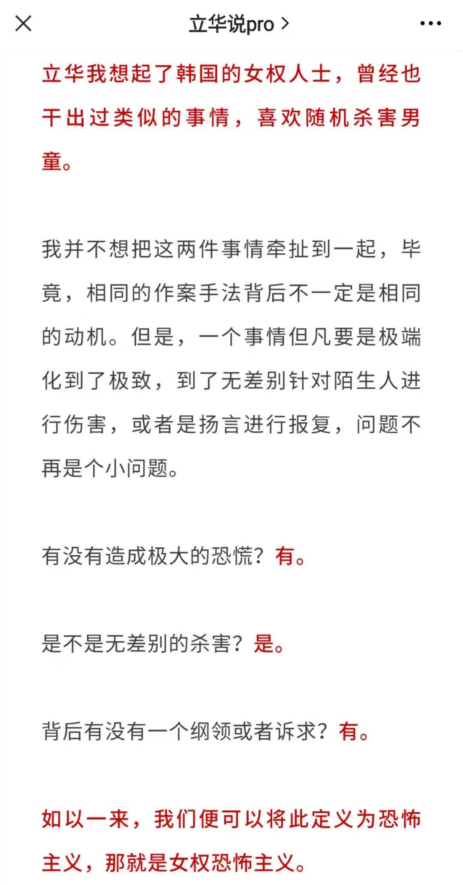

# 人间观察笔记 2021.11 | 人间日常

> ——如何称呼一个自我认知很清楚的中产阶级？
> ——无产阶级

这个月真的过的好快，可能是我又开始沉迷游戏了吧（囧，沉迷游戏真的太麻烦了，上瘾好麻烦

回忆一下这个月有印象的事情，罗马人看不得牛马，有人在上海养过性奴，有人实践了女权恐怖主义。关于恐怖主义我之前提到过一次，但是没有特别清楚的定义，昨天在叶主任的文章里看到了：

虽然我之前用过家里发现一只蟑螂的比喻，但是这里我想到的是另外的言论，来自台湾财经节目主持人/制作人/新党政治人物杨世光，他在媒体行业的经验是：新闻就是不经常发生的事情，才会播出来。也就是说一旦新闻不报了，才是真正恐怖的事情，因为这种事情已经是平常了

不要想多，我说的是新冠病毒大流行这件事逐步在西方媒体中逐步淡出公众视野的事情。也就是说确诊+死人已经不是不经常发生的事情了。当然月底爆出来的一个新变种病毒好像更像是一次故意的操作（神仙打架？）后续发展还得继续关注下……

转眼间12月份，2021年的最后30天也到了，又要准备今年的年终总结了……我感觉今年的主题应该就是时间白驹过隙的感概，我这个月度总结记下来感觉也没留住多少……还是跟学生时期不一样了……
