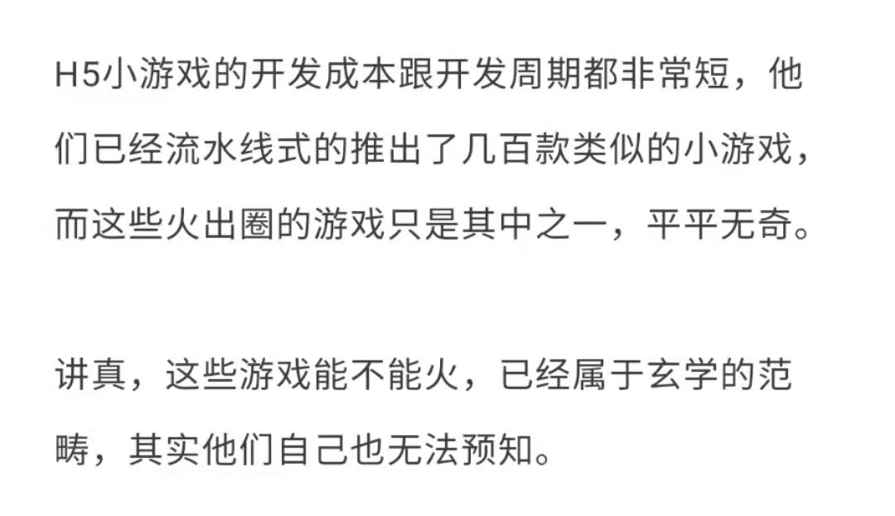

# 人间观察笔记 2022.01 | 开头一步

去年隔壁项目组的大佬做了一次团队内分享，讲的正好是cocos creator 2.x，不过由于游戏跟我们的业务不相关，大佬就高屋建瓴地讲了一下游戏编辑器的设计思想（毕竟主业是做低代码，概念上可以借鉴）。当时我已经对游戏开发产生了兴趣，正好有这么一个讲座非常对我胃口，分享结束后也提了几个问题，最后大佬总结了一下说，如果真的感兴趣，就从做一个打地鼠开始吧

---

~~于是我就开始着手做一个打地鼠~~

实际情况比较复杂，也有一些机缘巧合，我最终没有做打地鼠，而是和朋友合作做了下面这个微信小游戏：

> 阿三顶行李 小游戏二维码.jpg

好的我知道你们点开后大概的反应了，这啥玩意，怎么不动，怎么结束了，怎么就这一点，火车在哪里，为什么要用头顶这个东西，为什么动画那么生硬，游戏好单调

以上问题我都承认，我也不会说啊这好歹是我们努力半年（从创意提出到现在好像真的差不多半年了）的结果。做游戏真的难，就算有了编程语言基础、甚至游戏引擎，真的做出一个完整的游戏还是需要耗费人力物力的，我们只是稍微做了一个小蚂蚁级别的游戏（还不敢说麻雀虽小五脏俱全）就已经感受到了做游戏巨大的投入量

不过总体而言这个游戏的制作周期还是太长了，虽然团队成员都是用空闲时间在做，但这个速度我也不是很满意，回想一下立项后第一个策划DEMO毙案就花了一周，这个游戏的DEMO又花了两周多，再之后因为速度计算问题，删掉了原来的碰撞实现改造成物理引擎，又花了不少时间。手感优化结束后进入游戏整体开发，却被简单的暂停后开始还要倒数3秒难住了，因为这相当于在游戏暂停之外增加了内层的暂停（事件循环不能停，停了就没有倒计时，但是事件循环开始后物理引擎等就开始作用了）想了个方法绕开才勉强实现了。再之后拿到音效素材，静音的逻辑也走了弯路（可能是我没看懂文档），拿到美术素材就更麻烦了，真的开始插入帧动画的时候才发现前期沟通没做好，导致人物特殊动作无法实现。跑动和行李弹跳还是勉强用图片帧动画搞出来的，唯一值得一提的是动画播放速率和操控杆的对应关系一早就计划好了，虽然调用API问题又搞了一天。最后的界面逻辑全是体力活，终于搞完上线后，加广告代码又搞了一阵子，上线测试后再次修改又花了一阵子，最后就是你们看到的这个样子了……可能我对工具的使用再熟练一点，可以再加快50%？

---

所以我终于迈出了第一步做出了一个打地鼠级别的小型游戏，下一步肯定也是要继续迈的，但下一步应该不会继续停留在小游戏上了，理由有两个：一是我的兴趣也不在这种无剧情的游戏（毕竟小学六年级开始就是GTA的剧情玩家，IV > V 妥妥的）；二是这种小游戏要实现盈利说实话相对略难，这里放一篇引用文章

要实现解决我经济问题的爆款对运气和时间要求略高了，所以我也没办法寄希望于这个。我更希望做的是剧情游戏，不过吧，做小游戏也是可以练习技术的，现在学习了2D引擎，要不也试试看3D引擎（啊，一入建模深似海）

游戏这个东西吧，感觉就是我目前积累下来的视频+编程爱好的合体，而且还很难，失败的概率极大，我也不知道能搞多久，不过先继续试试看吧。

【以下是Github特供文字】

说起视频和编程这俩大兴趣，本科毕业后我就淡出了视频行业，然后2016年视频的风口就起来了，如果当时继续坚持说不定现在也是个小有成就的up主？但我想象不出来这种场景，因为那时我对视频逐渐失去兴趣是因为感觉想做的东西很难播出来，但又不愿意靠接单为生，干脆就不做了。随即发现了我对动手开发软件还是有兴趣的，于是用了两年成功转行程序员，虽然是最低级的前端程序员（不算自黑，但是前端/Web开发的确是编程行业中入门门槛最低的，脏活累活都让浏览器和框架干了）。视频和编程这两大兴趣一结合看起来就是做游戏了，既可以写剧本又可以开发交互构建一个世界，十分适合我，但也很难。还记得高中在OI训练班里第一次体验到某个算法死活学不进去，感觉就是摸到了自身智商的天花板。做游戏的话这种情况可能会经常出现，我得做好心理准备

至于为什么想做游戏，可能要追溯到2018年我准备毕业的时光。当时论文快收尾了，闲下来的时光重新体验了一把初中断断续续玩过的GTA4三部曲。在感叹神作之余，自己也开始构思一部和GTA4故事内核类似的作品，然后当时一想发现好像编剧+编程能力好像可以搞游戏了。后来入行当程序员一两年后，感觉编程基础已经足够，可以开始从小游戏开始练练手。当然中途也因为拖延浪费了不少时间。到了去年年中一个好朋友联系上我打算拉个小团队做游戏，我才开始认真对待了起来。实干了半年，虽然成果没有太满意，但至少全流程也跑下来了，合作伙伴都是游戏行业内的从业人员，跟他们合作也学到了不少东西，感觉可以继续期待之后的合作。

至于我到底想做什么东西，这里先按下不表，扯另一件事，就是我发现我有点魔怔（也不知道这个词用的对不对），可能是煎蛋上阴阳怪气的恶政隐看得多，也可能是家族内的耳濡目染，当我面对时事新闻的时候，会下意识地冒出各种恶政隐或者打拳的文案。当然我再多想一点也能知道这些文案背后的观点要怎么反驳或者站不住脚的地方在哪里，以及我也不会真的抄起键盘就上评论区泼粪（笑死，我连微博都不用，煎蛋的话当然也要保护我方站长不被约谈关站）。但这就是所谓好人要比坏人更坏才能安全地当好人吗？而且我感觉我这种魔怔应该也在每个月的笔记里会不经意地流露出来，这里又不能挂狗头保命，只能趁现在正好想到了，先自表一下清白。

【Github特供结束】

好了，最后应个景，祝大家虎年（省略300字祝福语）

