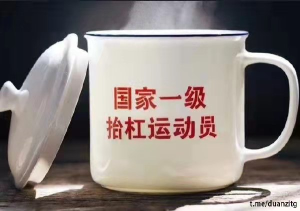
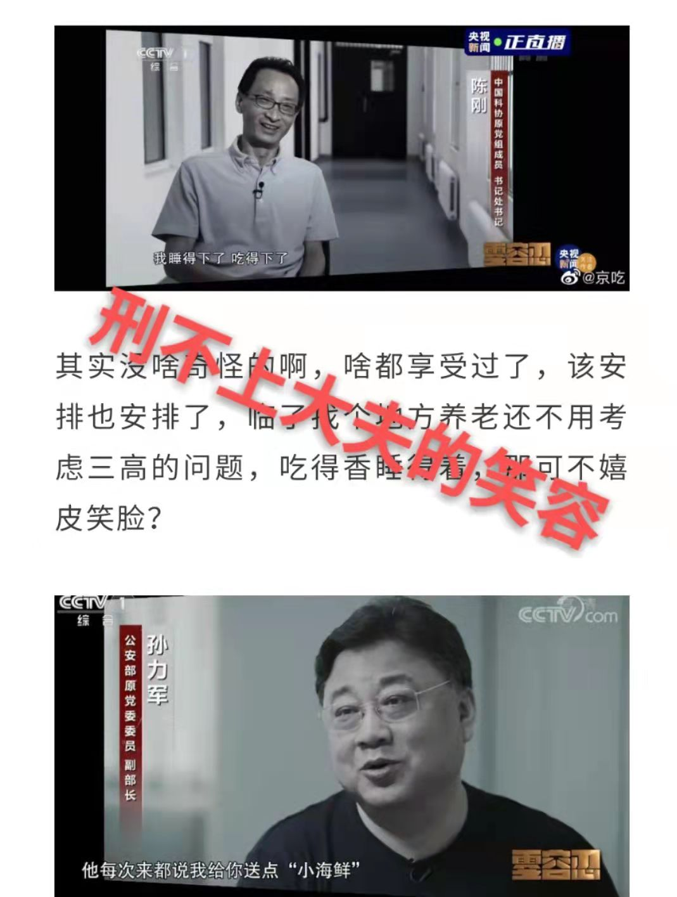
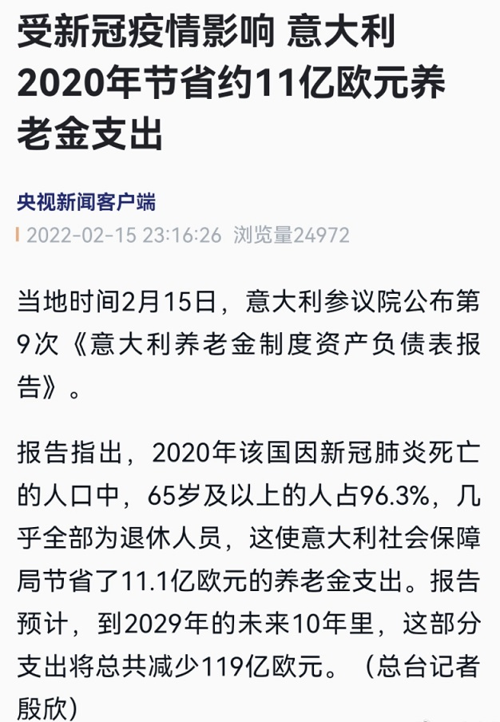

# 人间观察笔记 2022.02 | 抬杠工程师

> 中国呢？也醒觉了（除开政客官僚，军阀）。九年假共和大战乱的经验，迫人不得不醒觉，知道全国的总建设在一个期内完全无望，最好办法，是索性不谋总建设，索性分裂去谋各省的分建设，实行“各省人民自决主义”’二十二行省，三特区，两藩地，合共二十七个地方，最好分为二十七国。
> —— 毛泽东
> 
> 《湖南建设问题的根本问题一一湖南共和国》 

上篇我提到了我好像有一种下意识反应，可以想出各种各样不和谐的评论，但是这些言论并不是我认同的观点。这个月的笔记展开一下，给大家自证一下清白，随便表演一两条恶政隐

> 穷人跳水，富人跳台

本月初的热点自然是北京东奥了，在各路力量的加持下某女运动员获得的媒体聚焦量更是远超其他运动员。这个时候可以用什么角度发动攻击呢，没错从挑动贫富对立的角度就可以发出这一条评论，拿同样是在奥运会一战成名的某跳水运动员的家庭背景做对比，展现巨大的贫富差距，从而刺激到观看的人。当然同期发生的还有另一个全社会关注的热点就是8孩母亲事件了。拿这两件事对比的言论其实更加犀利

> 你和某运动员的距离还差十亿次投胎，你和某女性的距离只差一记闷棍

好家伙这个言论的确将阶级对立和性别/安全问题全都囊括了，在恶政隐方面的确技高一筹

可是我刚刚也提到了我要自证清白，容我展开一下为什么上来就亮出这些引战氛围浓厚的言论。

这个月认真思考了一下，可能是从小耳濡目染形成的本能，我好像有把话说得很难听的能力，再加上早年经历了煎蛋里蛋友争相恶政隐的时期，我好像具有了一些抬杠的能力。而且我要承认抬杠本身（或者说，想到其他人看了难受生气这件事上）可以给我带来一些正向激励（啊，心理变态可能就是这样的？）但是另一面我也相对比较清醒，我不会去追求这种正向激励，也就是说我除了在这里自证清白之外，是不会操起键盘在各种网络平台里留言的。而且现在我的思考可能除了抬杠本身之外，还会进一步思考如何反抬杠——比如挑动阶级对立的言论，可以用什么方案去驳斥（洗地），然后要怎么反洗地。有点左右互搏、网络攻防内味了哈。所以我感觉我更像是一个……抬杠工程师。在网上浏览对台言论的时候，除了看发言本身，还要看发言背后采取的是什么策略，以及这个策略可以用什么样的方式去反制。可能大部分人不太能理解吧，我只能说人的爱好千奇百怪，有些人喜欢看喜剧，有些人喜欢看动作，有些人喜欢恐怖（一般人难以理解吧？是不是应该批判一番？），有些人喜欢血浆纷飞的B级片（暴力倾向，直接关起来？），那我只是喜欢看网络上的人吵架，是不是看起来平和很多？

不过网络中的骂战除了对骂本身，其实也掺进去了一些政治力量，这是我们不得不注意的。你们是不是觉得我要开始说境外势力渗透什么的，凡是女权就是境外势力什么的，警惕拜登打马恩牌之类的。事实上舆论攻势的确也是当代国家间斗争的一种形式，不能否认这股力量的存在。但是你说我支持“凡是女权就是境外势力”那就不对了。再想深一点，会不会那些号召“女权就是境外势力”的团体，本身就是境外势力呢？会不会那些挑动对立的人本身就有工资呢？（卧槽，这么说我好像错过了几个亿，不过再想想1450的打工人能拿多少工资啊，有22K吗）【注：1450，指台湾“农委会”于2019年拨款1450万新台币预算雇佣4名网络小编，被台湾民众质疑是用公款养网军；22K，指本人在台湾交换时，接触到的在台大学毕业生期望就业月工资】

好的说了那么多我应该也自证了自己不是一个反贼，但我的真实想法又是啥呢，难道是自居知乎理中客不带任何立场绝对中立吗？不是。我目前也是有立场的，毕竟跟随马克思主义开始就决定了立场是一定存在的。先引用一句众所周知的名篇：

> 谁是我们的敌人？谁是我们的朋友？

当然这句话提出来的时候已经解决了一个问题，“我们是谁”。回到上一段的问题，我们，我，我是谁？

我是屁民

第一次了解到这个词好像是2010年，高二，英语课，不知道英语老师哪里整的活，给我们的趣味阅读材料，是当年的十大热词对应的中式英语翻译，其中就有一个屁民/蚁民 —— shitizen 。现在想想要是这件事被挂上网，我们的英语老师估计会惹上不小的风波，十年前的老师真敢搞事。当然后来随着阅历增长我意识到了，我们有着一个更有力量的名字，无产阶级。

突然一下气氛变了，是不是一瞬间闪过了红旗遍地口号震天的哪些想象，我是不是马上就要高喊一个路灯上挂一个资本家了，阶级对立了，境外势力打马恩牌了，取关举报了，啊这

犹记得前一段时间有一篇“财富自由量表”，按各种各样的行为给划分了自由的等级，从最低等的可乐自由到最高等的国籍自由。在我看来，这些等级中超过一定等级之后可能会参入一些其他的东西，比如，众所周知的某公司高管在事发前实现了嫖宿幼女自由，有的明星在2021年还没有嫖娼自由，上海的某些人有圈养性奴自由，农村里的某些爷们有生育自由。从这一点上铺开，我们会发现，这些藏在暗处的事情还没有暴露之前，有多少人是凌驾在其他人的生命之上的。还有一些新闻，反推一下：吃空饷自由，性侵女学生自由，权色交易自由……当然还有今年年初央视推出的大型公务员招考宣传片：

好的说那么多我好像已经是可以被打上恨国党标签了，但是我又要自证清白了，常说我国是“生的计划死的随机”，但给大家看下西方世界的“生的随机死的计划”：

再然后就是2月底俄罗斯大兵开进乌克兰，昨天刚刚看到新闻说乌克兰已经开始给平民提供武器了，这是一个什么概念，政府推平民上战场当肉盾？想当土匪的人是不是可以趁机解放天性劫掠其他平民？

写到这里我的立场是不是又有点回到五毛上面去了，而且如果有同行看到这里可能也能意识到这是一个“比烂”的手法，给观众植入“西方世界也没有好到哪里去”的观念，从而突显现状的美好。不过这倒不是我的本意，回到最初的那句话，我们是无产阶级，我们受到不同程度的压迫，可能是特权阶级对我们共同财产的鲸吞、可能是来自资本家对剩余价值的剥削、也可能是来自地位较高的异性，或者集体暴力形式的性侵犯、也可能是来自以美国为首的西方霸权主义，以制造流血冲突的形式来奴役侵害我们的生命。总之全球无产阶级当前依然是鱼肉，放眼望去尽是刀俎，只有切的深浅多少的区别。

那么你可能又要说了，你这是要再上一次红船吗？的确现在的党员可能已经跟100年前的党员不可同日而语了，我有时也会嘲讽家人连剩余价值理论都不懂怎么当先锋队。但是，纵观全球来看，我们的执政党还是相对坚持马克思主义道路的，而且人民的眼睛是雪亮的，相信不用我多说，大家也能感受的到。为人民服务的政党人民还是会拥护的。

讲到这里我又想起来还有一些人的观点，认为执政党在走修正主义道路。这可能也是一个共性，就是虽然都号称左派但总可以吵得不可开交。当然我无心参与这里面的讨论，首先本人理论水平的确不够高。其次，从头开始梳理一下马克思主义的发展历程，不难发现它的确是在不停改变，从最初“社会主义从资本主义中脱胎而出”，到“帝国主义最薄弱的一环开始”，然后是“依靠工人阶级转变为工农大联盟”，再然后就是现在的“社会主义市场经济”。如果我们坚持使用一成不变的旧理论，那上述所有改变都不会发生。因此我的观点是同路人可以少一点对理论的纠结，将精力放在其他方面

但，什么方面呢？我也只能说：我不知道。我还不知道，以后知道了再说。

这也是我为啥在开头放一段看起来是引战的文字的原因，毛主席在1920年的想法还是中国各省自治，然后成立联邦（牛逼，中华合众国还可行）。他本人的思想肯定也是经过了一些改变，6年后完成的名篇《中国社会各阶级的分析》已经提出了要联合朋友斗争敌人了。随着年纪增长改变想法的难度可能会越来越大，在这里也自勉一下，解放思想，实事求是。

最后再放一句引用（狗头保命）

> 中国要警惕右，但主要是防止“左”
> 
> 《邓小平文选》（第三卷）

