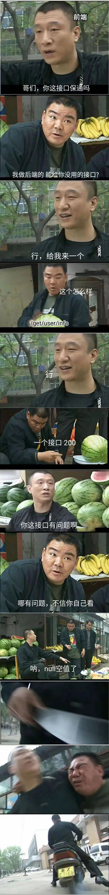

# 人间观察笔记 2022.03 | 防御式生活

2018年居然成功进入了程序员行业，但由于完全没受过职业训练，当时的mentor丢给我一本大部头书，勾了几章让我先看一遍，这本大部头就是著名的微软《代码大全》第二版。

其中有一段提到了“防御式编程”的思想，我就不丢专业名词了，给大家看一个梗图就懂：

这图怎么体现了防御式编程呢？首先孙红雷需要有接口会返回空值的意识，其次出现空值后的处理逻辑（西瓜刀、小摩托）要准备好。这两点基本上就是防御式编程的核心思想。

这段文字其实也对我后来的工作有一定影响，在写代码的时候会在函数最开始的地方留下边界情况代码处理的逻辑。

后来过了几年到现在，我在想其实这个思想可以超越写代码层面，上升成为“防御式生活”。核心也是两点，一是要有识别风险的意识，二是对这些风险都要做好应对的准备。

其实如果诸位考过驾照的话，应该也听过“防御式驾驶”这个词，其实也属于“防御式生活”的体现。想一下开车的时候有很多最好减速通过的场景（过路口、斑马线、超越电动车等等）还有遇到大车尽量避开不要与之并行之类的措施等等，那么再扩展开去，好像生活的方方面面都可以做类似的操作。

……
……
……

这篇文章我本来月初开始构思，但是现在到月底反而写不下去了，这个月又发生了不少事情。再怎么防御式生活也还是难以防住一些事情，尤其是我上篇文章还提到了阶级的限制，有时候能做的事情真的不多。这个月发生了啥呢？首先是2月底开始的俄乌冲突到现在一个月多了还没有结束迹象，然后是国内各个城市的疫情反扑，最后还有一次令人痛心的空难。之前想写的文字干脆全部推翻吧，找回1月份在朋友圈看到的一篇文章：

> 在「疫情、隔离、生计」等多种不确定性下，人们容易感到的一种「个人层面的无力和挫败」。
> ……
> 在抑郁症的基础上，政治抑郁还有一条重要表现：个体感觉自己实际上无法掌控命运。比如：
> 
> [《疫情之下，我的「政治性抑郁」》](https://mp.weixin.qq.com/s/mHNdnEJ_fPvAOZqkbzznrA)

后面这段文字我看着就笑了，有没有一种可能，就是大多数个体，本来就无法掌控命运？上个月在日常错乱发言的时候就想到说，任何一个劳动者只要签了劳动合同就注定了是输家，因为根据资本论中关于劳动价值的论述，只要你是出卖劳动力的一方，那你就是要被剥削剩余价值，任何一个马克思主义者应该都有这个共识。推广一下，大部分的人只要出生了，就注定是输家，这个是概率决定的，毕竟被剥削者占绝大多数，大部分人终其一生会处于被剥削的位置。所以大部分个体本来就无法掌控自己的阶级位置，是什么让人产生了自己可以掌控命运的错觉？

好的作为一个抬杠工程师我觉得上面这段槽点满满，我先自己给自己杠一下，首先可以从个体奋斗的成功安利来反驳，但我的论点是大多数人，全球的无产阶级兄弟，个体案例的反驳是无效的。其次可以用我国近年的高速发展来反驳，但我的论点还是立在全球无产阶级兄弟上，因此少部分群体的生活虽然取得了进步，但我国以外的群众就不一定了。再接着资本论本身的“正确性”就可以被质疑，当然这部分我也不是专家，我估计改开前后切换思想那段时间有大量的文本可以用，我这里就不献丑了。还有就是从剩余价值剥削跳跃到掌控命运这种立论也不是很扎实，我只能说我讨论的是全球大部分人宏观的命运，就好像说全球80%的人只拥有全球20%的财富（当然现实可能更极端），那么这80%的人里，就算马上发生大变革，让20%的剥削阶级变回无产阶级，无产阶级中也就20%的人换到剥削阶级去，剩下60%的人还是维持原样。因此我才会说大概率出生就输了，输多少的问题而已。最后就是可以直接否定这个观点，从小了定义“命运”，或者直接说这个观点是虚无主义不可取。的确我对那篇文字里的“命运”是往大了解释的，但我也没表达说无法掌控命运就等于啥都不干虚无摆烂。好的抬杠工程到此为止。

这个月发生了些什么带来政治性抑郁的事情呢？首先是突然爆发的俄罗斯乌克兰军事冲突。乌克兰方面是明确要求男性不能离境的，但后续有没有强制征兵不清楚。这里分两个情况，一是原本就不支持政府往死里挑衅俄罗斯的人，现在作为本国男性有义务留下来保卫国家了，内心会不会很痛苦。另一种是支持现政府的，原意为国牺牲的，在战场上直面生死应该也不好受吧。还有可能是两者之间，既不支持政府行为又必须承担起卫国重任的，这种就很悲壮。其他的就不一一列举了，我觉得凡是亲历过战场的人都会希望和平，唯独那些不上前线的人会有其他想法。俄乌的事情我这可能有个不太正确的类比，大概是60年代蒙古（清帝国时是一家）申请加入苏联，而苏联当时本来就对我国有核威胁，迟早在内蒙古边上安排核弹发射井，蒙古人还对几个口岸城市的华人进行了残酷的迫害（在顿巴斯地区对平民的暴行），这个时候我国组织志愿军入蒙了。如果把这种历史背景铺开，就能理解为什么之前我国不选边站的说法了。这种情况下在战场上兵戎相见的人、两国中期望和平的人、前线的平民，都只能听天由命。因此吧，屁民在这种环境下的确非常无力，贫贱不能移不是么。另外一点是，作为中国人，作为黄种人，据说不是屁民的阶级也有点害怕了，毕竟除了亚洲，除了中国能移到哪里去？在种族主义面前阶级一下平等了呢。

再就是国内也开始受到新冠奥密克戎变种毒株的侵袭。我在深圳从今年元旦开始就一直窝在家，上个月还是每天做核酸检测，持续了快一个月。现在看势头深圳疫情已经得到控制，上海的情况又不容乐观了。今年已经是新冠大流行的第三个年头了，可能之前有经验的人也会看到其他城市封城时的乱象提早做好准备，比如在家准备能支持半个月的干粮用品，至少突然封城时不需要出门抢菜（关于物资供应不足需要抢菜这点，之前可能还有人觉得二三线城市需要这样，深圳也好像只发生了一天，但没想到超一线上海也出现了这种情况，由此一来会不会人人自危了呢）虽然大部分人囤点物资应该就可以撑过去，但是这一波我们明显看到了，流产的孕妇（总不能来疫情了直接堕胎吧），住在京郊的打工人、小区群租房的超市营业员无家可归（为啥不买房？何不食肉糜？），哮喘的护士、需要透析的老人家（疫情来了就等死？）每一条新闻的出现都会让有共情能力的人产生无力感，如果我是他们其中任何一位，我要怎么防御式生活？没法防，防不了，怎么办。

最后就是一场重大的航空安全事故。这方面的报道说实话我一直不敢点开看，因为我还记得马航出事之后，看了一篇采访文章，里面有一条是同龄人对失踪乘客的表白，说回来就结婚吧，与此类似的还有好多，隔着屏幕都能感受到撕心裂肺。这里我也不再多展开了，不忍下笔。

所以到头来面对那么多无法掌控的事情，能防御到什么程度呢？我想起了《大空头》中的一个避世老交易员的形象，他们隐居在一个大果园里储备了一大堆种子。再夸张一点，可以是老美的末日地堡狂徒，时刻为爆发核战准备着……可是这些好像都不是我们屁民的防御选项，甚至说我们没有防御选项。那咋整，开摆？

举一个小时候怎么都想不明白的例子，杞人忧天，我记得还有一个课后问题，要如何说服杞人不忧天。说实话作为一个现代人，我也不知道如何说服杞人不忧天，毕竟天不会真的“塌下来”，但是天上什么时候会掉一颗陨石下来还真不一定，而且目前人类科技好像还没有能拍胸脯说万一有陨石也一定能将它推离轨道，更何况目前的陨石探测技术还经常出现漏网之鱼：

> 这颗近地小行星最初被称为“ZTF0DxQ”，现在，天文学家正式将其命名为“2020 QG”。当地时间周一，天文物体轨道模拟网站orbitsimulator.com的创建者托尼·邓恩在推特上写道：“昨天，新发现的小行星ZTF0DxQ从小于地球直径四分之一的地方经过，这使它成为已知的距离地球最近但没有撞击地球的小行星。”
> 
> 《史上最接近的天外“不速之客”：距地球仅1830英里 擦肩6小时后才被察觉》

因此，现代人都无法拍胸脯保证的事情，怎么可能劝服杞人不要忧天呢？因此杞人忧天完全是合理的。只不过大部分人并不会太担心小概率事件的发生，毕竟隔天上街被车撞死的概率比天塌下来的概率更大一些，我们会因为担心隔天会被车撞死而茶饭不思么？不会。从这一点出发往外推，可以发现屁民的生活似乎真的就逃不过各种意外。有人可能会说努力润出去就行，可是润到哪里去不都一样？全世界无产阶级都是弱势群体，只不过有些还在为温饱生存挣扎，有些在追求美好生活，有些正在争取实现人生价值而已。所以我提出的防御式生活，第一步也是要明确：糟糕的事情有很大概率会发生在大部分无产阶级身上，只不过是明天还是三十年后的区别。第二步就是面对这些事情也不要陷入政治性抑郁了，把能做的事做了就行。所以我这也不是在鼓吹走虚无主义路线，像最近出现的很多声音虽然力量微小，但都对推动情况变好起到了作用。

最后忍不住要阴谋论一句，有没有可能某些人其实是有意要造成“严防死守动态清零一样会死人和难受”的局面呢？这样不明就里的公众舆论会把矛头指向政策本身而不是执行层……不过首先我没有证据啊，只能说是一种阴谋论了，引用一下名人名言傍身——

> 我向来是不惮以最坏的恶意来推测中国人的
> 
> —— 鲁迅
