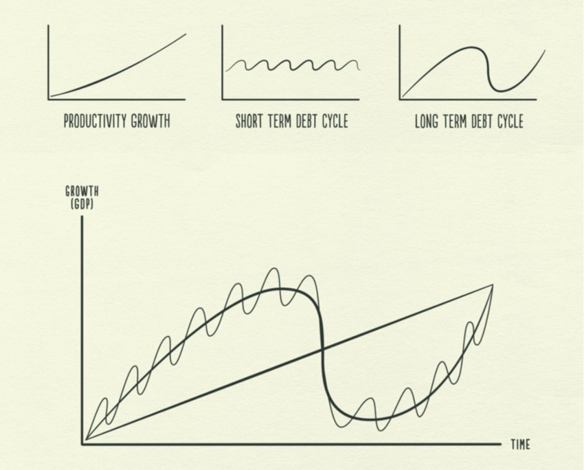
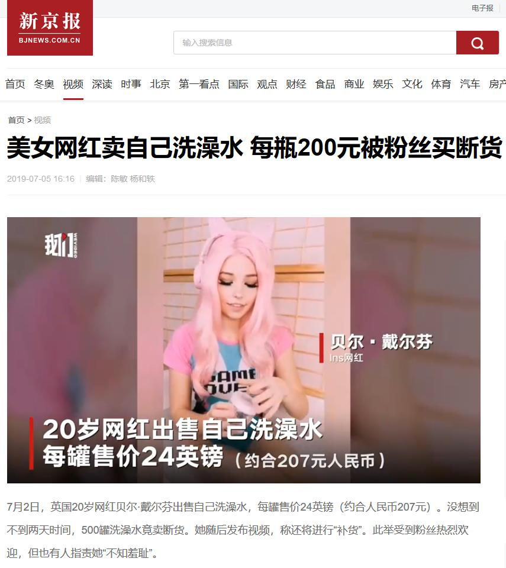
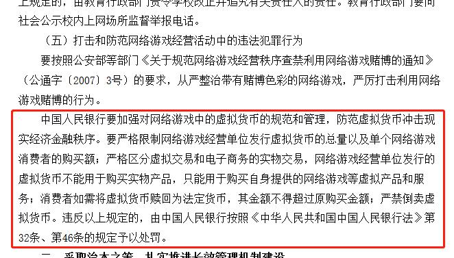

# 比特币本质上和网红的洗澡水没有区别 | 抬杠工程

没错我又来哗众取宠了，这次是厨房沉思，也是突然发现可以用这个比喻来讲述比特币（及其他数字货币）近几年的故事……

2011年，NBA球星凯文杜兰特在社交网络平台上发布了这样一段文字：

> 斯嘉丽，我想喝你的洗澡水。
> 
> —— 凯文·杜兰特

于是故事开始：

---

大概在21世纪10年代，一个网红妹子根据这个想法得到了一个绝妙点子：自己的各项指标都不比刚刚上述女星差，那她也能定期产出洗澡水，卖给有需要的人。绝妙吧。

*—— 2008年，中本聪提出比特币概念，次年比特币发布*

洗澡水这个东西吧，毕竟妹子人老珠黄了也就没用了，估计也就能卖十几年，大概供应上限2100万瓶的样子

*—— 比特币的供应上限*

网红的支持者可以邀请她来自家洗澡，产出的洗澡水会分一部分给支持者作为奖励

*—— 挖矿*

网红自然是个世界公民到处都可以去，而且水本身也不受海关管辖，因此所以任何人都可以持有并交易；交易本身如同发匿名邮件；洗澡水里含有妹子的DNA，可以保证真实；

*—— 比特币的去中心化、匿名、保证真实等特性*

最开始那几年妹子还是个小网红，她的洗澡水也就一些早入坑的支持者持有，一些支持者还各种对外安利，进行了一些类似用洗澡水换披萨饼的交易

渐渐地这个小网红凭借自身素质和支持者的安利吸引了更多人的注意，虽然最开始是黄赌毒不分家的黑产带起来的，但毕竟有需求就有供给，经过了数年的发展，基于物流基建的迅速发展，出现了各种洗澡水交易所来促成买卖双方的交易

*—— 2017年以前的比特币发展*

随着洗澡水生意的做大，主流媒体开始关注，尤其是洗澡水价格的巨幅波动（主要是上涨）让很多人动心了，于是大量民众入场参与

*—— 2017年起比特币进入大众视野*

同时一些人也想到了：我可以邀请网红来我家洗澡啊，这不就是一本万利的生意么。于是他们也是这么干的：投入巨资兴建大型浴场，一个比一个豪华奢侈，就为了吸引网红的注意，让网红来洗个澡。这种需求推高了供给价格，浴室的建材价格被这些需求推的水涨船高，真的想给自己家装修浴室的人苦不堪言。同时，维护这些豪华浴场还需要花大量水电费。

*—— 挖矿行为导致显卡价格暴涨，同时耗费巨量电力*

洗澡水价格的暴涨使得当年退坑的一些人大呼后悔，因为他们要么真的作为脑残粉喝掉了，要么就是因为种种原因丢失了原本属于他们的洗澡水

*—— 忘记了比特币钱包密码意味着再也无法找回*

想买洗澡水的人太多了，但一整瓶又买不起，于是大家开始按半瓶、四分之一瓶、0.01瓶开始交易

*—— 比特币目前的最小单位是一亿分之一*

最先开始卖洗澡水的网红现在大红大紫了，但江山代有佳人出，于是很多小网红也开始产生了卖洗澡水的想法

*—— 各种空气币开始发行*

有些精明的煤老板也注意到了这一点，他也开始物色一些小网红，挑了个最能整活的妹子，然后开始运用他作为煤老板的资源给洗澡水生意和这个小网红吆喝，让这个小网红的洗澡水价格一飞冲天

*—— 那个带头炒狗币的老板*

一些偏远地方几百万人口的市场话事人也看到了，干脆直接宣布在他们的地盘可以使用洗澡水买买买

*—— 2021年6月9日，萨尔瓦多国会投票批准总统提交的比特币作为法定货币的提案*

---

写到这里大家也应该发现了，把数字货币换成网红的洗澡水，整个故事理解起来完全没有问题，就是会觉得非常荒诞。是的，本质上就是如此荒诞。但应该也会有人说我强词夺理，完全没提到数字货币背后强大的技术原理。稍安勿躁，我先回顾一下人类历史：

> 1637年郁金香泡沫（农业的高端产品）
> 
> 1720年南海泡沫（殖民经济大发展）
> 
> 1920-30年大萧条（工业龙头国家的供需崩溃）
> 
> 2000年互联网泡沫（信息服务业大跃进）

站在人类文明发展历程的角度上看，每一次的生产力（经济）发展都会伴随泡沫的产生和破灭。这一观点可以是瑞·达里欧提出的小周期大周期概念，也可以是国内互联网中流传甚广的周金涛大神的康波周期，他们的理念其实有互通的地方。

所以用这种观念来看现在的洗澡水狂热，它的产生可以说有一定的历史必然性，当然也有很多人主动往里面添油加醋，也包括一些肉食者下的决策导致了现在的结果。总而言之，跳出当下来看的话，泡沫的产生是必然的，它在现实中的表现就是各种比特币类型的数字货币。

泡沫本身是一种人类经济活动的现象，是个中性的东西。但是我也不在这装理中客了，我是有阶级立场的。纵观历史每次泡沫的结束时剥削阶级大体上都能运用压倒性优势全身而退，与之相对的，无产阶级大多会陷入被剥夺一切艰难求生的状态。他们失去的只是账面上的几个零，但我们失去的是温饱、安全甚至自己的自由或生命。因此作为无产阶级的我们自然要旗帜鲜明地反对泡沫的急速膨胀和泡沫破灭后压迫阶级对被压迫阶级的无情收割。我这里也借用一下伟人的思路做一次分类：

第一、洗澡水市场的庄家/交易所

他们拥有市面上绝对多数量的洗澡水，并且拥有大量的法定货币，同时在社会中与公共权力有一定联系，可以进行相对不受限制的市场操纵行为。交易所本身还可以直接收取高额交易手续费，本质是开赌场，还不受相应法规的监管。

第二、洗澡水市场早-中期入场者

他们拥有大量洗澡水，但相比第一类人物，缺少对公共权力的掌控，一般是跟随第一类人的市场操控行为，作为第一类人的门面或者操作员。

第三、洗澡水市场晚期入场的牛散、矿工、交易所从业员

比起前两者他们入场晚，也投入了自身财富积累，运用了自己聪明才智，实现了交易盈利，并期望持续扩大盈利，期望最终能实现财务自由。

第四、穷逼赌徒

原谅我用词粗鄙，但我自己也自称屁民。现在洗澡水市场中大部分是这些人，而且其中一部分可能来自第三种人。由于被两种人的优势吊打，交易失败造成重大亏损从而进一步堕落成赌徒状态，甚至继续堕入万劫不复的赌瘾深渊。

这么一写我想说啥应该不言自明了吧，正篇到这里也可以结束了，下面再开几段文字来应对一些可能的质疑点。

---

**一派胡言，前几天还有人在乌克兰用比特币买车，比特币是妥妥的未来**

如果这是你的真实想法那你可能已经进入宗教狂热状态了，首先就事论事的话，普大帝简直是传说中的西方圣母，要攻城居然不把电线网线掐了，民众居然还能上网，在伊拉克或者阿富汗搞这种操作试试？其次也预告一下后面的文章会回来说下这个热点。

**从头到尾没有提区块链，技术进步怎么能用洗澡水替代**

没错我故意没提区块链，它在洗澡水狂热现象中就是一层技术外衣，这也是为什么我列举了人类历史上著名泡沫的原因：每次的外衣各不相同，它们的共性就是当时经济（生产力）发展的前沿。正因为是前沿，可能触发了人性中对技术进步的天然迷信心理吧。

区块链技术本身是可以给人类带来生产力进步的。就拿我的老本行档案学专业来说，要是能搞出全国联网的区块链档案系统，那很多纸质时代的问题都可以迎刃而解（当然我再吐槽一句，很多问题不是技术问题，但表面都说是技术原因，程序猿攻城狮同行懂的都懂）。而且我国是正儿八经的在发展区块链技术。因此我在用洗澡水调侃的时候一句不提区块链，希望不会造成一些错误的导向。

扯远两句，区块链其中的一些核心思想，其实我国老祖宗早就想出来了。马伯庸就在其著作《显微镜下的大明》中提及明代的黄册（户籍档案）制度。每十年一编的黄册，新造册入库时需要和上一次的黄册数据比对，如果相符才能入库，否则会打回重造甚至追责。只不过受制于技术限制，这是个中心化的纸介质数据库，而且全是人肉计算。当彩蛋看吧。

**你就是没赚到钱在酸吧**

那是，本屁民要是财务自由了会在这里发牢骚吗（狗头）

**这个比喻是你自己想出来的吗**

其实不完全是，我们现在生活在一个疯狂的时代，有些事件可以作为这个时代的脚注，就比如这件事：

我只是正好在厨房沉思的时候把这俩疯狂的脚注搭上线了……

---

最后放一个彩蛋，在码字的途中找到一篇2007年的公文，大家感受一下：

一年半以后，标志着比特币发明的论文《Bitcoin: A Peer-to-Peer Electronic Cash System》才出现在网络上

