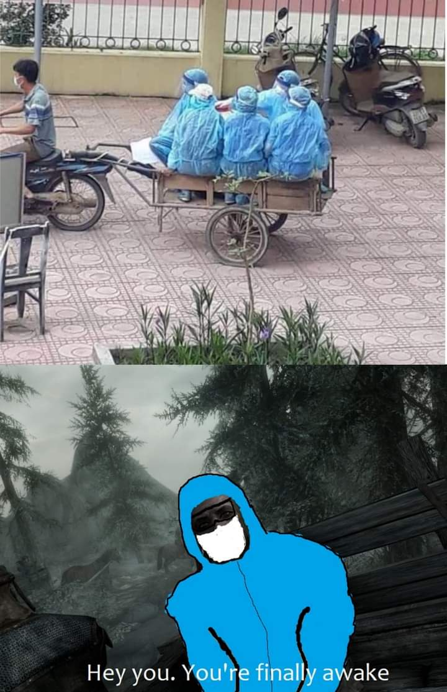

# 又菜又爱玩 001 | 老滚5天际

对没错又菜又爱玩说的就是我，由于不擅长一切竞技游戏，基本上任何竞技项目都是被暴虐，我本人也懒得去练技术啥的，所以只能龟缩在单机游戏里虐电脑玩（不对，怎么能这么说呢，老子是剧情玩家，菜不菜跟看剧情有啥关系图片）但是我这个人又比较喜欢嘴臭吐槽，反正最近也闲干脆开一个系列吐槽一下我之前玩过的游戏。

**友情提示：大量剧透警告**

**友情提示：大量剧透警告**

**友情提示：大量剧透警告**

在煎蛋和9GAG中看过无数穿越到老滚5开头马车的动图之后。我终于亲自体验了一把。光是开头地牢逃生那段体验我就感觉到这游戏非常对我胃口，从地牢出来开始走大地图到河木镇这一段路的体验更加强化了这个印象。回想起2020年废寝忘食玩巫师3的那150小时，我感觉这又要来一遍了……

果然，几个月后我差不多也玩遍了，且不说100%完成度，但我感觉也有80%了，主线和4个公会支线都跑过一遍，每个城市的所有NPC都对过话，地图上的点开的七七八八，感觉剩下的就要交给网上那些彩蛋视频云玩了😂那么我主要按剧情分块来吐槽一下，按我做任务的流程排序

### 主线

从地牢出来后去河木镇的路上有三个石头提供不同职业的Buff加成，战士法师盗贼，我当时脑补的故事是一个无名小贼（老滚五开场马车上主角的身份是个犯人）自由成长成一代大师的故事。然而在干掉第一头龙（白漫卫兵输出了大部分伤害，我笑死）之后居然发现主角是天选之子——龙裔，可以吸收龙的灵魂并且发出龙吼。好嘛怎么突然变成天选之子的剧情路线了，让我顿时灰常失望。但转念一想好像除了可以物理喷人之外主角也没啥特别的啊，这个天选之子未免也太弱了。尤其是我两次玩的都是脆皮法师路线，经常就是一不注意就被一斧子处决动画带走，或者是精英怪的两箭，或者一个冰风暴（拿破晓者那关的boss，我打太早了，死了无数次）。我玩的还是中等难度，真的是菜逼石锤了。

什么，你问我法师流怎么玩的？那简单，召唤系+毁灭系双修，到10级马上开巴巴斯和瑟拉娜的任务，后面所有任务基本上就见神杀神了，根本用不着天选之子的力量，躲在两个不死之身的肉盾后面当雷电法王输出就完事了（菜逼玩法）

继续说主线，大概流程是：初次吸收龙魂发现天选之子身份 - 灰胡子召唤受训 - 刀锋卫士任务 - 裂谷城寻人（盗贼工会联动） - 冬堡询问上古卷轴（法师学院联动） - 寻找上古卷轴（魔族任务联动） - 和平谈判（内战联动） - 抓龙 - 最终决战。整个主线的安排还算比较精妙，感觉主线的设计串起了至少50%的支线内容。而且最后在英灵殿大战前还能看到之前剧情中死亡的英雄，所以理论上最大化体验游戏内容应该就是边玩主线边推支线，支线推完Buff叠满就可以暴虐最终Boss。我一开始大概也是这样玩的。只不过第二遍只想玩点第一遍没做的任务，就调整了下顺序：10级带上狗和大小姐，然后直接开打内战。我一开始还以为不打完大龙Boss内战没法打，和平协商一定要开，没想到白漫领主在主角消灭掉西哨塔的龙之后就迫不及待给对手送斧子了，我真的一头黑人问号，后面就直接跳过了和平协商环节（难道天选之子不参战天际内战就永远不会结束了？）

老滚5的主线故事还是挺有亮点的，中间串起了好几个大的支线任务，中后期的剧情展开也很有创意，比如上古卷轴就是个债留子孙的工具（坑爹啊，游戏里也能体验一把什么叫“留给后人解决”，然后主角就是那个后人）在英灵殿见到各种老朋友，和先人并肩作战，消灭大BOSS之后才发现，之前站在人类这边的龙，要开始征服其他龙了。此时刀锋卫士的要求不绝于耳，天选之子不得不考虑自己死后，这曾经的二把手会不会直接撕破脸，奴役人类毁灭世界。这个两难选择可谓是主线结束后一段引人深思的留白（麻了，什么刘邦朱元璋晚年剧情）。但是游戏比小说好就好在小说的留白是真白了，游戏的留白可以让玩家自己谱写（屠刀举起来）

### 法师学院

由于选择了法师路线，每个城市酒馆、法师口中反复提及的冬堡法师学院是我最开始就开启的公会支线，但事实证明这是一段非常痛苦的经历。因为法师学院也就是把教学者集中在一个地方而已啊，学习法术要么在大厅里自己重复施法，要么交钱速升，跟学院毛关系没有，学院内搞个法术技能提升Buff也好啊！整个法师学院剧情，除了买法术书之外，在“课堂”上学到的法术也就最开始入学的一个基础法术，和最开始的一个防御法术。

然后……然后就是一般的魔法学院危险教学基操了，下古墓打僵尸挖核反应堆，把反应堆搬到学校里又不会弄，这时又来一个会使用砸瓦鲁多暂停时间的神仙修士给主角再叠一层Buff，说这人我们硬点了，有啥事让他去跑腿吧。于是跑学院地牢问路，跑矮人遗迹大战上古机器人。我当时还没摸索出神犬+大小姐的猥琐流，只带了一个学院同学上路，还要时刻保证她血量不见底（有一次不小心把同学打没了，直接显示被学院开除，需要重新入学，啊这）费劲千辛万苦回学院交任务，发现反应堆被内鬼独霸了，然后这内鬼居然把校长给秒了，我靠，你这校长怎么当的啊，人家霍格沃茨这种教学质量，校长还活了6集，老滚的魔法学院就这水平还名扬天际省，出了这种事学院招牌直接扬了算了。校长便当之后又给主角指了个方向：去校长年轻时一次探险的废墟里找反应堆控制棒。然后又是千辛万苦顺便重走一遍校长年轻时怎么跟同学探险，数人遇难，校长最后抛下两个朋友独面关底Boss自己跑路的不堪往事。这段演出是挺悲壮的，不过当时我被怪虐的太惨很难分心去感受剧情。最后把控制棒拿回学校，发现教导主任也便当了，此时天选之子挥舞控制棒控制了反应堆，痛快地屠了内鬼（我玩的那个存档，内鬼的尸体还被盟友教师用死灵术复活了，最后在学院大厅化为一滩永不消失的灰烬，笑死）。然后那个砸瓦鲁多仙人又回来了，收走了反应堆，还说主角处理这件事非常好，下一任校长就是硬点你了。WTF？何德何能就当校长了？？这剧情飘得比哈利波特还离谱，重点是当上校长的时候还是个十几级的菜逼，过后学院NPC除了打招呼时会客气一点之外，还是要给主角各种跑腿任务，跑你妹啊把我这校长当塑胶是吗，垃圾学院，赶紧关了吧。

### 龙裔DLC

作为一个非常记仇的玩家我非常难以忘怀见完灰胡子从高吼峰七千级台阶上下来之后，一分钟不到直接被两个奇装异服的教徒当街打死的奇耻大辱。搞完沙雕魔法学院任务之后立马找到任务地点，准备坐船去打死米拉克这个幺儿。结果过场动画一放我傻眼了，居然是一张新地图，后来查攻略才知道这是个DLC。当时也是沙雕不知道开了图之后就解锁传送了，来到新城市没有据点，背包容量上限可让我太痛苦了。不过好在当时已经带上了狗，不然我直接上岛表演狗带（菜逼面对灰烬魔怎么打的动）。终于在攻略的帮助下做了N个任务灭了间谍一家才得到一个据点。别的好像就没啥特别的了，带狗开图稳的很。龙裔的主线也挺有意思的，说是初代龙裔控制了岛上所有居民晚上梦游出门给他修祭坛，修完祭坛他就可以复活出山一统天下，唯一需要注意的就是初出茅庐的末代龙裔（主角），于是就派出马仔想要扼杀主角（说实话，就我这个存档来说，坏人确实成功了，奈何玩家能读档啊哈哈哈哈）老子就带着狗来取你身家性命了哈哈哈哈哈。等等，什么？决战要在书里打？狗传送不进书里？完了这又要给大哥表演狗带了。我的复仇之路的确走的比较艰辛，好几个关卡都是书中世界的探险，追寻者和食人鱼怪暴虐我，我只能用召唤系穿墙的设定让他们打追寻者内战（有一关地图开门之后就是5、6个怪围攻，完全没法打，只能在开门前用穿墙召唤磨死他们）。不过好在最后大战的时候我已经开完图了，召唤出了游戏中最强战力——熊人，好几巴掌呼死了大Boss。不过不得不说书里的关卡美术非常直观体现了什么叫克苏鲁风格，非常好，玩过一次再也不想玩了，而且收集了一大堆黑暗经书还不能从物品栏中移除真的绝了。本脆皮法师根本不升精力值，扛着这些无用经书简直不要太痛苦……

### 盗贼公会

作为主线任务必经之路好像不做不行，我第一个档最开始没带狗积累了一点潜行技能，就顺便开始了盗贼公会的任务。不过撬锁和栽赃之类的任务比起快意恩仇的杀杀杀好像是差了点意思，大概到了公会领袖跳反才有了点意思，复仇战打的很爽快，最后的水下逃生也很惊险（水下呼吸药都喝光了，差点又要读档重来），然而！最后一个任务居然是要把万能钥匙还回去！笑死，我就想问问夜莺组织，你看到我身边这条狗了吗，人家可是魔族，你看我交这个魔族任务了吗？没有嘛，你们的万能钥匙我就同样笑纳了。笑死，布大叔还说事成回去继续接盗贼公会任务，让盗贼公会恢复往日荣光后就正式承认主角是公会会长。免了免了，你们就继续在下水道里喂蚊子吧。（玩到这里我已经有些异样的感觉了，怎么盗贼公会也要主角当会长，魔法学院那种拉跨事情又重演？）

### 战友团

加入战友团后任务有三种，打架，消灭危险动物、拯救被绑架人质，看起来是个正义的组织吧。很好，三分钟后告诉我核心成员全员狼人，我之前魔族任务还屠了你们一个同类你们不会发现吧（还好没发现），剧情还强制要求主角也变成狼人才能继续进行后续任务。不过狼人变身后的冲刺攻击真的无敌，巨人、猛犸象这种最血厚的怪都是几爪子解决，不过打龙不太能用，在一堆卫兵面前变身的话估计只能现场表演一个变身箭猪。短距离操控起来也不太实用，后来开黎明守卫DLC时大小姐他爹还鄙视狼人血统，走黎明守卫路线的Boss战还想直接用狼人冲击教对方做人，没想到实在太难操控了，反而被吸血鬼教做人了……

扯远了，牵扯进狼人之后就开始走屠杀白银之手的路线了，这点估计也是游戏开发的时候没想好，理论上玩家应该还有个选择是觉得狼人是邪恶的（佛瑞克斯，狼人手撕四岁小女孩），应该要有退出战友团加入白银之手的选项，不过估计也是开发资源局限没做，就当艾拉妹子太香了没有龙裔能够拒绝她的血吧，而且我感觉黎明守卫DLC也弥补了这个缺憾。后半段剧情还是屠杀，一狗一狼血洗女巫老巢，然后是白银之手，最后刨了战友团创始人祖坟，什么戴孝集团。最后能在英灵殿看到战友团领袖还是有点感动的，然后剩余支线把其他狼人都治愈了只留一个艾拉作为玩家变身狼人的入口，也行吧。

玩到这里我已经发现这些支线真的套路明显，主角加入哪个哪个就要倒霉，总有一两个成员要便当，其中一个必然是当前领袖，因为要腾空间出来给天选之子叠Buff，在英灵殿的时候主角应该可以用最多五种身份来自报家门，分别是天选之子和其他四个著名公会的领袖。问题是这些领袖真的一点领袖样子都没有，当了领袖还得亲力亲为接任务。感觉当领袖体验最好的也只有刀锋战士了，好歹屠龙任务都是三个战士全出，群殴简直不要太爽。

### 黎明守卫DLC

书接上文，黎明守卫DLC弥补了玩家不能加入白银之手屠狼人的遗憾，感觉黎明守卫跟白银之手性质很类似，都是民兵团体。估计在制作组觉得DLC把之前白银之手魔改也不合适，总不能屠完白银之手之后还要加入他们吧，于是就引入了黎明守卫，对立方也从狼人变成了吸血鬼。吸血鬼的能力也比狼人要强很多（当然白天会变成削弱，我第二个档特别早就变吸血鬼了，经常上演各种被一击秒杀）

黎明守卫的故事也挺有意思的，首先大小姐的确是制作组用心设计的角色，比起游戏中其他NPC，大小姐陪着主角走完了一整个剧情线，故事的每个阶段都有新对话选项，可以说是走完了相识到互相信赖的全过程了。大家应该也知道我接下来要吐槽啥了吧，就是制作组没有给安排大小姐结婚选项。相比之下，跟她类似的角色，狼人妹子艾拉，是可以结婚的。更别说其它NPC。举个非常常见的例子：伊索尔达的象牙妹称号，原因是给她带来一根长毛象牙就能满足结婚条件。当然也有观点是不能用人类的价值观去衡量吸血鬼，大小姐拒绝的理由非常充分。但是可别忘了黎明守卫线有一个结局是可以劝说大小姐重返人类身份的，走了这条路线也不会触发结婚条件，这个就说不过去了吧，只能说制作组考虑的不太周全了。

剧情方面，走黎明守卫路线的话会比较夸张一些，大小姐只身闯入敌营找主角出来，邀请主角参加反叛她爹吸血鬼大君的计划。故事到后面基本上就是大义灭亲没啥好说，能看到地底怪物伐莫族前身雪精灵还是挺新奇的。不过我很好奇大小姐她爹的邪恶计划到底是什么。毕竟拿到弓之后大小姐也愿意提供血来实现日蚀，但是除了普通居民对天有异象有反应之外，吸血鬼一族包括大小姐反倒是啥反应都没有，对制作组的这个安排实在难以理解……

剧情中还有一段相当于用来给主线打补丁的故事：在灵魂石冢里打的那条龙被理想之主骗进来看守大小姐她妈的。当时开的条件是龙只要等到她妈挂掉就能离开，然而龙进来后发现她妈是不死的吸血鬼。这相当于解决了主线剧情中的留白——龙裔死后帕图纳克斯率领龙重新统治人类怎么办——龙裔只要是不死的吸血鬼就完事了，可以守护人类到时间的尽头。

### 天际内战

内战故事线据说制作组砍了不少内容，不过能在内战剧情线中跟第一关中一起逃离地道的NPC重逢也是挺令人惊喜的。然后大规模团战也是打的很爽快，不像其他关卡都是一己之力打三五个敌人。最好笑的点在主线那边也提了，一是解决了白漫西塔的龙之后就可以开打内战后面的所有剧情，这些人完全不把大Boss放眼里，主线推进时如果内战已经打完了，和平协议任务就直接没了，说明内战根本不需要给主线让步，龙也没有给内战带来什么麻烦。二是如果之前达成了和平协议，主角只要不加入任何一方内战就不会继续，即使打完大Boss，两方也没有要重新干起来的意思，就很迷，为了打龙暂停的内战，打完龙大家就继续和平了？总之内战剧情单独看是没啥问题的，但是跟主线一并列就很奇怪，我目测是内容砍的不太干净造成的这种割裂感。而且做黑暗兄弟会任务的时候我已经打完内战了，独孤城相关的任务会出现帝国卫兵在一堆风暴斗篷士兵中穿行的奇景……

### 黑暗兄弟会

这条故事线给我印象很深刻，而且主要是它前期的几个任务。黑暗兄弟会刺客大概在主角惹到NPC之后就会在开图路上杀出来，反杀后可以从刺客身上搜出A姐留的买命便条（但是后期见到A姐本人也没有相关对话，买命之仇一句对话都没有略可惜）。后来看攻略知道黑暗兄弟会主要干的就是暗杀NPC，由于不希望NPC死亡造成游戏体验不完整，我把这段放在了最后做。

加入黑暗兄弟会的任务是梦中被A姐拐到废弃木屋中接受3选1杀人的考验。但主角是谁啊，天选之子，最后的龙裔，冬堡学院首席法师，盗贼公会会长，战友团领袖，是你想绑架就绑架的？尤其A姐的原话是：“今天房间里必须死一个人才能放你走”。噢，你不也在房间里么？于是A姐就被我屠了。但是这惊喜的是A姐居然有死亡语音 “Well done...” 看来她有故事啊。可惜人死了只能靠我们自己脑补为什么A姐要说这种遗言了。杀完A姐提示任务失败，但是离开木屋后开启新任务：消灭黑暗兄弟会。这点真的惊喜了，因为一般来说RPG游戏就是跟着任务提示做事情。这个任务选择杀A姐是没有任何任务提示的，完全是玩家自己的判断，但是这个结果是开启了隐藏任务，可以说制作组很用心了，沉浸感 100。

不过我也要吐槽一下消灭黑暗兄弟会这个隐藏流程，着实搞笑，跑去给马洛指挥官汇报，对方大喜并给了一个任务，说消灭黑暗兄弟会的荣耀应该属于你，这是他们的大本营，你一个人进去屠光他们吧。你踏马真的在逗我，这也过于偷懒了。黑暗兄弟主线里你们还派了一堆人到处放火才把整个兄弟会扬了，现在居然让主角一个人对抗整个大本营？麻了，于是我在主线非常愉快地屠了指挥官一家。

黑暗兄弟会前期还有个隐藏前置任务，开图的时候能在白漫城北遇到运棺材的小丑，这个伏笔埋得好深，谁能知道马车里的棺材不是小丑的母亲，而是掌管黑暗兄弟会的夜母呢，而且后来的剧情主角还要不止一次钻进这个棺材里（第一次进是有点恐怖）

兄弟会的剧情到后期也有点搞笑，A姐自己出卖了主角，打算以此作为交换让指挥官放过黑暗兄弟会，但是吧你俩都私下勾兑完了，还让主角杀人家儿子干什么（或者说，居然敢跟有杀子之仇的人勾兑），这不是摆明了要把自己家扬了么，结果就是自家被扬了。后面主角是怎么逃出火海的完全没交代，剧情是主角钻进了夜母之棺（好像是纳大叔用棺材把玻璃窗砸了），三百岁萝莉又是怎么存活的？出去发现A姐把自己献祭了，但是为啥要这么做，用来祈求夜母原谅吗？那主角为啥要钻棺材？（当然可能程序员需要一个全黑的过渡用来切换场景）总之最后的剧情还是挺令人摸不着头脑的。不过反正最后都化身死神了，一路狂屠就完事。最后的最后成为夜母代言人。但是吧，夜母还说接到任务要给兄弟们说一声，象征黑暗兄弟会重拾信条什么的，然而为啥后续夜母无限发任务的时候就不能给其他人说一声转派给他们呢？嗯？又是一个成为领袖后还要自己干活的沙雕设定。

### 总体

首先槽点最大的当然是四大公会任务了，抛开具体故事不谈，无一例外都是主角加入后当前的领袖因为种种原因挂掉，然后主角表现优异成为新任领袖，然后一点领袖的样子都没有，管理公会？不存在的。指挥人干活？不存在的。而且跑腿任务还可以无限领取，我要这领袖有何用，去英灵殿跟守门人吹牛皮吗？好像吹了也没用啊，啥领袖都不好使，得先打掉他半管血。

然后就是主角除了天选之子——龙裔之外，还叠了一堆Buff。先拿四大公会来说，战友团领袖是托梦选中的主角，冬堡学院是有仙人硬点，黑暗兄弟会可能算误打误撞，跟夜母共处一室被选中，只有盗贼公会的布大叔最特别，一届凡人，可以第一眼就选中主角并拉进组织。不过按理说选一个龙裔来赋以重任似乎也无可厚非？毕竟实力放在哪里（然而我一个脆皮法师有个什么实力，实力全在狗和大小姐身上）就是布林乔夫大叔慧眼识人的能力已经超神了。至于黎明守卫和龙裔，龙裔DLC是天选之子的宿命对决，黎明守卫那部分还算相对正常，冒险过程中偶然认识的大小姐，所以才觉得大小姐故事没有浪漫选项太可惜了。我对“天选之子”这个事情很在意是因为一开始的捏人环节有一种你可以选择扮演任何人的感觉，而且初始状态是个一级犯人，感觉就像是一个无名之辈从零开始的故事。然而后面的故事走到哪都发现自己其实是天选之子，实在是有点失望。

四大公会任务的剧情走向实在是过于雷同了，跑过两个公会任务之后大概就发现了，公式就是：加入公会，跑几个小任务，大佬委以重任，公会内剧变，家被扬了，领袖和几个大佬领便当，最终复仇结束然后主角就成领袖了。这么说来黎明守卫领袖伊老头应该偷笑了，他可能是唯一一个剧情结束后还能活下来的组织领袖😂

还有个点之前也稍微吐槽了下，就是这个所谓高度自由的结婚选择，然而实际上大部分都是彩礼结婚的模式……即使不是实物彩礼，也就跑个腿，就可以触发结婚条件了。所以这就有种割裂感，NPC好感度达到结婚条件只需要一个小支线任务的功夫，然而陪着主角走完一整个剧情线的大小姐却没有结婚选项，迷惑。

黎明守卫DLC有三种方式让主角选择变身吸血鬼（好像制作组非常希望玩家体验吸血鬼状态的玩法），但是成为吸血鬼后NPC的交互选项太少了。好像只有墨索尔城的女吸血鬼和裂谷城整容医生会评论主角的身份。三百岁老萝莉、杀吸血鬼任务里的那一对、还有个藏得很深的蓝宫法师都是同类，也没有相关拉家常的对话选项。大小姐都会说吸血鬼辨认同类气息非常简单，但同类NPC没有类似对话就很可惜。

最后就是天选之子后续的命运了，我去看了一遍攻略，主线和重要的支线全部走过一遍了。结局状态是：主角从英灵殿里跑了一圈回来，混了到了四大公会的领袖，还是内战英雄，把能叠的Buff都叠满了，但是却没有一个自己拉团队称王称霸的路线……不太合理。尤其是内战剧情的一个核心是精灵一族禁止天际省人祭拜塔洛斯。这人不也是正是一个称王的龙裔吗，那理论上走风暴斗篷路线，作为龙裔的主角直接一个号称塔洛斯再世要一统天际甚至大陆，估计也是可以有号召力的（有招募刀锋卫士的剧情，走屠龙线的话私人武装力量就有了），然后反水乌佛瑞克，领导叛军统一天际……不过我感觉RPG游戏扮演领袖相对比扮演单兵要难做，估计这也是为什么四大公会任务到最后主角还是得自己跑腿的原因

好了扯那么多唯独没提到社区提供的繁多Mod，我一个都没装。的确看起来装完Mod完全是另一个游戏，但我是个剧情玩家，看了下Mod也不会对故事造成太大的改动，最多就是引入一些细节调整（比如娶大小姐）所以玩原版对我来说也足够了。

最后一句总结，老滚五营造了一个庞大的故事，但整部读完感觉广度是足够的，但是还缺一些深度，细节能再拉满一点就完美了。

