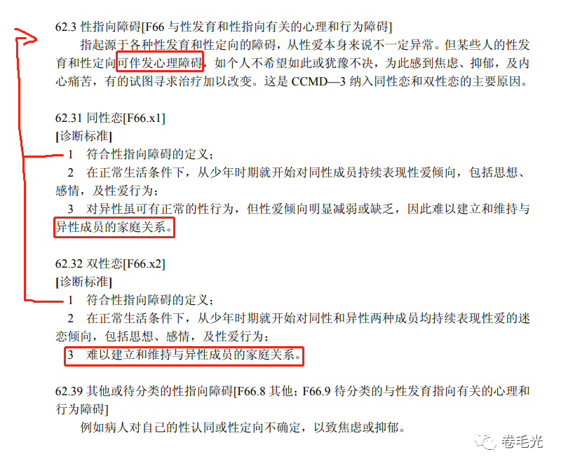
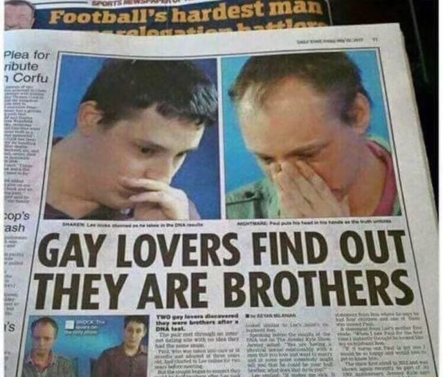

# 你支持同婚？那你一定也支持近亲相〇吧？ | 抬杠工程

原谅我取了这么一个哗众取宠的标题，不过我这小号一没啥人关注二也不需要宠，就是写着玩，打扰到各位推送列表了提前说句抱歉。

这其实是我某天浴室沉思的时候发现的一个想法，一句话表述就是：“所有用来反对同婚的理由都能用在近亲上，那么对这些理由的反驳也同样可以作为近亲婚姻支持者的论据”

具体情况呢？我粗略整理几个观点，并排放置一下大概就能看出来：

|理由|同婚|近亲|
|--|--|--|
|信仰不支持|🙂|🙂|
|自古以来|龙阳之好，识得唔识得？|达尔文娶了表姐.avi|
|造成疾病/生理缺陷|安全措施|一人结扎，全家幸福|
|没人生韭菜不够用|领养/人工|领养/人工|
|社会压力|天赋人权（咦？）|封建复辟（咦？）|
|这是精神病，得电|这点我们之后展开聊聊|CCMD-3中的性心理障碍分类中没有一条与近亲相关|
|通通都是境外势力|🙃|🙃|

逐条展开后可以看出其实的确如此，除了第一条和最后一条没什么办法讲道理之外，其他几个反对点都可以用类似的思路反驳，也就是说如果一个人对同婚持支持态度并且可以反驳质疑理由，那么这个人理应认同近亲，否则就有双标的嫌疑（当然可能也有些不同点我没考虑到，欢迎补充）。

好了看到这里读者可能会有些不舒服的感觉，我论述这些是想干啥，霍霍我家亲戚吗？非也，这只是我日常沉思中的一个小记录而已。可能是成长环境和工作的双重影响，我发现我的思维方式有点像一个……抬杠工程师

面对一些网上的言论我会去思考一些攻击它和应对攻击的方式，可以理解成一个网络喷子在自己的脑海里左右互搏吧，当然一些看起来比较出格的想法也会冒出来，比如同婚和近亲相〇的共性，可以说是找到了这个公共议题的盲点？有点类似与找到了个bug？我会比较享受这种思考过程，算是我的一点小怪癖吧，因此这篇文章也没有发在主号里，就在这个自留地里随便嘟囔一下。

至于你要问我的真实观点是啥，按着我的脑袋问“你到底支不支持同性/近亲婚姻？！”，那我会反问一句：“你支持当下的婚姻制度吗？它是完全合理的吗？”（手动狗头）

---

另开一个小段落说一下CCMD-3（中国精神疾病障碍与诊断标准第3版）中对同性恋相关的定义吧，我看有些文章以此作为我国还没有对同性恋去病化的依据。但从标准中的描述上看，还得满足一定条件才能视为精神障碍，原文如下：

按这个标准，如果不符合第一条，或者可以和一名异性成员维持稳定的家庭关系，其实按标准来说不属于性心理障碍，没病！当然雷电法王可能不这么认为，我先没品一句，什么时候开养老院啊（再次手动狗头）

这里再插一句，民法典规定了一夫一妻男方女方，所以这个诊断标准按民法规定定义家庭关系其实没毛病。至于前几天网上看到有一个三人成家的朋友圈，一个丈夫两个妻子，如果他们其中两个人领证了，同时又住一起的话，其实是违法的

> 第一千零四十二条　【婚姻家庭的禁止性规定】禁止包办、买卖婚姻和其他干涉婚姻自由的行为。禁止借婚姻索取财物。禁止重婚。禁止有配偶者与他人同居。禁止家庭暴力。禁止家庭成员间的虐待和遗弃。
> 
> —— 中华人民共和国民法典

当然现在有钱人玩出啥花样我们都司空见惯了不是吗（三次狗头保命）

↑ 我有时候也会突如其来地阴阳怪气，可能就是我这个人的确没什么素质吧

最后说一下为什么我突然想到这个点，缘起于很久以前听闻的一个过于drama的新闻：

突然就开始叠buff了😂

假如这件事是真的，那考虑一下这俩人发现兄弟关系之前，是不是一切都没问题？就是一对正常的同性情侣，互相的爱和相互支持都是真实的，如果他们不知道兄弟关系，生活一切正常，他们也能正常成家做一个被社会接纳的家庭。那么为什么从天而降的血缘关系会使这一切终结呢？这毫无道理，再细想一下，就得出了我浴室沉思的结论。

最后，希望我这篇哗众取宠的文章可以给读者带来一些思维模式上的激荡，大家一起来找找生活中常见逻辑的bug吧！

> The unexamined life is not worth living. （未经审视的生活是不值得过的）
> 
> —— Socrates（苏格拉底）

> 审视过的生活过不下去
> 
> —— 我

