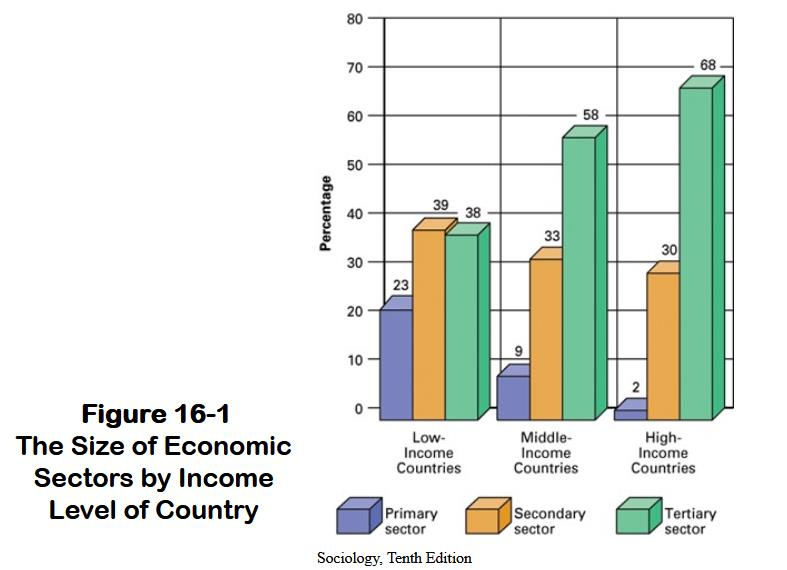
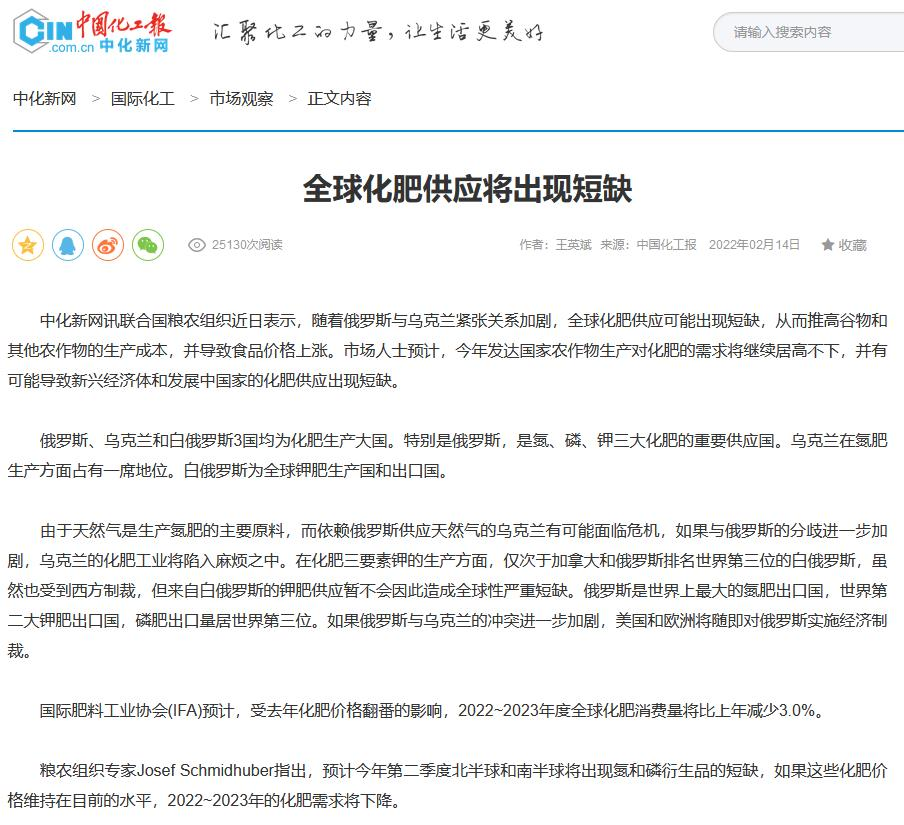
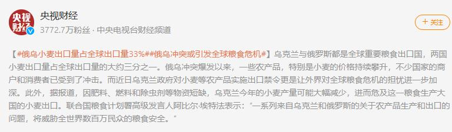

# 普大帝：给大家演示一下什么叫降维打击 | 抬杠工程

是的我又双叒叕取了一个哗众取宠的标题，不过这个观点应该也是老生常谈了，我尽量迅速表达一下观点就收笔。

首先是降维打击这个词，随着《三体》系列的大火出现了一些衍生涵义，已经成为了类似“空穴来风”这种能表达两个相反含义但是都被众人认可的成语。我这里用的还是它的原意：

【剧透警告】【剧透警告】【剧透警告】
> 处于同样维度的两个文明，其中一个率先转移到更低维度，之后将当前空间的维度降低，使来不及准备降维生存的另一个文明遭受毁灭性打击
> 
> —— 刘慈欣 《三体 死神永生》

我突然想到很早之前听过的一个网络段子能形象地说明这个概念：

> 永远不要和一个傻瓜争论，因为他会把你拉到和他一样的高度，然后用丰富的经验打败你
> 
> —— 网络段子

好的名词解释到这里差不多了，下面回到主题，为什么说普大帝给我们示范了一次降维打击呢？最近的新闻让我想到了我们之前奉为圭臬的产业理论：第一产业（原料开采，农林牧矿）、第二产业（制造业）、第三产业（高科技、服务、创新等产业），我们经济发展的终极目的就是不断地爬这个阶梯，向发达国家的状态看齐，我估计大家应该在不同地方看过类似这张概念图：

> 
> 
> 随便在网上找的图

我们求学过程应该是见过的各种类似的图表。大概就是收入越高第三产业占比越高，同时一二产业占比越低，给人一种大力发展第三产业才能成为高收入国家的感觉。

然后今年普大帝用实际行动告诉我们，过去的规则不管用了。

也是从最近的新闻说起：

虽然这是很严肃的事情，但是我忍不住想编个没品段子：

> 西方国家：你不能用美元了
> 
> 普大帝：没天然气了
> 
> 西方国家：你不能用我们的手机和APP了
> 
> 普大帝：没化肥了
> 
> 西方国家：你们的航班不能来
> 
> 普大帝：油价飚了
> 
> 西方国家：你们富豪被抄家了
> 
> 普大帝：你们还有吃有穿有电吗
> 
> 西方国家：……

这不就是教科书般的降维打击，看不起第一产业是吧，直接釜底抽薪，看你们怎么饿着肚子顶着高价能源费用搞第三产业。而且最骚的是造成这种后果的制裁行为还是西方国家先发动的😂甩出一张二向箔大家都降维，但是人家普大帝早就已经在二维宇宙恭候大家了，结果只能是自己尴尬。

好的没品就先到这里吧，我们作为没经历过战火和饥荒的一代人，对这种灾难没有直观感受，但对其他国家的一些人来说就是生死的区别，这其实是很恐怖的事情。不过关于这点我能说的也不多，只能期望说冲突尽快解决，全球无产阶级兄弟可以顺利熬过冲突带来的能源涨价和物资短缺，活下去。

回到最开始那张第一产业第二产业第三产业的图，这曾经是多少人的共识，可是大家都忽略了这张图是建立在国际间资源可以自由流通的基础上的。这一次冲突后大家会发现，没了第一产业的产出，后面的第二第三产业瞬间会变成空中楼阁。往大了说，原本运行了三四十年的国际分工体系变得不可靠了；往小了说，就拿我现在用来码字的vscode来说，万一哪天这玩意禁止中国大陆地区使用咋办？万一别的东西没了咋办，这个可能是当下所有人都会需要思考的问题，后续也会采取各种各样的行动。

上篇才提到的达里欧大神，这两天发现又出了一个制作精良的视频，宣传新书《Principles for Dealing with the Changing World Order》。视频里指名道姓地指出了美国已经进入了衰退周期，未来可能会面临源于内部的革命和来自外部，处于上升期的中国的挑战，而冲突结束后，新的国际秩序会产生。先不说太远，2022年才过了3个月，有多少变化是人活了几十年都没看到过的。但达里欧的观点是，虽然几十年不见，但上百年前，数百年前，同样的事情都发生过，我们得做好准备……

这个月底的人间观察笔记题目其实上个月中就定好了，就是没想到短短一个多月能发生那么多事，直接充实了大量论据😂也不知道真的到了月底动笔的时候还能加进去多少……
