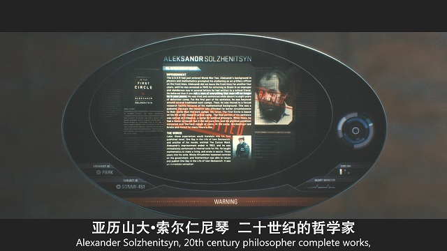
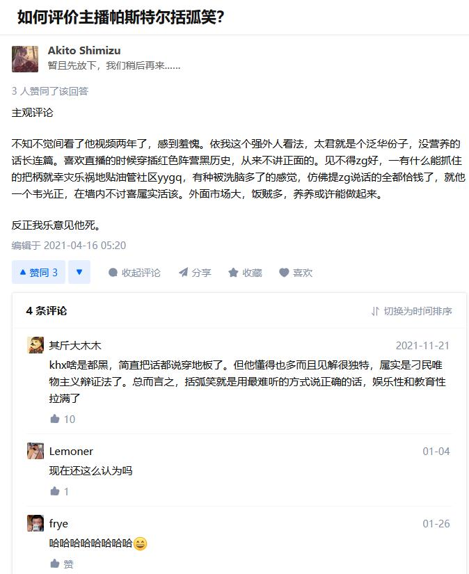
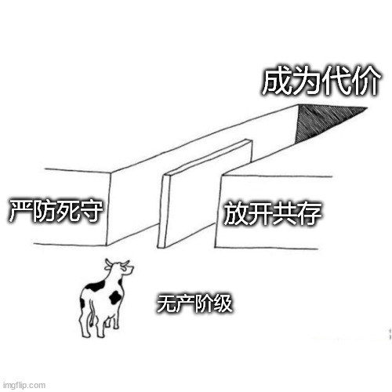
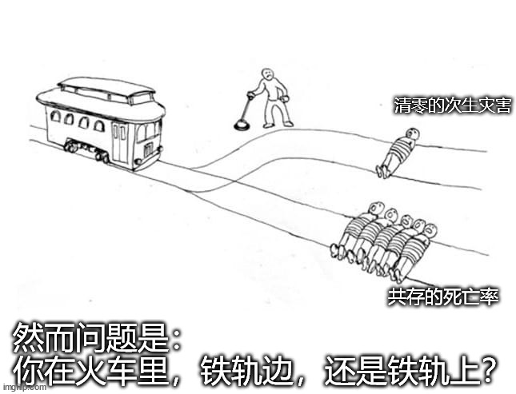
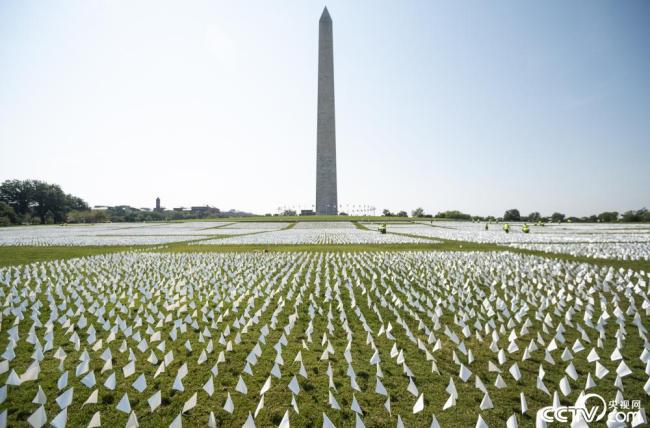

# 人间观察笔记 2022.04 | 没有人喜欢索尔仁尼琴

你可能会说不是啊，他不是一个自由斗士么？媒体霸权真好用对不对，我第一次听说这个名字是在电影《云图》中，借助卡文迪许这个角色的独白，两次提到了“在放逐中劳作的索尔仁尼琴”，还借助星美451直接引用了他的话并介绍了他的个人信息。这不就至少证明了，这部电影的主创很喜欢他。是的，但我说的是真实的索尔仁尼琴，而非媒体建构的他本人。

为什么我要强调“真实的索尔仁尼琴”？我们直接跳到百科里对他的盖棺定论：

> 亚历山大·索尔仁尼琴（Александр Исаевич Солженицын，1918年12月11日~2008年8月3日），俄罗斯作家，二战时的苏联炮兵连长，因勇敢获得两枚勋章，1945年因通信中不敬被流放哈萨克8年，此段经历后来成为他作品的主题。他1962年出版反映集中营生活的作品，被吸收进作协，1968年因作品《第一圈》无法在国内出版而在境外发表，被开除出作协，随后获得1970年诺贝尔奖，而后因出版描写极权主义的巨著《古拉格群岛》被驱逐出国，到美国后毫不留情地批评自由主义，苏联解体后又大骂戈尔巴乔夫和叶利钦毁了俄罗斯，**立场让左右两派都无法与之相处**。他死后，被誉为“俄罗斯的良心”。
> 
> [亚历山大·索尔仁尼琴_百度百科](https://baike.baidu.com/item/%E4%BA%9A%E5%8E%86%E5%B1%B1%E5%A4%A7%C2%B7%E7%B4%A2%E5%B0%94%E4%BB%81%E5%B0%BC%E7%90%B4/1358414)

我是怎么知道这个老头居然那么猛的呢，还是通过一个宝藏up主——括弧笑，这人拳打走资派，脚踢小粉红，我感觉这个人就是一个索尔仁尼琴式的人物，既不是美分也不是五毛，这样的人两边都不讨好，你看这条知乎评论：

很遗憾我就是这种人的粉丝，以及我感觉我自己也是一个两边不讨好的人，毕竟以现在的二极管划分法，我既不是五毛也不是美分，甚至有一点过分的虚无主义：

那作为一个专业的抬杠工程师我还是随便补两个能杠的漏洞先。比如次生灾害的影响有没有放开共存的大，按绝对数量来说我个人觉得其实这一点是有效反驳，因为国外的数据很明显了，得病一定会死人，而且国外一样有次生灾害。但这其实属于比烂逻辑了，甚至我可以拿列车问题拿出来套用一下，看这张图：

虽然很残酷但新冠的全球大流行的确很像这个列车难题，毕竟病毒不跟你讲意识形态，传染是一定会传染的，变异是一定会变异的，得病是一定会死人的，那么是否应该做些事情，减少死亡总量，但让次生灾害带走一些人？我第一次接触电车难题的时候也是这种感觉：从数字上看必须是要的，但是谁有资格做变轨的操作？现在来看电车难题又有了新的想法，那就是面对电车难题的时候，你很有可能不是那个有权力操作变轨的人，那么把大家的屁股整理一下，大概能从立场推断出观点。

然后另外一个可以杠的点就是国家政府已经尽了最大努力保护普通群众了，为什么我还要在这里瞎逼逼添乱。关于这点可以有三个反杠方向，一是我就在这碎碎念又没有发到任何的社交平台中，写日记也要管？二是的确瞎逼逼真没啥用，这点我承认，毕竟古语有云，“能哭死董卓否？”。三是方向没有问题，就是执行太拉跨了。也是，但我还记得有这样一种说法，底下的执行力有多拉跨都没有考虑进去就定方案，也是方案制定者的问题😂。好的我自己左右互搏了一阵子都有点让我自己本身的观点模糊了，回归一下主题，那就是殊途同归的虚无主义。

虚无主义在我人生中占据了不小的一部分，甚至说我在大一暑假国际小学期接触到虚无主义这个词的时候才意识到我之前有不少价值观就属于虚无主义。当然后来接触了真正的马哲后也在有意识地给自己纠偏。首先回过头来看什么叫成为代价，借用了之前传得很广的段子：“要不惜一切代价XXXX，后来才知道我们就是那个‘代价’……”，那么在新冠疫情的全球性流行中，我们不仅看到了海外甚至中国某些地区中病毒扩散后真实的后果——感染激增、医疗资源透支、出现较大规模死亡（别杠，死一个人发生了一百万次）、病毒变异不止，重复以上循环……在国内，我们见识到了强力防疫会带来次生灾害，具体我就不列举了，我甚至庆幸现在我们能看到的都是个案，一旦个案增多之后，众所周知人类的注意力是有限的，这些个案就会加总成统计数字、图表、然后看着看着就麻木了……

最后说点不带感情色彩的话吧。有一种观点说实际上第三次世界大战已经开始了，只不过这次是人类vs病毒的战争，可能未来的人类回看这几年的历史会为人类的愚蠢感到震惊，毕竟还爆发了局部战争。群众自己也会从短期事件里吸收经验，比如现在大家都有了适量囤积物资的意识。我一开始的想法是囤积物资最多也就能顶半个月，毕竟哪有那么多年轻人家里能配两三个大冰箱，就拿我租的四十平小房间来说，平时在里面走动都觉得窄，哪还有地方放囤积的物资？那些嚷嚷着要给家里添置冰柜的可以说也是一种现代的何不食肉糜了。但后来觉得可能有些思路要变了，毕竟是人与病毒的战争，不像过去一二战那样，有绞肉机式的战场，现在的情况更像是时刻要面对空袭的状况。如果按这种思路去思考，那是不是各地应该开始建设防空洞（方舱）、并安排战时物资储备、紧急状态处置方案、空袭警报系统，等等等等……所以对个体来说，在空袭中绝对不受影响的情况，是不存在的。所以按这种思路，的确应该适当引导民众适应这种战争状态，肯定是一时半会儿回不去疫情前时代（没有空袭）的状态了，所以能做的准备最好要做好。当然更多的事情是需要更大的集体去完成的，毕竟当年毛子对我们有核威胁的时候，全国都在挖防空洞，这种级别的事情光靠个体肯定做不了，希望各地政府也跟个人一样，这次看到了上海的状态能学到点什么，比如广州好像就在打提前量，在确诊量抬头（超过两位数）就开始准备方舱医院了。所以就像上篇文章提过的那样，上海最初的操作不当导致了“破防”，而且对比一下其他城市就会发现一旦指数传播到达一定量级，执行之前的封城措施造成的影响和代价就越大，而且很不幸的你我这种普通人，屁民，无产阶级，很大几率就是那个代价。

这里可能也会是一个黑点，塔西佗陷阱又张开了它的血盆大口，甚至放眼望去全是陷阱，走出了塔西佗道路。老生常谈的一句话“没有能力解决问题，就解决提出问题的人”，看起来非常荒谬，但是站在理性经济人的角度，实在合理的不行。解决提出问题的人收益比不解决要大，那为什么不解决他？所以没有人会喜欢索尔仁尼琴，毕竟无差别喷子放在哪好像都是负收益，解决提出问题的人可太符合常理了

我之前也吐槽过无产阶级被当作代价付出掉之后，造成这种情况的人，甚至都不需要被“借汝头一用”，头顶上的乌纱帽摘下来过几年再换一顶就完事了。这也是那张虚无主义梗图的核心，无论在哪无产阶级都是被压迫的那一方。你以为你润到有选票的地方就能把权力关进笼子里了？笑话，权力怎么可能会进笼子，进笼子的那是权力的宠物，观赏用，而且权力的宠物活得比你还要好。所以现实就是无产阶级大部分贫贱不能移，润了也不改被压迫剥削的本质，因此表象看起来就非常虚无主义。但马克思主义强大就在这里，主观能动性发挥起来。这里我就不细说了，讲点大而空的话吧：

有一种观点是，“所有建立共产主义国家的尝试都失败了”。是的，在1903年之前“所有尝试飞上天空的尝试都失败了”，这并不影响人类继续研究并发明飞机。

因此，国际共运可能并没有失败，它只是还没成功。

