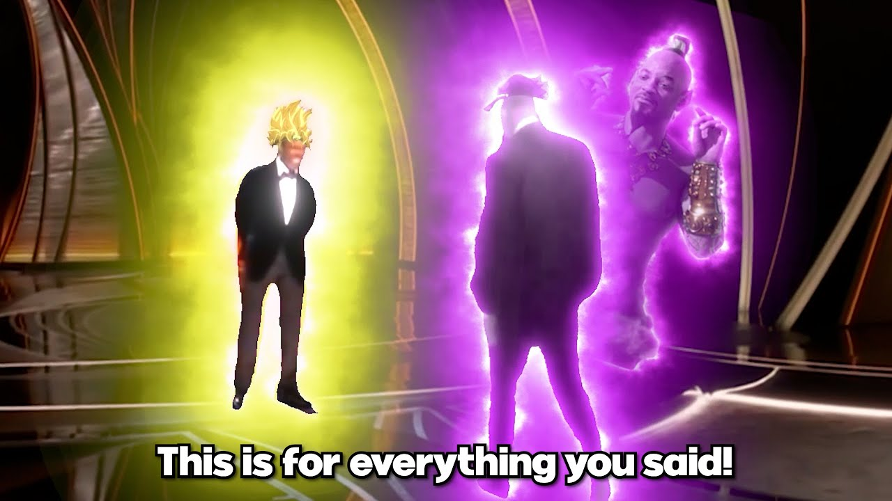
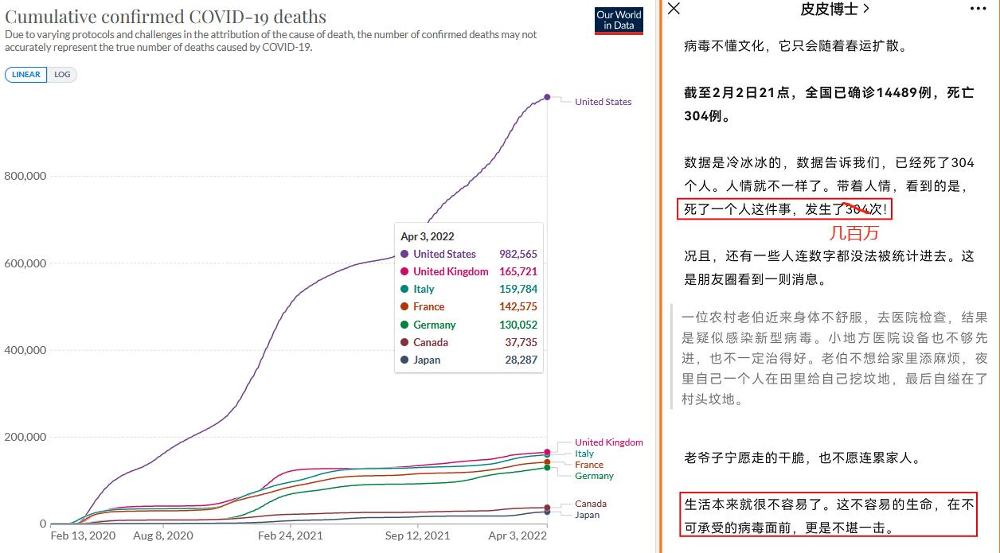
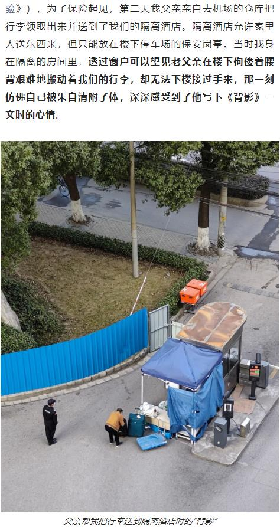
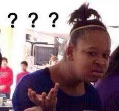

# 从奥斯卡那一巴掌说开去 | 抬杠工程

（不会还有人不知道这个梗吧，不会吧不会吧）

最近看到的一些事情串起来还有点想法，一时兴起更一篇短文。首先是看到了一个有意思的分析这件事的文章，忘了第一次在哪里看到的了，后面又看到一篇就记了下来，引用：

> 台湾地区中坜信义的小学老师洪黄祥就在脸书分享看法，引起强烈回响。洪黄祥老师在学校利用3个班的社会课，拿这个事件跟学生们讨论，但采取分阶段透露讯息让学生知道。
> 
> 公众号：导筒directube
> 
> 《引人深思，威尔史密斯奥斯卡施暴事件引发的一场小学实验》

关于这篇文章的内容我就不多重复了，主要是借鉴一下文中对各方面信息的收集和对事件的拆解。除了当晚发生事件本身之外，还有一些从本人动机方面的考虑，指出演员意图从政的可能性，目前是在立人设阶段。当然我个人觉得这段演出可能不太行：

> 而且值得注意的是，打人前后威尔·史密斯的表情变化非常丰富，完美展示了嬉笑怒骂四种状态，可能这就是影帝级别的情绪调动能力吧…
> 
> 毕导，公众号：毕导
> 
> 《逐帧分析威尔史密斯打人事件，这届奥斯卡影帝是真能打啊...》

好的关于这巴掌本身就说到这里，借助前面提到的分析思路，来说点别的，比如俄乌冲突最近别称五花八门的某超一线城市，一两周来网络上居然开始讨论起了抗疫路线之争，这里我也放一篇文章，已经把这两年来的声音总结的差不多了：

> 概念八：不开放，其他病患怎么办，次生灾害导致的死亡比新冠还多！
> 
> 拍老师，公众号：拍照稀烂的焦虑怪
> 
> [转载] 还好互联网有记忆

所以套用一下之前的思路，我们把问题拆解看看，面对目前情况对生活的冲击，可以拆成几个问题：

造成现状种种不便的原因是路线选择问题还是执行结果问题？

如果是路线选择问题，目前其他路线的结果整体会是什么样，比现状要好在哪里？

如果是执行结果问题，那为什么会出现这样的执行结果？

如果是准备不充足导致的执行结果，那是否表示更早之前的方案有问题？

（借鉴演员从政论，来点阴谋论式的延伸）是否有某些人希望造成这样的结果，并引导公众质疑路线的选择？

上面的问题我都不一一作答了，下面说一个可能发生的事情：

> 第四十二条　传染病暴发、流行时，县级以上地方人民政府应当立即组织力量，按照预防、控制预案进行防治，切断传染病的传播途径，必要时，报经上一级人民政府决定，可以采取下列紧急措施并予以公告：
> 
> …… 
> 
> (四)控制或者扑杀染疫野生动物、家畜家禽；
> 
> ……
> 
> 《中华人民共和国传染病防治法》

合理推断，病毒广泛传播意味着广泛变异，目前已经出现了人畜共患变种新冠病毒：

> B.1.641（白尾鹿+水貂+人类共患变异株，加拿大特产）；
> 
> 拍老师，公众号：拍照稀烂的焦虑怪
> 
> [划胖] 对不起，但XE可能已经过气了……

什么你说家养宠物没事？不好意思，香港今年初就已经证实了：

> 最后，鼠传人之后继续形成社区传播链，很不幸还是没问题的……
> 
> 拍老师，公众号：拍照稀烂的焦虑怪
> 
> [独家原创]纽约：下水道危机一发（后记）

总之病毒如果变异出了人狗共患/人猫共患，那么你家猫狗死定了。而且看国外五花八门的变异，谁都不能打包票说这一天不会到来。

最后要喷一下之前推荐过的一个印度博主，当然原文已经消失了，我想办法刨坟鞭尸一下，首先看两段原文：

> 我们国内说奥密克戎一来外国又躺平了——这种说法并不确切——他们在德尔塔那波疫情确实是躺平的，但这次却是站着的，因为奥密克戎的强度已经不足以击倒他们了，既没有造成医疗挤兑也没有造成民众恐慌。
> 
> 说一些“政治不正确”的话 公众号：随水文存

从统计数字来看死亡人数曲线的确是直线站起来的，我也不知道这算哪门子站起来。至于没有医疗挤兑那的确在理，但现实情况是什么呢？还是要感谢之前引用过的拍老师，他的文章能破解各路信息迷雾：

> 2022年第九周（2月28日）起，NHS病床占用率上涨到93%，继续逼近2021年初（Alpha爆发高峰期）的恐怖记录——所谓在医疗崩盘的边缘疯狂徘徊，大概就是指的这种情况吧。
> 
> 拍老师，公众号：拍照稀烂的焦虑怪
> 
> [境外疫情观察] 看！漂在大气层上的NHS！

小时候我有点难以理解为什么天启四骑士分别是：瘟疫、战争、饥荒和死亡。明明前三者都会死人，为什么死亡要单独拎出来。现在我有了特殊的感悟，那就是最初的死亡都有特定的原因，瘟疫带走老弱病残，战争带走壮年男性甚至普通民众，饥荒带走一切，最后的幸存者能体验到的是一种目睹大规模死亡后带来的麻木感，放眼望去尽是死，已经没啥意义去追究怎么死的了

至于民众不恐慌，好吧，我只能说媒体霸权真好用。世界霸主就是家底厚。之前常听到的一句话，有钱人家的孩子可以不断试错，他们有错的成本，穷人家的孩子错一次就要付出一辈子甚至几代人的代价

我还没喷完，再看一下这段话；

> 优秀的个体非但不具备繁殖优势，甚至繁殖意愿相对更低，这很可能会导致人类的整体智能水平停滞不前……
> 
> 说一些“政治不正确”的话 公众号：随水文存

我只能说幸好这个博主是人文行业从业者，要不然他可能真的会去搞基因编辑婴儿（等等，好像这个真的有人搞了）甚至去搞搞生命之泉计划？这着实是科幻达尔文主义了，叹为观止，尤其是这老哥还是上有老下有小的人，能说出下面的话：

> 首先，其他国家的老百姓在第一波、第二波的疫情里面已经被筛选过一遍了，接受了病毒的“洗礼”，那些老弱病残扛不过去的，早就被淘汰了，剩下的都是“抗病害品种”。其次，其他国家在接种疫苗的时候，都是给老年人等高危人群优先接种，而我们的接种策略则相反，因此其他国家老年人等高危群体的预存免疫也要优于我们国。
> 
> 说一些“政治不正确”的话 公众号：随水文存

尤其是这个老哥在历尽千辛万苦终于回国，他爹还给他送行李的画面还给他感动了一阵子：

我不太清楚这人在写下上面那段文字的时候有没有想过他家老人和孩子可能就是“那些老弱病残扛不过去的，早就被淘汰”的一员。如果这人是真的这么想，我只能说体验过印度思想的人果然不同凡响，反正有转世轮回保不好还能转世投胎到北欧是不是，这不赌一把？多说一句那些暗中希望我国养老金和意大利一样实现盈余的人可别忘了，病毒对小孩也是有杀伤力的：

> 全美0-17岁年龄段一共有6个小倒霉鬼死于流感， 同一时间同年龄段，超过1200位儿童死于新冠……
> 
> 拍老师，公众号：拍照稀烂的焦虑怪
> 
> [后台点播·奇文共赏] 激战！流感VS新冠！（小祖宗版）

可能也有人也暗中希望孩子也灭一批，毕竟人口下降的话20年后房价也跟着降嘛对不对。但是你们可能也会失望了，央视都说了：

等等，原来有些人是希望喜迎房价上涨啊，噢，我懂了，还是我太年轻，有些人已经在大气层了，是我无知了，果然我还是too young too simple，买不起房的人果然 naive……

最后一看总字数又两千多字了，用个段子来总结一下吧：

一个月前，深圳：我通过封城实现动态清零

上海：我通过精准防控实现动态清零

一个月后，深圳：我清零了

上海：我们要共存！

