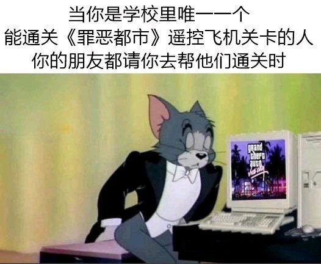
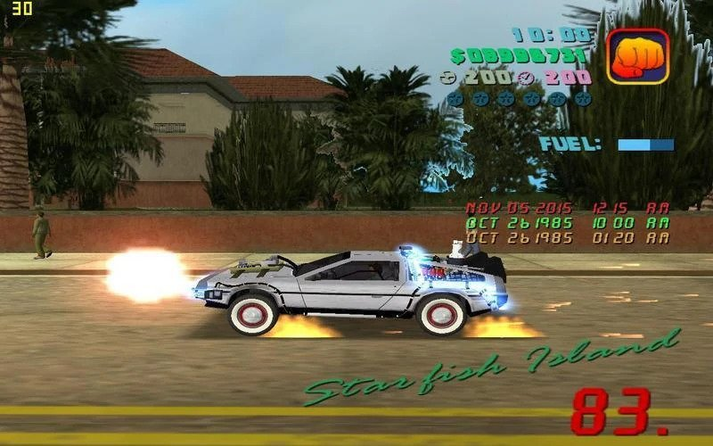

# 又菜又爱玩 002 | GTA VC

这个缩写懂的都懂了，这部大名鼎鼎的作品，全称应该众所周知吧

**友情提示：大量剧透警告**

**友情提示：大量剧透警告**

**友情提示：大量剧透警告**

---

;

我想了一下，这篇写出来不算是常规的吐槽，对我而言它不仅仅是一款游戏那么简单，因此这篇文字更像是 “一款游戏能如何影响一个人的成长” 的故事。

2006年，也不知道我爹妈为什么愿意给我家拉了网线，我算是朋友之中最先接触到互联网的人。而且当时我姑丈也比较热衷折腾电脑技术，早早地给我家安装了光碟刻录机，也教会了我怎么刻碟。某天在和朋友们的扯淡时我发现有些家里没拉网线的同学有下载游戏的需求。于是我想到了一点：当时，700M容量的CD刻录光盘售价两块五，如果我五块一张卖出，可以净赚一瓶汽水，正好这些同学也愿意把零花钱用来买碟。于是我果断做起了这个小生意：同学告诉我想下载什么游戏，我给他下载好刻录进光碟里，就这么来回交易了好几次，我也接触到了不少之前没听说过的游戏。然而这个利润率100%的盗版生意（践踏人间一切法律.jpg）很快被我自己发现似乎不太合法，于是我就主动停止了服务，估计总共也就赚到几瓶可乐的钱而已。

扯远了，在我短暂经营盗版光碟生意的那段时间，有个朋友就给我提了侠盗列车罪恶都市这款游戏。当然可能和那时的大多数网友一样，我下载到的是300多M的阉割版本。啥叫阉割版本呢，就是砍掉了游戏里所有的电台音乐、过场动画音频，只留了本体的可玩部分，将安装包大小压的最低。当然我们这群小学生懂个啥，当年第一次进游戏，看到这么大的地图，有枪有车有飞机，还可以各种为非作歹，以及有各种秘籍和作弊器能用，当然是兴奋的不行，只要能进入游戏，啥都不用管，先把变态武器和锁血弄出来，然后就疯狂突突突刷六星，后来甚至能玩出啥飞天坦克之类的（车辆悬空秘籍+坦克向后开炮）总之就是把能用上的秘籍都排列组合试一遍，轰轰轰不亦乐乎

最初的新鲜感过去之后，我产生了一个疑惑：这个游戏该不会就只有这种玩法吧。开头的过场动画里那些无声的画面更是加重了我的怀疑：这些人看起来在说话，但是却完全没声音。控制主角走到A点紫圈标记处也会触发过场动画，但这些人指手画脚是在干什么。放完动画好像地图标记变了，界面上还多了几段英文（当然我那个时候连单词都不认识几个）。种种疑点让我合理怀疑这个游戏不止如此。果然，当我找到百度贴吧的时候一切都明朗了——这个游戏是有故事的，而且我下载到的是阉割版，完整版有1G多，那个年代的1个G简直大的无法想象。于是经过漫长的等待时间，我终于安装上了完整版的罪恶都市，过场动画里的人物终于发出声音了，坐在车能听电台音乐了，我也从贴吧里学会了如何存档、接任务、推进剧情、购买资产等等操作。当然那个时候我的英语水平还是一个辣鸡，也没有汉化补丁这种东西，所以只能看贴吧里的主线攻略，看一关，玩一关，这样才把整个主线通关，了解到这个游戏的全貌——一个黑帮分子从零开始不断为非作歹建立自己的黑帮帝国的故事。不过那个时候我才刚上初中，对里面很多情节都没有成年人程度的共情，而且对很多情节根本都不理解，更别说透过剧情去感受R星讽刺现实的意味了。但这的确是我认真体验的第一款剧情向游戏，让我感受到了漫无目的突突突以外的推进剧情的乐趣，也为我后面成为GTA4玩家并发现我是个剧情向玩家奠定了基础。

当然GTAVC对我而言不光是剧情游戏启蒙这一点，它和百度罪恶都市贴吧共同激发了我用电脑进行创作的欲望。不过说起创作欲望这一点，其实我更小的时候就发现了。2004年我跟我的小伙伴家里刚配置电脑的时候，就通过互相借光碟的方式，玩到了《整蛊邻居（Neighbours From Hell ）》1、2两部游戏。被里面的情节逗得爆笑之余，我也开始构思一些自己原创的整蛊情节，要怎么跟朋友们分享呢？嗯，画个火柴人漫画不就完了，于是我用垃圾画工在作业本上开始了漫画连载。当然这种垃圾画质就不拿出来秀了，后来也因为有些沙雕传阅的时候没注意被老师当场抓获并要求供出作者——我。当年的老师并不鼓励这种不务正业，经历几次批评我这种画画的行为就被压抑了下去。但是到了网络时代就不一样了，我发现贴吧里好多人用罪恶都市游戏的截图，配上文字，就是一部精彩的漫画故事，看了网友的脑洞，我想我能不能也做一部呢？

然而并没有，GTAVC原版不太满足我的脑洞，我想下载一个《回到未来》的Mod来开始创作，奈何网上完全没资源（0kb/s 0%），所以并没搞出图片故事。但是，我在贴吧里还看到了另一种形式的创作：飞车特技视频。这个好做啊，用游戏自带的回放模式，下载一个录屏软件，加上Windows系统自带的Movie Maker（剪辑软件）就能搞！于是我就搞起了，并且在2007年的暑假出了我的第一部视频作品，就是罪恶都市的游戏录屏。后来开始玩魔兽争霸3，想到也可以录制魔兽争霸，于是用魔兽地图编辑器搞了一部魔兽版国庆阅兵，然后就是第一部有真人出镜的魔兽搞笑短片，再后来学AE做简单的特效……把网瘾变成生产力，最初的起点就是，这款永恒的《侠盗猎车手 · 罪恶都市》

后话：

视频制作贯穿了我的少年和青年，但最开始那两部GTA录屏真的就是剪出1分钟随便配个BGM就出片上传到视频网站，而且还是56网，麻了这个网站现在居然还活着，但我已经想不起来登录账号了。而且更蛋疼的是我把原片弄丢了，现在存在我硬盘里的版本还是从网站上扒下来的320p高糊版本……后来做到第三个视频才有意识要把原片存好……

惊觉时间已经过去15年了，2016年以后我就没怎么动手出过视频，也没有搭上短视频的风口当个UP主啥的，不由得要感慨一下……
