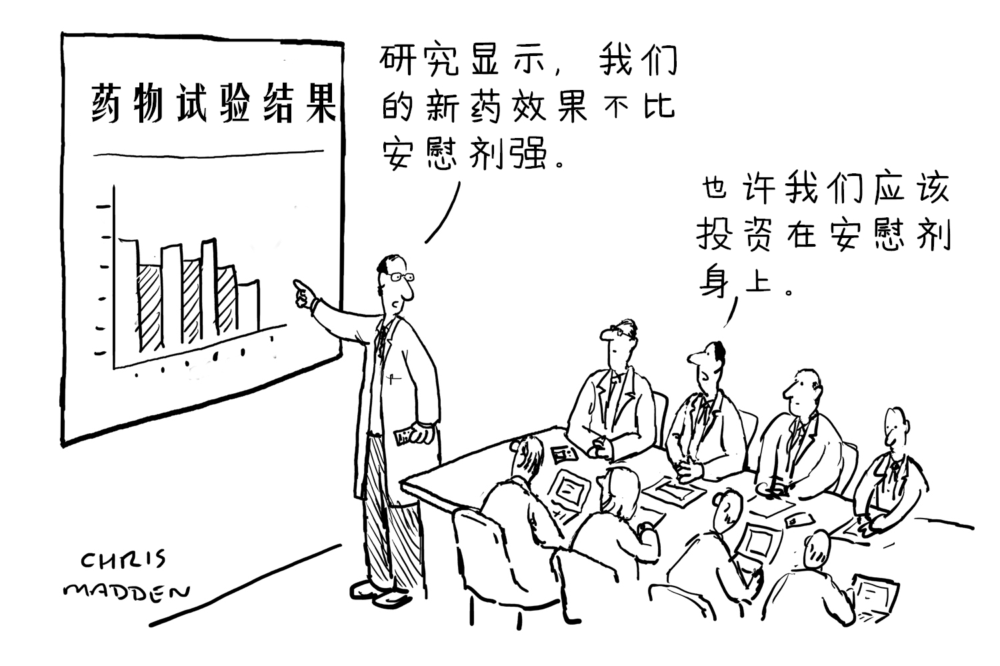

# 关于安慰剂的思想实验 | 抬杠工程

时间有限，更一篇短文，仅仅是思想实验，请勿联想

众所周知有个东西叫“双盲实验”（不知道的同学长按词语-选中-搜一搜），设计的本意是用来避免安慰剂效应的，关于安慰剂效应这可牛逼了，大意就是有些人可以做到“我自信我自愈”

好的那么假设，就是假设啊，没有别的意思，在没有实验组的情况下，我们能不能直接用生理盐水来触发安慰剂效应？毕竟，安慰剂效应是真实存在的，总有一部分人可以获得比完全不做任何事情更好的结果

好的，就写那么多，联想不好，禁止联想

creadit: Chris Madden

