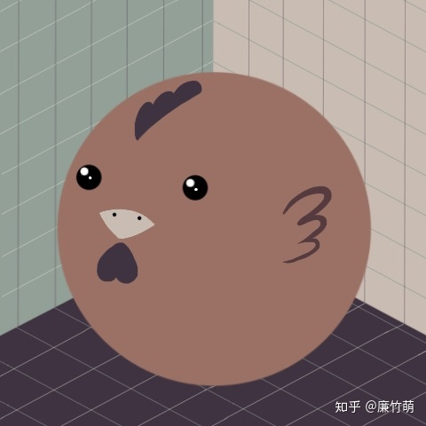

# 哪有那么多真空中的球形鸡 | 抬杠工程

时间有限今天还是更短文

真空中的球形鸡也算是一个火出原本学科的概念了，大概是物理学计算中为了方便总是设定些便于计算的条件和形态，以至于能出现“真空中的一只球形鸡”的概念。我最开始接触到它的时候还因为脑补出来的形象过于搞笑还自己傻乐了半天。

仔细想想这种过度简化其实在现实生活中常常发生。这也是我上一篇文章《关于安慰剂的思想实验》遣词造句非常克制的原因，因为仅从安慰剂效应出发去解释现实，本质上也是设定了一只真空中的球形鸡，所以我并不希望读者有过多的联想（此处真的没有双关）

从三年前疫情开始到现在其实也陆续接触了很多观点，安慰剂效应也仅仅是其中之一，从利益链条角度也能分析出些长篇大论，后面还有更大的医学之争甚至文明之争，什么一盘大棋之类的观点一个比一个刺激……我也不多嘴了，还是退回昨天的思想实验

曾经我也是个唯双盲实验论者，讲科学嘛，理科教育训练出来的结果。但是这毕竟是用在人身上的，又不是真空中的球形鸡，涉及到人就不得不多想一些，比如疫苗的双盲哪里搞的，诶对了，第三世界国家。要是在国内搞会不会媒体霸权的铁拳直接就砸过来了？那第三世界国家的人就不是人了？诶你别说，人生而为人，只不过有的人要更人一点（手动狗头）

还有一点，就好像是基督教在中国一定不会拿耶稣跟跟玉皇大帝他们排坐次，这个算是所谓原则问题？一旦把耶稣和中华传统的神仙放在一起，那从就表明基督教接受了这一套系统，所以基督教一定要维持自己一套泾渭分明的状态，坚持完全不一样的说辞。这个故事可能也代表了目前的某种态度和观点。

总之，很多事情就跟今年奥斯卡那一巴掌一样，从不同角度、获得的不同信息、可以得到更多的结论，世界上真的没有那么多真空中的球形鸡
