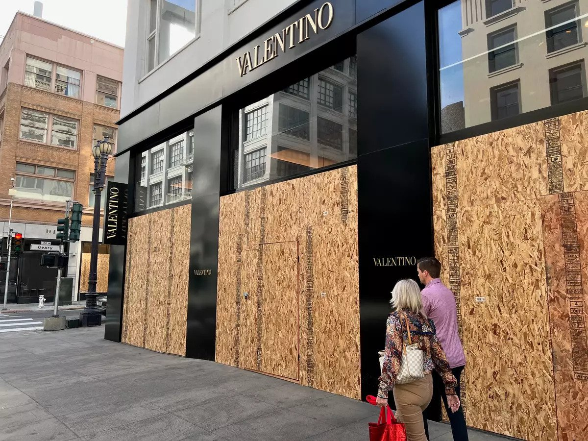
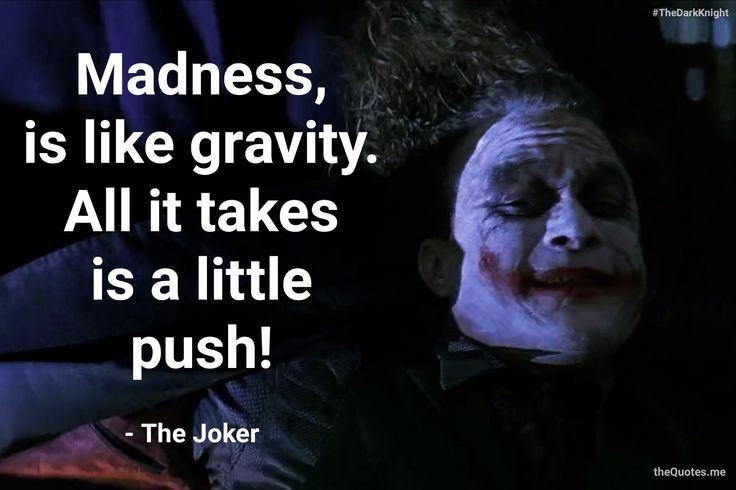

# 人间观察笔记 2022.05 | 99.99% vs 0.01%

本期内容我自己想想都觉得可能会有点过分，因为会涉及一些女性权利的话题，姿势水平不够可能就会变成打拳，或者被拳打，不过无所谓了，我现在的水平能写成啥样是啥样吧，毕竟水平的确不高。

这个月有两个看着相对难受的事情，一个是明公写的公众号文章，我用一句话总结就是：房子就像女神，玩够了之后就该找人接盘了。不是我硬扣帽子，这可是人家的原文：

> 正如地产大王李嘉诚不会赚最后一个铜板，资深的老海王也都知道要在妹子年老色衰之前，给她提前找好退路。（我一个哥们说他喜欢送去读长江商学院等EMBA）
> 
> [《520的降息与解除限购》](https://mp.weixin.qq.com/s/ANINTChRKgQ7lovrTM1cpw)
> 顾子明 政事堂2019

里面既提到了那个白嫖死🐎玩意，也提到了EMBA这种高学费圈子，还套用了虎扑NGA社区常见的渣男女神舔狗老实人的故事模板，总之看完整篇文章下来我感觉不太舒服。但仔细一想我感到不舒服的原因是什么呢？

有句名言叫，有些人反对特权、痛恨特权的原因是自己没有特权。结合一下我也是半个大脑在长下半身的物种，很难说我不舒服的原因里没有🍋的成分，因为明公用的虽然比喻很下里巴人，但也正是因为互联网时代来临后这种渣男玩女神最后甩给舔狗接盘等事情都能普及到用来做梗了。毕竟，自古以来，“美女是稀缺资源”，文章只是用当今的事实来做比喻而已。事实让人感觉不舒服，那么这里面要么不符合期望，要么引人嫉妒，要么二者兼有。

下面我要开始扣帽子了，给玩够的女神找人接盘是不是物化女性。什么叫接盘，我笑死，这俩字用都能用在人身上，女神是不是人，能接盘女神，那是不是物化。所以一整个接盘梗看起来只有老实人输麻了，渣男和女神都有美好的未来，但是别忘了接盘本身的强烈物化女性意味，所以这个梗里只有男性是人，女性是可以被“抛盘”的物体，这么看来老实人也赢麻了，你至少是可以参与交易行为的主体，而不是被交易的物件，而且再嘴贱一句，老实人还得感谢渣男，要不是他抛盘，你都没机会接盘女神。

好的关于这个梗的批判先告一段落，看下一个故事。

我有个朋友（女）最近在找工作，在面试国企的过程中遭遇了非常明显的性别歧视，比如开门见山地问什么时候结婚什么时候生娃，或者有面试官提醒说，后续流程的面试官会有强烈的性别歧视，让她在面试时“突出自己的工作能力”。朋友就觉得整个环境就很变态：一边希望女性生三胎，一边就业歧视女性。我当时就灵光一闪，啊这不就是三赢吗？首先就业歧视下去，女性失去经济来源，只能通过婚姻（或者，上文说的找渣男或者老实人）依附在男性身边以求生存，此时男性的就业压力降低了，得到了人生伴侣（或者，只是个搭伙过日子的异性），响应政策（和老一辈人殷切的延续香火的期望）生了一二三胎，这样未来的劳动力得到了再生产。往大了看，一是解决男性就业问题、二是解决男性婚姻问题（别问，问就是捻乱，君不见梁山好汉一百单八，有几个成家带娃？）三是保证了出生人口，解决未来人口断崖问题。国家赢三次，也是三赢。所以国企招聘实施严重的性别歧视不正是在积极执行国家政策吗？女性那么积极打工搞钱，怎么会老实呆在家里生三胎？所以总的来说一点都不变态，是你们把现实想的太好了。（我这里先阴阳怪气一把）

结合以上两个故事我们可以看出当代女性的社会地位确实尴尬，一方面作为稀缺资源的美女一如既往地能资源变现，另一方面大部分女性因为具有不可替代的十月怀胎的能力，受到男权（或者用赵主席的话说，父权）社会的剥削。这部分的内容我也暂不展开了，刚刚赵主席的文章贴这里大家感受一下：[男人可选择的三条人生道路（女生勿入）](https://mp.weixin.qq.com/s/txwFTW-KQkt23uMMK-iDVA)

承接上文，作为半个脑子长在下半身的动物，异性散发着天然的吸引力，同时我们也有着天然的破坏倾向。这也是我在之前的文章中提过的，“三年血赚，死刑不亏”这个段子背后的可怕之处 —— 作为理性经济人，如果真的觉得死刑不亏，那一定会去做三年血赚的事情。有个我不太想提但真实的例子就是，以一人之力捣毁整个顺风车业务线的故事。所以，迈入现代后的性解放运动，连带着对女性着装外貌等等的“审美变迁”，都增加了我等屌丝男睡到/接触到女性的概率，降低了我们走上死刑不亏道路的风险。当然这只是屌丝的部分，父权阶级那部分我不了解，大家可以尽情脑补。另外，关于审美变迁，以“我可以骚，你不能扰”作为出发点，我隐约觉得现代女性或主动或被动地成为了一种“玻璃橱窗中的展示物”。真实的玻璃橱窗展示物——商家给群众开辟出的一块展示区域，不用进店就能观看到商品，从而激发购买欲望。顺着这个逻辑，现代社会里给女性准备的玻璃橱窗可太多了，从穿着到妆容，互联网时代后还有无数的美颜相机、无数的社交平台，总之就是让女性“自信表现自己”。那，男性群体怎么看？当然是戴眼镜、拿放大镜、用望远镜，360无死角地看。这不就是隔着玻璃对着里面展示着的商品流口水的画面么。而且每件商品明码标价，给人一种“有钱就能进店购买”的感觉，激励着我们努力赚钱消费进店买走。而且这个比喻的现实意义是：当前大环境下，橱窗内的商品不会被打破玻璃窗抢走，如果这个前提发生了改变，那么：

男性角度说完我们转到女性角度，当然我本人毕竟性别不同很难下结论，只能从提问题的角度来思考。首先上述事实是男性和女性共同面对的，作为女性个体，是否能意识到日常生活中接触到的信息，有多少表面上是打着取悦自己旗号，实际上是为了让你自愿走进橱窗中的呢？还有认识比较清楚的女性，在看到女神梗的真实故事后，会觉得这也是一种反向的不平等么（对男生而言是只能当老实人，对女生而言是没有机会用颜值变现）

想到这里我突然有一个联想，有个名词叫“工贼”，在当年的语境下，指的是不参加工人运动甚至破坏工人运动的人。转念一想，在女性平权的语境下，那些主动接受甚至追求女神人设的人，是否可以叫“女贼”？想到这点就有意思了，同样是被压迫阶级的反抗，工人运动和女权运动有着很相似的地方：
- 比如刚刚说的工贼现象；
- 比如想修福报还得是985211的毕业生，想被富人玩弄还得有女神级的颜值；
- 比如现有机制下工人的对手其实不是资本家，而是其他工人：劳动效率高的能获取更多报酬，以至于内卷。女神的对手不是富人和老实人，而是其他女性，一个极端的例子：其他人都打拳，就她不打，那男生岂不都追她一个；
- 比如工人和女神基本上都有35岁淘汰的年龄压力，福报企业能给N+3，资深海王能送EMBA不白嫖；

之前只是笼统的感觉马克思主义者（我现在都不敢自称这个了，还是叫“马克思主义爱好者”比较合适）一定也是一个女权主义者，现在细想一下才发现那么多共通之处，也难怪，同样是被压迫的群体，面对的境遇也很类似，同时，《共产党宣言》里都写了要消灭“人对人的剥削”，那么非常自然地男性对女性剥削也属于其中，是要被消灭的对象。所以马克思主义者必然是一个女权主义者

打个岔，突然想到一个加急笑话。我在文中引用了《共产党宣言》，请问我的身份是：
1. 小粉红
2. 共产党员
3. 境外势力
4. 屁民

最近还在酝酿一篇关于《大空头》的文章，想起2008年之后爆发的占领华尔街运动，用阴谋论的说法就是这么一联合可把那些上层精英吓坏了，赶紧分化群众，十几年后灯塔国变成现在群魔乱舞的样子。其实我在写上面文字的时候也想到了，写这些算不算挑动对立。但，现在所谓的对立看起来都是50% vs 50%，甚至说100个 1% 互相对立，而且总会给每个群体一种 1% vs 99% 的悲壮感觉。然而实际上的情况却是 99.99% vs 0.01% ，谁是那 0.01% 大家都心知肚明，可是 99.99% 早就被分化成原子了，只能说你大爷真的是你大爷，工作做得真好，要去联合 99.99% 谈何容易。至于对立问题，宣言里早就写了，本来就是对立的，该消灭的东西要消灭，何况没说一定是肉体消灭。不过我感觉对 0.01% 来说，消灭了现有的特权可能比肉体消灭他们还要难受吧。

最后谈一谈人性（Humanity）这个词，这点东西方好像是共通的，提到人性大家想到的都是好的那方面。可字面解读“人性”不就是人的作为么，那么多“没人性”的事情都是人做出来的，为什么“人性”只包括好的那部分呢？我猜可能是古人的一些美好愿望吧。这里引用一张图作为结尾顺便呼应上个月的文章：

人性的堕落何尝不像重力一样，毕竟有几十万年的自然选择沉淀，写在DNA里的东西没那么容易变，随便一个黄赌毒就可以激发出人性中恶的部分（当然，以后搞出基因编辑人了当我没说，然后关于自然选择我还有个细思极恐的猜想：现在的女性是几千年父权社会人工选育出来的温顺品种），但重力是可以被克服的，就像1903年以前一样，“所有尝试飞上天空的尝试都失败了”，更不用说，1961年，1969年，仅六十余年后，人类就能向太空进发了。因此，我们的事业，也只是还没有成功罢了
