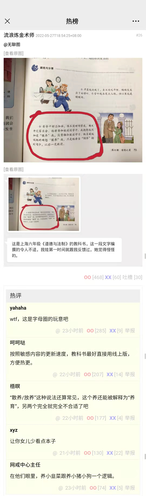
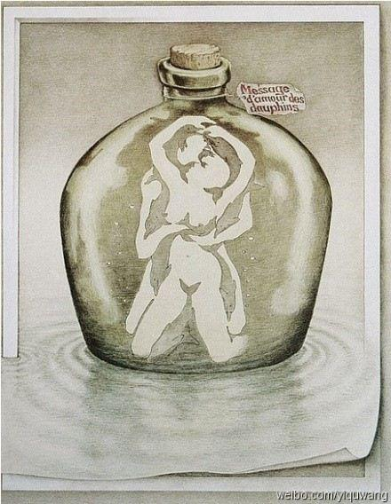
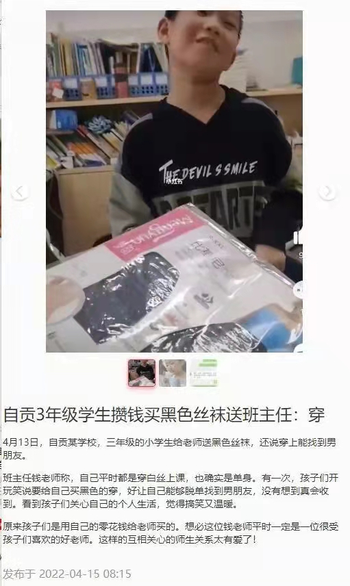

# “圈养”比喻和九只海豚 | 抬杠工程

不会有未成年人点开了这篇文章吧？左上角有一个黑色的 × 看到了没？点一下就好

---

最近刷煎蛋看到一张教材图和蛋友的吐槽，有点意思，更一篇短文，首先开局一张图：

我也不是要跟风鞭尸毒教材，也先不批判把孩子当成牲畜养这种比喻映射出来的封建糟粕，就讨论一下用词。光看第一个词“放养/散养”，从小到大我妈就挂在嘴边，说她小时候一直都是“放养”我。所以用第一个词是可以的，成人和小孩都不会想太多。至于后面两个词，从第一个词的比喻出发，“散养” 相对的是 “圈养”，再精细化一点是“饲养”，似乎也没啥问题？从 “放养/散养” 到 “圈养” 到 “饲养” 的递进逻辑清晰，就是不太文雅而已。

然而从教材图之后的内容就开始画风迷乱了起来，聊天记录里也没说六年级的娃（女）觉得怪在哪里，反倒是评论开始往父女play上面想了= = 我的最开始想的也跟 “梧瞑” 的想法前半段类似，但另外两个不至于到 “完全不合适” 的程度。看到蛋友的评论，我突然回想起了一个十几年前的一张老图：

标题应该是这样的：“1秒测出来你是否纯洁”

正文是这样的：“真正纯洁的孩子只能看到9只海豚”

热评是这样的：“海豚？什么海豚”

类似地，“散养”、“圈养”、“饲养”，在孩子们的眼中，其实是不是都是9只海豚？有些时候成年人的强行指出反而会让孩子过早的接触到成人信息，导致一种欲盖弥彰（我高考语文也才刚及格，这里应该用啥词）的后果

但是，我们别忘了这个年代的小孩比我们小时候懂的多的多了，举两个例子：

首先是这个搞笑的社会新闻，仔细想想这群小鬼是怎么得出”穿上黑丝就能找到男朋友“这个结论的，其次~~年少不知白丝好~~这群小鬼是真的这样想的么？

另一个例子，是发生在我朋友身边的真事，她任教的小学里，发现一个男生（几年级不太记得了）画R18本子，而且内容还是迷奸类型的，而且还在班上传阅。我这种加急地狱笑话爱好者都直接哑口无言，这什么加急地狱人生。

所以我现在甚至还有另一个问题，现在还有多少小孩能看见9只海豚……？
