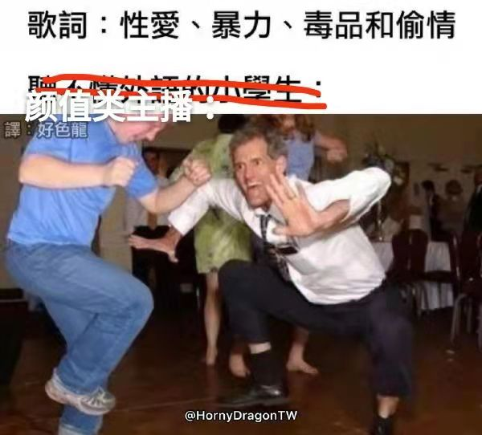
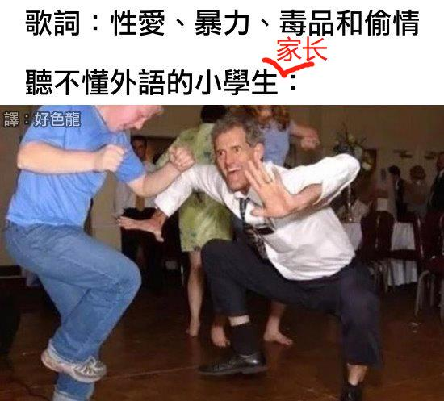
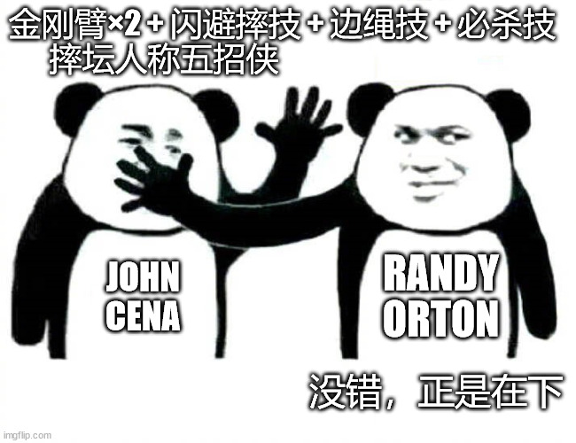

# 听不懂外语的小学生家长.avi | 抬杠工程

我曾经做过一个梗图来讽刺现在的短视频BGM：

但最近我发现这个讽刺对象又得改了，大概是这样：

某天我正开心地用某短视频APP刷着WWE摔角视频，然后这个APP的推荐算法给我塞了一个热门视频到我的推荐列表，本来我马上就要划掉它了，但是响起的人声让我大呼不对劲。于是找了BGM把字幕配上给大家感受一下（未成年人已打码保护）：

[视频就到腾讯那边去看吧](http://mpvideo.qpic.cn/0bc3nmaaaaaawuac6s3zzbrfa26dabvqaaaa.f10002.mp4?dis_k=ca804039bcc16f43b2517c6dbbeaf818&dis_t=1654416603&spec_id=undefined1654417637&vid=wxv_2391038618586038273&format_id=10002)

点开这个用户头像一看，好家伙，两个女儿一个11岁一个7岁，配的BGM是什么虎狼之词。当然了解美国文化的读者可能要说了，这来自RAP界的经典曲目《Shake That · Eminem · Nate Dogg》你在这瞎BB啥。可是这玩意黄毒兼备诶，加上未成年少女的画面……基本上就是禁忌的加急地狱笑话领域了

（没看懂歌词的读者也无所谓，大概就是我在梗图里讽刺的那样）

当然我觉得这个BGM估计也是烂大街的网红配乐，99%使用它的人估计也就是图个动次打次或者卡点，可能90%以上看视频的人都不会注意到这个BGM，能听出来歌词含义并且意识到这种歌词+未满12岁少女的组合非常不合适的人，估计只占观众群中的很小很小一部分。应该怎么对待这种视频作品，说实话我没想好

首先站在未成年人本人的角度来说这玩意属于安全风险，我要是她们同学，肯定会不安好心地来一句：“妹子，你也不想这个带歌词翻译的版本让我传出去吧？”先霸凌一波再说。而且就算现在没有发生，这些视频等到同龄人的知识广度达到能理解BGM歌词之后，就会成为黑历史。“妹子，你也不想你年轻时的这种视频让我到处乱播吧？”

其次，我本人算是个文化自由派，觉得文化创作这种事情不应该有过多的干预。但是注意，过多的干预，适当的干预我认为是必要的。但是就这个案例来看，我有点拿不准干预的程度在哪。首先要听懂BGM的含义对目前我国内容安全审核的从业者肯定有点难度，而且也很难把歌词放进审核标准里。比较可行的方案是从源头去识别BGM并禁用掉，但先不提成本，人民群众喜欢这种节奏感强的配乐来做卡点视频，群众也喜闻乐见（这点等下再展开），你算老几？

所以一个相对折中的方案就是，各类短视频平台给用户提供足量的动次打次音乐，满足群众对卡点音乐视频的追求，也要把糟粕歌词排除出去，尤其是要消除对未成年人的安全隐患，这样看起来就皆大欢喜了，只不过目前还没有针对不和谐BGM的整治网络平台专项行动，由铁拳来专门盯着这个功能，我估计上面的理想情况很难在短期内实现了

然后回头说下上文提到的 “群众喜闻乐见” 。我其实是持怀疑态度的，首先我是群众，我就不喜闻乐见；其次众所周知什么热门推荐算法都有背后的操纵。这种动次打次音乐是真的人民群众喜欢，还是因为有算法 & 大V们不断地重复制作+推送，才让人民群众以为这是他们喜闻乐见的作品呢？（请自行搜索 信息茧房 ，或者按对岸人民的说法：同温层 ，以下省略几千字）

……

最后，既然开头提到了WWE，我还是得吐槽一句，只要你活得够久，就能见证Randy Orton成为五招侠。人家赵喜娜的金刚臂 + 侧方抱摔 + 边绳 You can't see me + FU 五连招现在好歹也加了第六招“闪电拳头”，兰迪大叔倒好，成正派了，也成五招侠了，金刚臂 + 反抱摔 + 边绳 DDT + RKO，还能更像么你俩？唉，辣鸡WWE，弃了弃了（下次还看

