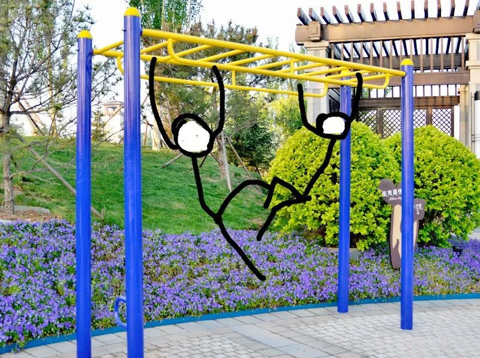

# 大空头 但十五年后 | 抬杠工程

我有点忘了我第一次看这部电影是什么时候，可能是本科的时候？留学的时候又看了一遍，工作后又看了两遍，所以至少是看了四遍，常看常新

影片中金融相关知识的介绍，网上已经有大量的影评了，我也没啥能说的。这次有感而发的是电影中的大概第二幕，大概是2007年那一段，“Truth is like poetry. And most people fucking hate poetry.” 

我得先解释一下剧情：起初，银行把成千上万的房贷合同打包在一起，作为一个理财产品对外销售。大概的逻辑是：成千上万的房奴本来是要还钱给银行的，比如借200万，25年后还300万。银行不想等那么多年，于是将这堆合同打包，当成理财产品卖了，售价230万，卖给有钱人，有钱人一看这好啊，反正我现金存着也是贬值，买下这堆债务过25年后净赚70万爽翻天。

聪明的读者应该马上发现了这里面的问题：万一房奴还不起钱跑路，有钱人就收不回300万了，那为什么有钱人还愿意买呢？这里面就引入了风险的概念，房贷合同的确有违约风险，但不高，而且债务打包，几个个体的违约对总体价值来说影响相对不大（当然后面还有再打包以及打包的平方等操作，这个不是重点，知道根源是房贷就行）

到了2005年，一代神人蝙蝠侠Michelle Burry（下面简称MB）通过阅读市面上发售的这种房贷理财产品中包含的成千上万份房贷数据，发现还不起房贷违约的个体数量比想象中要高，而且还有继续升高的趋势。这意味着这些理财产品的价值将会下跌，因为它的价值是房奴今后要还的钱，而房奴很快就会还不上钱了，也就是说它很快就会一文不值。于是，在万恶的资本主义社会，MB决定恶意做空房贷理财 —— 具体做法是说服各大银行参与一场赌局：房贷产品价格上涨，MB赔钱给银行，反之，银行赔钱给MB

这就是电影最开始的情节，后面由于消息传开了，出现了另外两三个最早的空头，故事开始围绕这三方展开……当然这不是本文重点我就跳过了

2007年1月，很多房奴还不起钱断供的消息已经传开了，甚至已经上了新闻。按常理来说，这就是空头们赌对了的时刻：房贷理财理论上也应该不值钱了。然而并没有，这些理财的价格稳如老狗，也就是说这些空头还是得给他们赌局的对家赔钱。因此这几个空头或多或少都经历了怀疑人生的阶段，但随着房贷断供新闻越来越多，房贷理财价格却丝毫不掉的现象，让他们意识到，价格的反常意味着市场的不正常：跟他们对赌的银行发现自己要输了，赶紧让其他人坐上赌桌把自己换下来，然后自己跑去坐到空头的位置上

2007年7月，房贷逾期越发严重的现象都已经见报了，MB在联系银行的时候，得到了这样的回复：（技术故障，眼熟不？2021年的时候，他们急了，甚至可以拔网线）

2008年1月，过了大半年，MB才接到了一通电话：

2008年3月，美联储召开了30年来首次紧急会议出手救市，2008年全球金融风暴在我们面前展开

我小时候有这么一段回忆，下面这个健身器材大家应该很熟吧？我小学的时候非常爱玩这个，经常像个猴子一样在中间横杠上荡：

男生们经常玩一种游戏：左右两边各一个人，向中间爬去，双方要接触到之后，可以用各种方法让对方掉下横杠，一般来说是用腿夹住对方的腰然后使劲晃，让对方双手失去耐力摔下来

我小时候的手臂耐力还是可以的，虽然平时打架个子小力气不行不占上风，但是一旦上了杠凭借耐力也是可以赢一两局。有天我对上了一个相当强大的对手（就叫他瘦版胖虎吧，平时欺负人的事情他也没少干）在杠上鏖战一番后他臂力不支掉下去了。但我这胜利的喜悦还没持续3秒钟，因为这货站稳后直接冲我给了一拳，然后我也掉了下去。

我赢了吗？就那一局游戏来说，我赢了。但痛苦的还是我，因为我挨揍了。

> 这不是和约，这是20年的休战。
> 
> 费迪南·福煦，法国陆军统帅

有个比较阴谋论的讲法：2011年，群众反应了过来，占领华尔街运动轰轰烈烈地展开，打出了We are the 99%的口号。顶层精英一看这不行啊，赶紧分化群众，赶在金字塔底层连横之前，竖着切，搞合纵，左右之争搞起来，种族分化搞起来，性别对立搞起来，彩虹旗上要多少颜色给多少颜色，于是大洋彼岸成了现在这个样子。

至于我们这边，只能说热烈庆祝计划生育即将实现预定成果 —— 人口负增长。你我都懂。

距离2008（或者更早，按2005年来算），也已经快到20年了。现在我们在哪呢？我就直接一图流吧：

上半部分的三个时间节点分别对应了电影中三幕情节发生的时间。可以发现席卷全球的风暴开始并被世人所知的时候，空头已经获利离场了（因为不离场的话对手可能已经破产，也就是说赢了赌局也没有获利）对比下半部分的走势图，现在似乎也已经过了电影中银行疯狂自救的时间节点，该到空头离场的时候了，也就是说接下来会有好戏发生。但是这次又是什么崩了，我这种普通人又怎么会知道呢？

Where do we go now？

可能你会说看上图，就算是金融风暴，指数在4年后又回去了，甚至还创了新高啊，我也太悲观了吧。

是，回想一下零几年那时的国际形势，一片风平浪静，平地摔一下好像是没啥问题。但20年后的现在……

我接下来应该会去看看1929年的资料
