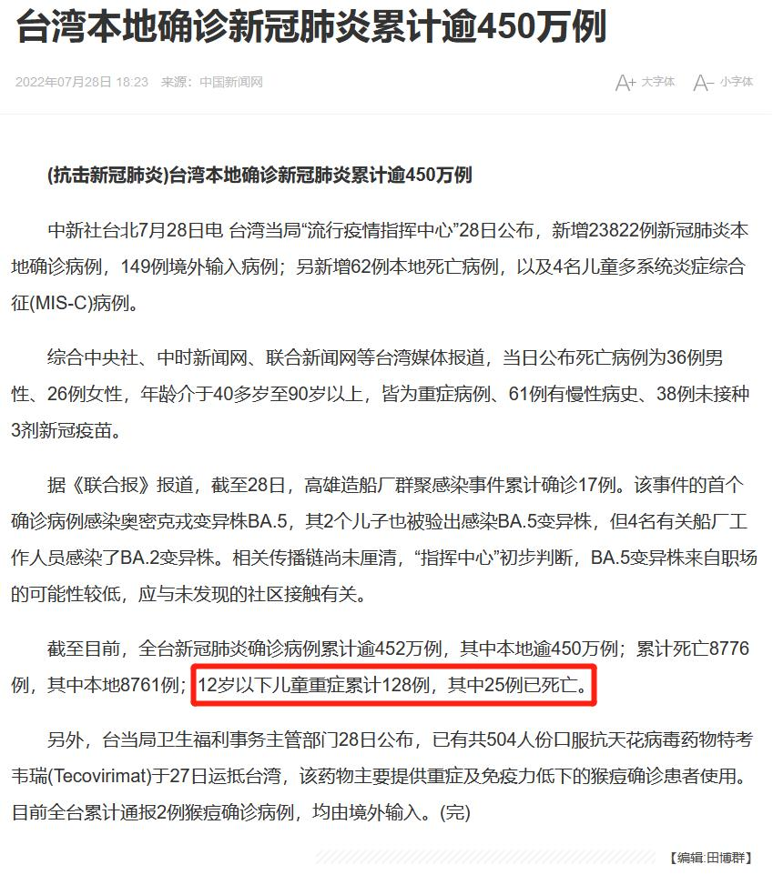
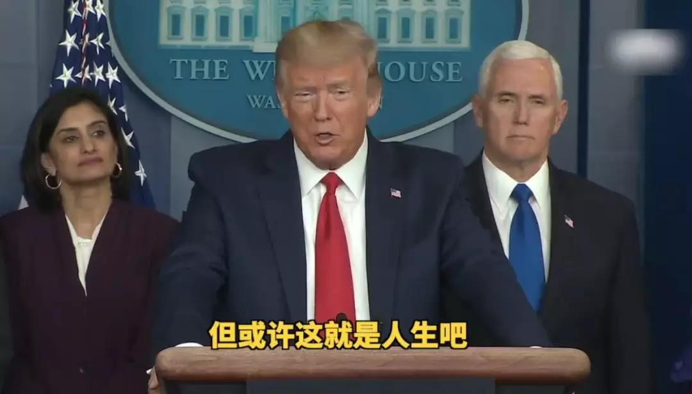

# 人间观察笔记 2022.07 | 生命至上

平时日常阴阳怪气搞反串反讽都搞出精神分裂了，我自己都觉得这个标题就是本着阴阳怪气嘲讽去的。

既然是这样顺手发表一个暴论：“那些嚷嚷要偷着乐的人，麻烦去看一下原文，说的是外国记者，你们这些人没有乐的资格”

好的发挥[疫苗人](../07/vaccine_man.md)本色（本月的抬杠工程小短文）我自己解析一下：首先是蹭了偷乐的点，其次是引用了原文中提到的外国记者，意图勾起大众对一等洋人社会现象的不满，同时最后拉踩群众，塑造一种清政府舔洋人欺百姓的形象。牛逼不，美分赶紧给我打钱。

但其实互联网发展到今天越来越多人发现，就算是算法加强了信息茧房效应，但更深层的原因还是人性本身，那种只愿意相信自己觉得是对的事情的特质，什么食古不化，冥顽不灵，固执己见，成语都已经帮我们总结出来了，所以多一个五毛不多，少一个美分不少，但舆论场就是这样一条一条发言营造出来的，积少成多，聚沙成塔，有时候我也不得不思考其他人的精神世界，果真如此容易被同温层影响？从结果上看也许的确是这样的。

好的这个月的反串美分也差不多到这里，回归正题。去年开始从朋友圈观测到几个因为参与数字货币获得不小经济收入的人，然后在网络上也看到零星的“我有个朋友炒币实现财务自由润到加拿大了”类似的故事。虽然我主要好奇的是这帮人是怎么穿透国家的禁令进行操作的，但还有另一个想法，那就数字货币是一个向全世界开放的赌场，能赚到钱的当然就是其中少数几个赌徒和开赌场的人。因为赌场本身并不创造财富，只是财富的重新分配，那么有两个人暴富了，就有九十八个人受损失。那么，你会反对国家禁止你进赌场的政策吗？

说完跟钱相关的，回来看看跟命相关的，是的偷着乐又回来了。那些怎么死都行就是不能死于新冠病毒之类的言论我就不重复了，大家都有感觉。但回归事实看看，病毒传染速度快，一直在变异，健康的成年人染上会难受几天，可能出现长期症状。老人和体弱者重症死亡几率大，有人可能还暗搓搓喜迎养老金盈余，但小孩就更夸张了，不明肝炎目前还是不明，而且也有直接升天当小天使的可能。这就是世界其他地区的现实。

重症128例，死亡25例，看起来好像不多？但如果这发生在你家呢？养了几年的小孩说没就没了，会是什么样的情景？开句非常没品的玩笑，要是美国看到台湾这个样子，一定会送自由民主上门……等等台湾有自由民主啊那没事了，等等怎么送了民主党众议院长过来……？

有时候我也惊讶于群众的忍受力，明显从2020年新冠病毒大流行开始，多少人丧失了生命，多少人因后遗症工作生活受到影响甚至维持收入都成问题（打个岔，上海爆出了用人单位歧视曾经新冠阳性的务工者的新闻，新冠到底有没有后遗症，资本家清楚的很啊同志们）可是再往史书里看两页，多少句“人相食”提醒着我们炼狱是真实发生并且重复上演的事情。我们把世界想的太好了，丛林从未远去，还在加速回归。两年前人间观察笔记刚开始动笔的时候提到的比烂逻辑依然有效甚至越来越明显。长大了才明白独善其身已经很难，兼济天下从出生就注定了不可能。2020年前还是歌舞升平，这两年接着奏乐接着舞，到2022年特别军事行动的炮声开始掩盖乐声，现在下一波可能就近在眼前……

既然要暴论我再补一个美国总统选举笑话的2022年版本吧：我有一计，保证当选，首先竞选纲领是当选后立刻入侵日本，这样军工集团的支持就有了，然后宣布无条件授予日本女人难民亲属签（国家分配waifu），这样美国男性的选票有了，不缺女人之后生育应该也不愁了，号召各州不限制美国公民堕胎，这样白左女性的选票有了，最后谁去当兵送死呢？当然是黑人和非法移民群体了，入侵日本后土地产权按军功重新分配，重新上演一次西进运动，这样黑人选票有了，最后在冲绳建设全球免签的水龙敬乐园，这样全球统治阶级的支持有了。最后日本反正也跟五常里的中俄有梁子，英国反正是美国小弟，然后让澳洲还法国两个潜艇订单，五常支持就有了。最后反正签了不打核战争的文件，常规战争还收视不了自家的狗？至于韩国，换子给中朝就好。国力收缩回第二岛链，冷战还能打三十年，剩下的就交给后人智慧好了。这个计划太完美了，就差一个美国国籍我就能当选了。

看完上面的事情会不会觉得荒诞至极？但里面引经据典每条都有历史渊源，看起来又合理的的一批，曾经发生过的历史再次上演一遍是不可接受的，但是为什么呢？说实话我们可能真的不能理解，但是把视角切换一下，会不会在西方人或者所谓西方文明世界下的眼中，死人真的就是家常便饭，新冠死亡人数全球第一（当然这可能是因为第二第三检测能力不足让出来的第一），枪击案频发，抢劫强奸零元购都得往后靠靠，为什么他们不觉得生命至上？

谁的生命至上

虽然别看我好像五毛全开一路输出美国，但我还是要突然反串回来扯一句，一旦中国超越美国成为世界老大，中国会不会更快美国化，毕竟这个月看看你二舅再看看人家大伯，今日美国，明日中国的潜力还是有的，到那时候，谁还能喊出生命至上？
