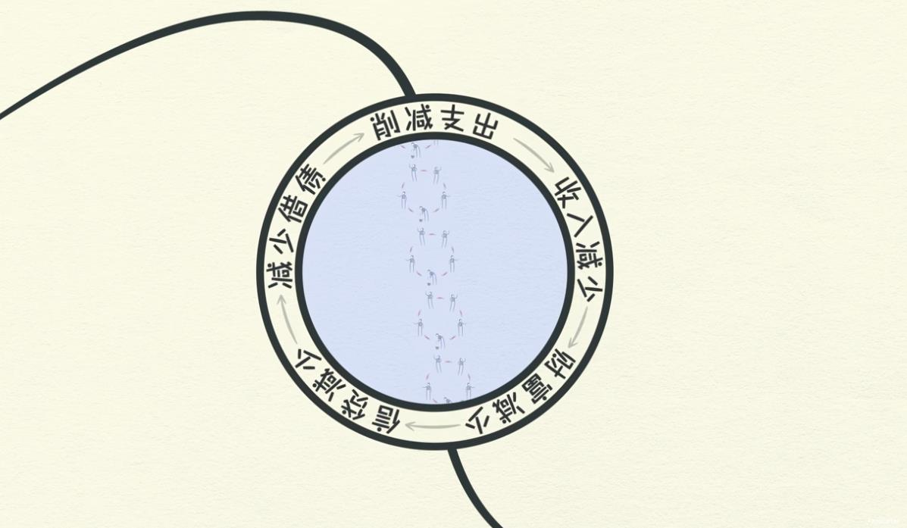
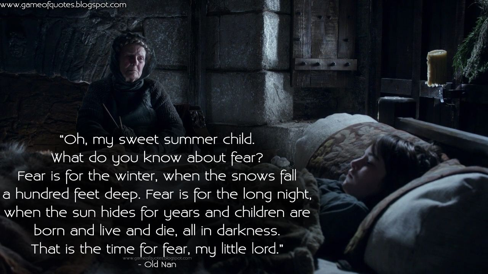
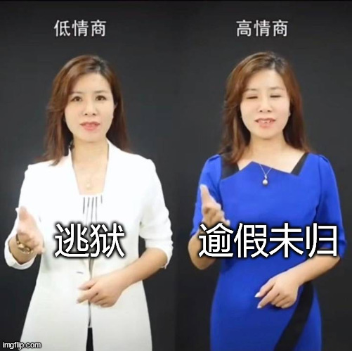

# 人间观察笔记 2022.08 | 凛冬将至

又到了每月码字的时候，这个月可有意思了，月初某退休老人一通操作让全国网民都以为要击落专机对美宣战了，结果月底来个达成审计底稿协议，看起来又是握手言和。来多点这种转折挺好的，多看点实事，可以避免落入二极管思维。对现在网络舆论里动不动就划分五毛美分也是二极管的一种，而且这是一条恐怖的道路

前几天正好又看到好几条某东南亚公司的传闻，最夸张的还有人在异国刚下飞机被毁约了，着实有点唏嘘，今年年初还面过这家，最后没选，但现在的工作也不是铁饭碗，这不任总也来给大家传递寒意了。何止寒意，字面意义上的活下去就是胜利。看世界新闻就知道，这两年有太多人，跟我们一样的，普通人，无产阶级，百姓，屁民，没什么事就先挂了。不信就去数数小白旗，体会一下什么叫死一个人发生了几百万次。当然群众的眼睛是雪亮的，当所有人都感到寒意了，那么下降循环就开始了，这里借用达里欧的一张图：

再借用杨世光常说的一句话，当某物涨价时，买不到某物，当它价格下跌时，没有人要买它。

下降循环近在眼前

就好像冰与火之歌的异鬼，正好是个绝妙的比喻。人类在发明金融工具之后，衰退就像那几十年几百年会回归的凛冬一样，一定会回来，有时候异鬼大军会一起跟着下来。我们这一代真的就像剧里台词中的“夏日出生的孩子”，从未见识过凛冬、长夜和异鬼

再往下想想，这个绝妙的比喻甚至还能呼应上最新的龙之家族衍生剧，原来龙家要征服大陆问鼎铁王座还有一个隐藏动机，就是要率领大陆人民在凛冬中对抗异鬼，龙家统治者的形象突然就高大上了起来，但也为后来冰火故事蒙上了一层悲剧色彩：龙家被推翻后没人意识到要对抗异鬼了，造成一系列的生灵涂炭。那么，为什么不一开始就昭告天下长夜和异鬼的存在呢？哈，可能马上就有人拿一整本帝王心术来锤爆我的狗头，毕竟屁股决定脑袋，阶级决定思想，存在必合理，等等。不过如果脑洞开大点，站在人民的角度当然是越早准备越好，如果执政的是代表人民的政党呢？异鬼还会是秘密吗？长夜来临时整个龙石岛底下的龙晶应该已经把长城守望者武装到牙齿了吧，直接箭雨犁田，甚至都用不着龙。

等效比喻回来，如果长夜和异鬼分别代表经济衰退周期和随之而来的天启骑士，那么，人类并不是没经历过这些，这次会有什么不一样的吗

上面两张图，一张是波士顿圆脸在自媒体博主事业起步后，为全国各地有需要的人、事做过的捐赠合集。关注时政的小伙伴应该都看过圆脸的视频，也算是个大号了。下面一张是台湾网红好棒bump，他最近成名是因为从阿联酋迪拜、柬埔寨等地成功救出被诈骗集团绑架强迫劳动的台湾人，将营救经历发上网，反被台当局指责是不实消息。上下对比一下会发现果然江山代有才人出，无论出生在哪里，都有挺身而出为人民做事的年轻人，那么，这不比虚无缥缈常常双标的民主自由要普世的多？

（补一个小吐槽，这要是放在一百年前，组织是不是已经跟对方接上头了，现在还有没有组织啊

最后收尾总结吧，经济循环，历史周期律，凛冬和异鬼，似乎的确是人类无法避开的事情，面对这些就是面对人类和这个现实世界本身

月底突然又粗大事了，一名逾假未归的逃犯持刀刺死了两名警察，一查嫌犯是个“外役监”，不是逃狱是“逾假未归”，后续一查，“截止2022年8月23日統計，外役監近十年脫逃者共計49人，其中45名為趁返家探視未歸，僅4名是由機關內跑出去而脫離機關管制力範疇者。”

在此不厌其烦地老调重弹：
 
> 海恩法则，是航空界关于飞行安全的法则。海恩法则指出: 每一起严重事故的背后，必然有29次轻微事故和300起未遂先兆以及1000起事故隐患。

其实同样的道理也可以用在别的地方，极端暴力事件同样也会跟着凛冬一起发生，有时候我也好奇有些念头是不是本身就存在于人的脑海中，就算没有社会新闻的刺激也会冒出来，就像一个永不消散的幽灵，在人性之中游荡，无法逃避，只能自求多福，丛林从未远去
