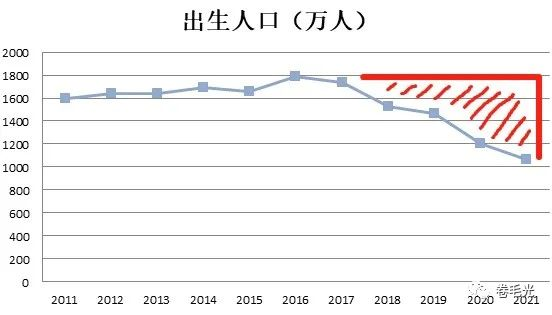

# 人生有多少个十年 | 抬杠工程

开篇前先跳个预言家，什么叫[郑伯克段于鄢](../07/hang_himself.md)啊，一看发表时间7月16日，战术后仰

最近看到母校又在发布校庆公告，回想起十年前也是5年校庆10年院庆接着来，同学还找我问入学十年有啥能搞的事，真的让我瞬间梦回十年前了

（下一秒：吔屎啦）

有一种观点是现在的经济下行其实是2008年金融海啸的余波，甚至2008不是和平条约，而是20年的停战，未来实际上是一波更大的要来了。本来应该在上一次金融危机中出清（应死尽死，破产倒闭，被看不见的手调节.jpg）的实体非但没死，还续了十年阳寿。不过，债就是债，十年后还也是要还，虽然结果都一样（甚至要还的更多），但，谁还？

朝菌不知晦朔，蟪蛄不知春秋，年少不知比特币，税收已到2010年，只恨没有祖宗十八贷，斯巴达克斯终将发出咆哮

人生有多少个十年，但

有些人就没有人生，因为他们根本没出生

文末再跳反一次，和平时期叫人口红利，动荡时期叫……治安风险，什么叫高瞻远瞩啊（战术狗头
