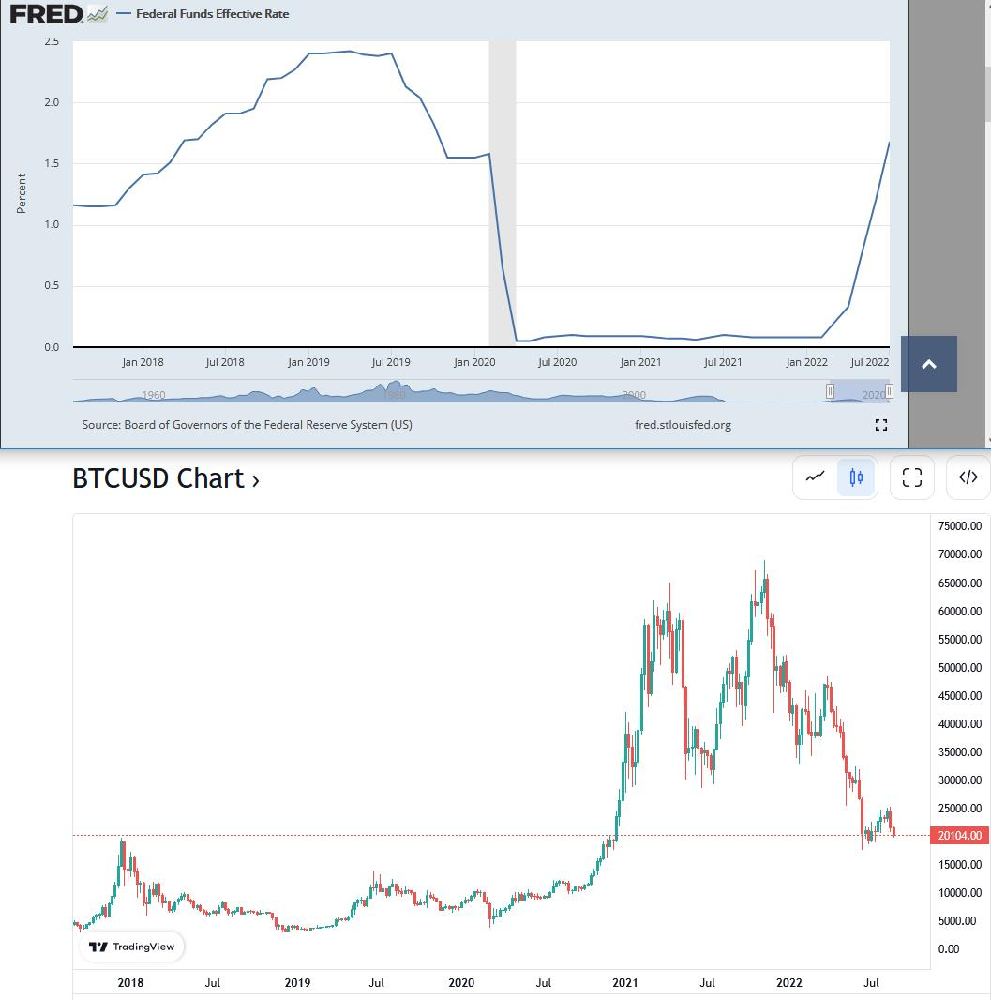
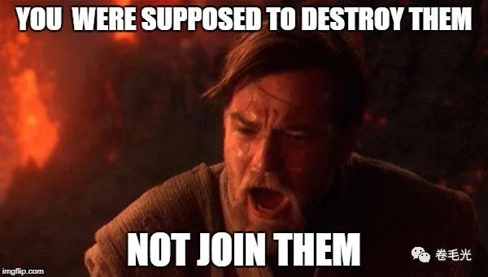
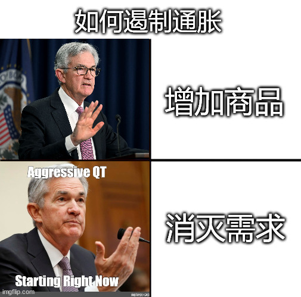
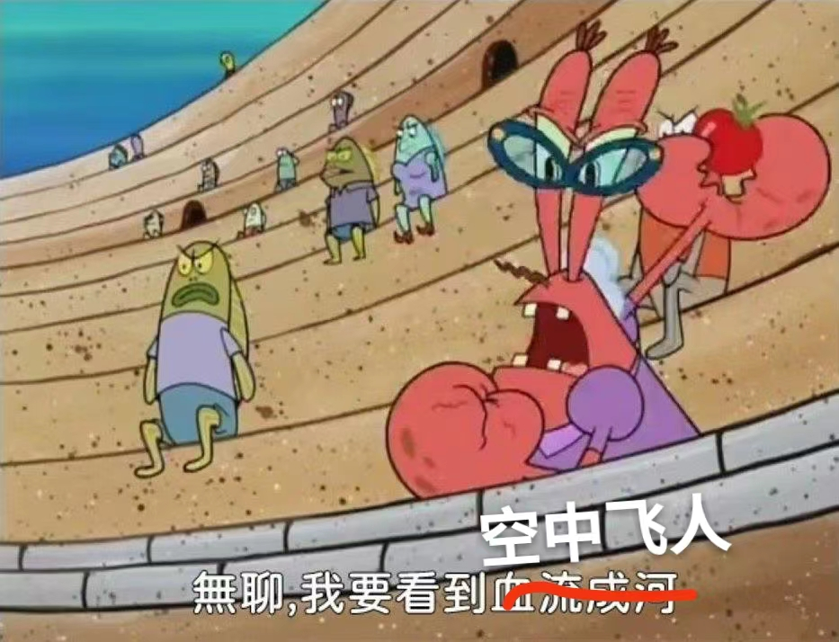

# 被招安的比特币 | 抬杠工程

又来更短文了，这次不止是标题党还是一图流

首先说一下背景，我也不装什么理中客，对于比特币等投资品，我就两个态度，一是身边有人炒币发了，酸的牙掉，二是矿老板让我几年换不了显卡，气得肺炸，总之就是一生无脑黑

然后就是一图流了：

简单连接一下上下时间轴，可以简单比喻成，2018年以前的比特币还是刚刚聚义的梁山，结果被加息围剿，但到了2019朝廷发现没钱剿匪了，只能暂时言和，到了2020辽国大军打过来了，马上就把比特币招安了，招安之后，嗯，之后的事情大家都知道的

还有个有意思的巧合，这两年大火的一款交易软件就叫Robinhood，就取名自西方故事中的绿林好汉。那既然如此我也用西方文化的梗图来吐个槽：

当然你也可以说我一叶障目不见泰山，那当然，我现在已经是无脑黑了，这个公众号3月份就发了文章吐槽比特币：[《比特币本质上和网红的洗澡水没有区别》](../03/bitcoin_is_basically_bathtub_water.md)

马上就要征方腊了哈哈哈，再跳一次预言家，6月份的自产梗图《梗图自产计划 004 | 下里巴人》

噢对了我又忘了他们可以做空，麻了，我牙又要酸掉了

