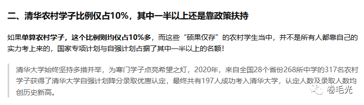

# 当时只道是傻逼 | 抬杠工程

偶然回忆起十几年前高中的一件事，于是有了标题这句感慨

有点忘了是高一还是高二，学校通知说每天的晚修要开补课班，美其名曰“培优”，提供 语数英物化生/政史地 等全部高考科目的辅导，就是一中自己的老师上课，每科每周开一次班，每科报名费一学期大概几百块，想报名的同学去各科代表处报名交费

我当时听完一拍大腿就爆笑了，居然有人愿意花钱买作业？而且还是在疯狂赶作业的晚修时间上课，而且上完课甚至会得到更多的作业，是嫌作业太少做不完吗？傻逼才会去报名吧？

然后我就成为了班上少数几个一科培优班都没报名的 真 · 傻逼 之一，其他同学至少都报了一科，甚至还有报了两科的，我觉得要不是因为时间冲突，可能有人会报个三四科。看到这个报名盛况我都震惊了，原来傻逼竟是我自己

培优班这玩意还是学校自己搞的补习班，统一调配老师、时间，收费的价格，一学期二十几周才几百块。要是这些老师在课外开班呢？

我的义务教育生涯中至少见过三个在校外开补课班的老师，初中语文老师，高中数学老师，和高中副级长。其中初中语文老师是直接在家长会上找我妈精准推销的，每周日下午上她家补习一下午，然后我语文成绩还下降了，然后我妈大呼上当直接就不续费了，据说交了几千块，然后我还因此记恨她一辈子，因为强行侵占了我无所事事的周日时间。高中的数学老师是在课堂上暗示了他课外提供补习服务，最开始我还没听出来这个话外之音，后来有同学说他去上了他的课外补习班我才知道的，但也没问价格。至于高中副级长，后来一个一中学妹去找补课班，还真找到了已经辞职不干老师专门做补习班的她，据说收费是一节课几百块，一节课，能顶我们一学期的培优班费用了，学妹她妈还担心小朋友觉得贵不去上，甚至没告诉她真实价格

一中开培优班的事情，我好像从来没给爹妈讲过。我估计以他们当时的认知，应该会敲着我的脑袋骂我傻逼，几百块能买到的补课简直相当于不花钱，能提高分数收获的大好前程岂不是白白丢弃了。不过要不是我初中以实力证明了上补课班反而会让我成绩下降，他们可能甚至会贼心不死给我安排上

上大学之后没几年就出了这个段子：北大清华毕业都买不起房，那还买学区房干嘛？然而，看另外一个数据：

所以说，除了这10%的买不起房的毕业生之外，剩下80%的毕业生，家庭资产里早就已经有多套城市房产了，他们根本不用回答学区房之问，因为家里本来就有。与之类似的还有在深圳打拼两三年存了十几万加上父母给的几百万成功在深圳买房的故事。这种故事越来越多，象牙塔里的小朋友耳濡目染，很难说不会有什么别的想法

更何况老师也是需要应付生活的成年人，他们可能自己也会思考除了技能之外，要不要给学生传递一些别的信息，有些人可能就跟我上面说的案例一样，要么校外开班，要么直接组织学校里的补课班。甚至，现在想想还有个夸张的事情，我的自我认同是shitizen，这个单词是我高中英语老师教的，那节课的主题是2010年度热词，那可是公知群魔乱舞的时代，直接引入课堂了还可行

现在已经十年后了，这几年发生了什么大家有目共睹。也不知道我上面提到的所有事情现在是否还在发生，说不定跟我一样的傻逼越来越多了

今天刚好又是教师节，祝所有称职的教师节日快乐。
