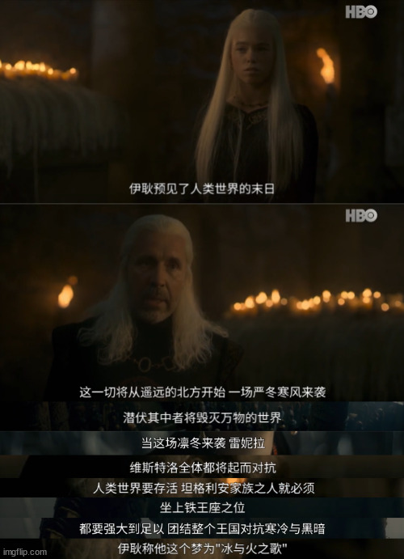
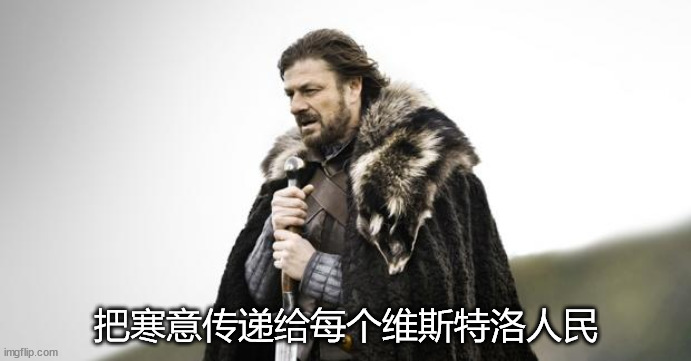
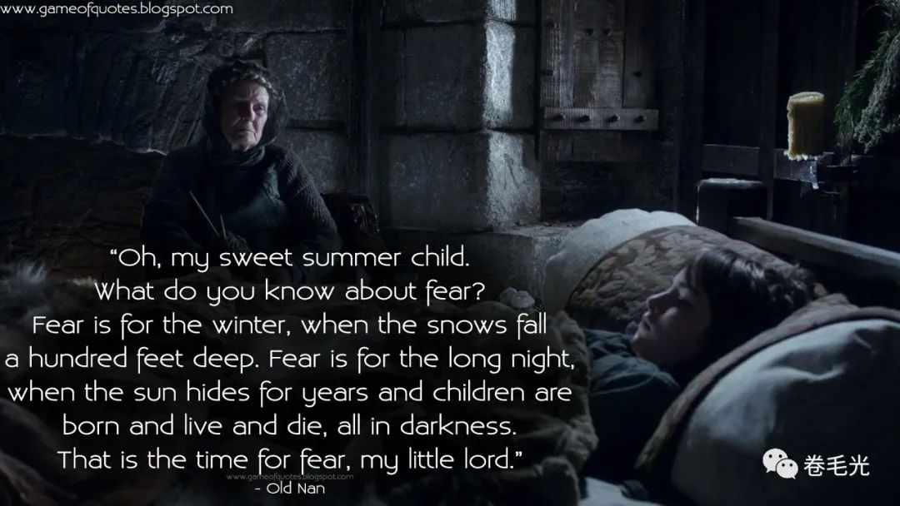

# 把寒意传递给每一位维斯特洛人民 | 抬杠工程

啊最近权游的衍生剧龙之家族开播了，里面有一个桥段让我突然开始疯狂联想。先看剧情：

芜湖直接摆明联动冰火和权游了，突然加进来一个预言，合着龙家要当王原来是出自如此高尚的动机，率领人类对抗凛冬是吧，那整天嚷嚷着 winter is coming 的史塔克家咋算呢，他们可是把这句话作为家族箴言的，咋到了龙家这里就要变成国王代代相传需要保守的秘密了，绝了

然后突然发现凛冬和异鬼是一个绝妙的比喻：人类在发明金融工具之后，衰退就像那几十年几百年会回归的凛冬一样，一定会回来，有时候还会带着异鬼大军一起来。我们这一代人真的就像剧里台词中的 “夏日出生的孩子” ，从未见识过凛冬、长夜和异鬼

再往下想想，龙之家族衍生剧揭露的龙家要征服维斯特洛大陆问鼎铁王座的隐藏动机：要率领维斯特洛人民在凛冬中对抗异鬼，龙家统治者的形象突然就高大上了起来，但也为后来冰火故事蒙上了一层悲剧色彩：龙家被推翻后没人意识到要对抗异鬼了，造成一系列的生灵涂炭。

那么，为什么不一开始就昭告天下长夜和异鬼的存在呢？哈，可能马上就有人拿一整本帝王心术来锤爆我的狗头，毕竟屁股决定脑袋，阶级决定思想，存在必合理，等等。不过如果脑洞开大点，站在人民的角度当然是越早准备越好。要是花两百年时间准备，长夜来临时整个龙石岛底下的龙晶应该已经把长城守望武装到牙齿了吧，直接龙晶箭雨犁田，甚至都用不着龙，更别说看到权游那种无厘头决战了。

在从权游故事转回人类社会的比喻，经济循环，历史周期律，凛冬和异鬼，似乎的确是人类无法避开的事情，面对这些就是面对人类和这个现实世界本身，所以如果我们能从权游故事里学到点什么，那就可能就是如果现实跟故事一样，我们基本上就完蛋了，赶紧想想其他方案吧
