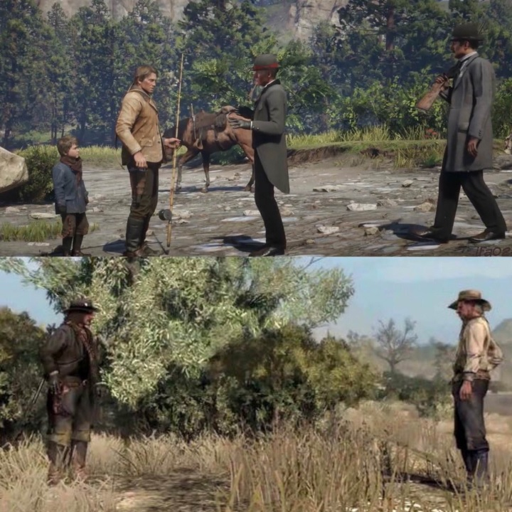

# 又菜又爱玩 003 | 大表哥2

这款游戏是我2020年底和赛博朋克2077一起买的，2021春节后通关了2077，然后玩了下大表哥2的第一章，觉得好像这个游戏也能沉迷好一阵子，但2077已经让我废寝忘食玩了好久了，得缓一缓，于是就先放着没玩

结果2021年末到2022年初我跑去沉迷老滚5了（玩过的小伙伴可以去看我的八千字吐槽：[又菜又爱玩 001 | 老滚5天际](../03/game_review_skyrim.md)）结果今年到了steam大促，大表哥2居然打了五折，大怨种舍我其谁

于是这两个月我就废寝忘食玩大表哥2了，说来搞笑，正好最近我上班通勤的路上读的是水浒传，下班到家玩的是美国水浒传，什么中西结合，而且结合大表哥1的故事，可以发现这俩真的有点神似

**以下严重剧透警告！！！**

**以下严重剧透警告！！！**

**以下严重剧透警告！！！**

大表哥2应该是我玩通关时完成度最高的一款R*游戏了，做完尾声最后一个任务，一看存档完成度90%，我最喜欢的GTA4，最高完成度也才80%多，一般来说任务、支线、随机事件我基本上都是全清的，可能是因为本作的收集要素少了，挑战也有几个比较方便完成的，这俩拉高了完成度到90多。剩下的部分交给网上的彩蛋视频吧。我看到一个99.8%完成度时去亚瑟坟前会有一段特殊剧情动画，可以说十分感人了，有巫师3血与酒通关结尾内味了（说起来次世代版本更新了，要不要再沉迷一次呢）

夸我就不多夸了，总之就是这辈子必玩的游戏，都给老子去玩，唯一可惜的是大表哥1是主机独占的，如果不看1的剧情，就无法完整感受大表哥2的故事魅力，虽然大表哥1是大表哥2的前传，直接玩大表哥2也可以。但这样就有点像，不看星战456，直接看星战123部曲的感觉（至于星战789，是好莱坞衰落的象征之一）。我作为一个PC玩家自然是没办法上手玩了，所以玩到大表哥2尾声的时候，去云通关了大表哥1（正好趁发烧病假在家没事，最近这个时期你懂的，病倒一片）

举一个小小的例子，大表哥2里有一个任务是亚瑟带小杰克去河边钓鱼，在那里杰克第一次遇到了未来的杀父仇人罗斯探员；15年后罗斯探员在河边打猎享受退休生活的时候，被杰克找上门，结束了他肮脏的一生，完美闭环了真是。如果没有玩过大表哥1，可能就体会不到带着杰克钓鱼时，R*编剧安排罗斯探员的出场，向我们传达的这种遥相呼应的命运巧合感。当然大表哥2本身的故事也已经很震撼人心了，与大表哥1剧情的呼应只是锦上添花，但如果你是一个跟我一样的剧情向玩家，那真的非常建议去把大表哥1也看了，在大表哥2中看到R*安排的伏笔的时候，就能体会到这种剧情设计的精妙。

震惊，19岁少年河边凶残杀害退休老人，起因竟是15年前的河边偶遇，观众惊呼：杀的不够爽

好的终于可以开始吐槽了，首当其冲的就是荣誉值系统，大致上在游戏里好人好事会涨荣誉值，反之烧杀抢掠会降荣誉值。不过有些点令人难以理解，钓到鱼后放生会加荣誉值，在四下无人的地方搜刮平民尸体会减荣誉值，所以荣誉值系统……像是个全知的神，一直在审判你的行为。虽然这种超自然的设定出现在大表哥系列里也不奇怪（UFO彩蛋、恶魔彩蛋、石刻任务，还有大表哥1里的高帽怪人，大表哥2里也有相关彩蛋），而且救赎、审判本身就是西方基督教神学体系下的经典设定了。但大表哥里还有目击系统，也就是犯案之后被其他人看见，目击者会去报案，如果无人目击则无所谓。这俩并排放在在一起就有点奇怪了。而且荣誉值带来的影响就很有意思，首先在游戏里，高荣誉值可以带来商店折扣，从9折到7.5折到5折。结合上文，我们可以得到一种玩法，就是在四下无人的荒野不停地钓鱼放生，回到城市里商店老板会给你打折……emmmmmmm？这种不和谐感就有点像我当年高考的时候，老师们一边说着提高一分超过三千人，每分必争，一边说高考时判卷里面有一些运气成分，取决于判卷老师。所以实际上是判卷老师决定了我们是否能排名超过几千人或者被几千人超过？那分数本身就不是一个完全客观的评价指标，每分必争还要和人比较其实没多大意义。还有一点是荣誉值居然在游戏的前4章是锁上限的，我玩的老好人亚瑟在第三章基本的荣誉值就不能再涨了，我还以为是游戏出bug了，到第6章帮完寡妇之后才发现原来是锁了上限，令人迷惑，难道前4章的好人好事还不足以证明我扮演的亚瑟是大好人吗？一定要得了绝症之后才能达到满级？人之将死其言才善的意思？到了尾声后约翰找到雨豪酋长，送他上火车也能暴涨一波荣誉值，这又是啥设定？亚瑟的荣誉值转给了约翰？

荣誉值对最后亚瑟的结局也有关键性作用，低荣誉值时最后和迈卡对决结束后，迈卡离开时会对亚瑟下杀手，高荣誉值时迈卡会直接离开，留亚瑟一个看日出的机会。同样地我们可以玩出这种故事：亚瑟在四下无人的地方放生了很多鱼，然后冥冥之中影响到了迈卡让他不下杀手……？而且迈卡本身就是被塑造成绝对恶的存在，唯物主义地说，就算迈卡知道亚瑟是个好人，但整个剧情线看下来，迈卡并不会因为亚瑟是好人而改变他的行为，从他能出卖帮派并且能果断对帮派成员下杀手就能看出来，苏珊大妈的死就是铁证（不过迈卡也是聪明的，对峙中先杀苏珊大妈，因为他知道老好人亚瑟不会先开枪，但是苏珊杀叛徒不会心软，茉莉就是在众人犹豫之时被苏珊一枪打死的，所以要先下手为强）所以荣誉值高低对结尾的影响看起来也不是很合理，只能说可能因为是剧情删减的关系吧，好像原本除了狼结局和鹿结局之外还有别的结局，传说中的鹰结局还能保亚瑟一条命，可能荣誉值对剧情能起到的作用本来应该更大的吧，最终被删减成了这样而已。

既然提到了迈卡，他的动机其实也有点谜，前四章不断给帮派带来麻烦就不说了，但顶多就是个在老大耳边煽风点火的小人形象，此时人物动机还算明朗合理。第五章跟众人一起瓜马岛落难，九死一生回到美国，然后当起了平克顿侦探的线人，正式背叛帮派。但拉凯营地被包围之后，平克顿的人用马克辛机枪扫射众人的表现，看起来就不像是要留卧底活口的样子，迈卡这种恶人居然不记此仇。况且如果他还是卧底，第六章德奇还犯下了一堆滔天大罪，屠军队，杀康禾，炸大桥，抢火车，甚至迈卡还策划了其中一些，按理说从降低损失的角度，平克顿侦探应该阻止这一切，尤其是康禾还是金主之一，被刺杀了。连金主爸爸都没有保护好，这侦探社还要不要做生意了。总之虽然迈卡是卧底，但他和侦探社之间的合作成果的确不咋地。迈卡在第六章之后的动机就略迷，本来就是叛徒，最后也没有抓亚瑟或者德奇去领赏。如果迈卡在第五章看到机枪的时候已经意识到了对方不会留自己活口，第六章时还要继续的泄露营地位置就不合理了，明知再背叛帮派自己也没有好下场。如果迈卡还对平克顿保留希望，那他应该把亚瑟或者德奇抓了领赏才对。总之迈卡是叛徒这部分的剧情，通关之后回来琢磨一下，会有一些不合理的地方。

不过话说回来，如果我们以养寇自重的角度来看第六章平克顿侦探的不作为，那倒是非常的合理，尤其平克顿还跟CIA和FBI的创立有关联，这是不是也是R*在非常隐晦地暗示这俩货的养寇自重是老传统了。简直就是在被自杀的边缘疯狂试探啊。

再来就是关于金钱机制。首先剧情和营地机制会让玩家觉得，贡献帮派金钱是有用的，但实际上卵用没有，毕竟这是一个白茫茫大地真干净的故事。就算玩家没有给帮派贡献，最后也留不到约翰手上，包括物品、马匹（不过马过了8年好像是会老？不过老兵的白马又可以留给约翰？）玩家甚至要把乱伦兄妹当成银行，让亚瑟去存款，约翰去取款，才能达成金钱传递的效果。剧情中德奇天天嚷着帮派需要钱，才能逃离这一切有更美好的生活。那玩家攒了一大堆，也不会触发关于钱的剧情，比如多少钱才够这种对话。虽然我知道应该不可能有亚瑟一己之力存4万美金带领帮派离开的故事，但好歹安排一段剧情动画吧，内容可以是德奇躲闪具体金额问题的这种表现，用来表现钱其实不是他的真实目的，就够了。以R*对剧情细节的重视程度，少了这么一个关于存钱的玩家反馈路径的确有点可惜。

再扯一两句最近火的不行的碎片化叙事。直接丢结论，我怀疑这是保持游戏的线上热度的方法。把故事情节丢在游戏世界的各个角落，全部见过的玩家才能拼凑或者脑补出完整的故事。那么自然有些没有玩的那么仔细的玩家没办法脑补出来，或者找到了碎片的一部分，想知道更多信息。有这种需求自然线上社区的热度就起来了。拼凑出故事的玩家收获了流量，没玩到那些信息的玩家收获了故事，游戏厂家收获了曝光量和好评……当然我也不是在批评这种碎片化叙事不好，R*在剧情叙事这方面可以说是业界顶尖。比如主线故事最大的剧情转折点，黑水镇劫案，根本就没有直接表现出来，游戏一开始就是帮派成员在雪山逃亡，玩家只能通过日记本和其他帮派成员的对话中了解这次灾难的信息（然后各种up主收集素材做成视频——《1899年黑水镇到底发生了什么》）。然后就是数不清的支线/随机事件/隐藏彩蛋，比如横跨地图东西两端的小屋子里，一个老巫婆，一个隐士，家里各藏了半张藏宝图，拼在一起，可以找到传奇枪手奥蒂斯·米勒的手枪，他的故事在香烟卡和报纸上能看到，结合藏宝图上的文字才能还原整个故事。这还只是其中一个碎片化叙事的例子，这种线索有很多很多

说下想法，碎片化叙事需要玩家去解谜，但这种解谜的乐趣就只属于硬核玩家了，像我们这种废寝忘食打游戏属于奢侈的上班族，基本无法体会到这种乐趣，只能去看网上的彩蛋视频或者搜攻略。所以还是希望碎片化叙事能再降低点寻找难度，我这种普通玩家可能甚至连线索都没发现就通关完删游戏了，如果不去查彩蛋视频，可能根本感受不到完整的剧情魅力，更遑论自行去解谜了。

最后讲一下最前面提到的美国水浒传比喻，大表哥1和2代的剧情连在一起，也是一个好汉聚义，劫富济贫，领导变心，帮派瓦解的故事，最后的大boss当然也都是万恶的朝廷。只不过大表哥1里约翰是被迫招安，而水浒传是宋江领导众人走的招安路线。大表哥系列的人物派系还是比较泾渭分明的，没有水浒式的把朝廷大将劝上梁山的情节，唯一搭边的是站在印第安人那边却被指控叛国的门罗上尉了，但可能美国没有招安这种洗白手段，所以也没法上梁山，只能润了。正好最近中西文化双修，不得不感慨一下，无论是美国西部时代，还是中国封建王朝，人对人的压迫都是相似的，人们的行为也都是相似的，要么生在罗马，要么成为牛马，要么跪下当狗，要么活得自由，大表哥系列和水浒传表现了相同的人性，从而跨越了时空，超越了表现手段，产生了神奇的相似感。

到这里居然有四千字了，差不多就到此为止吧，还有另一篇文章要码字，就酱