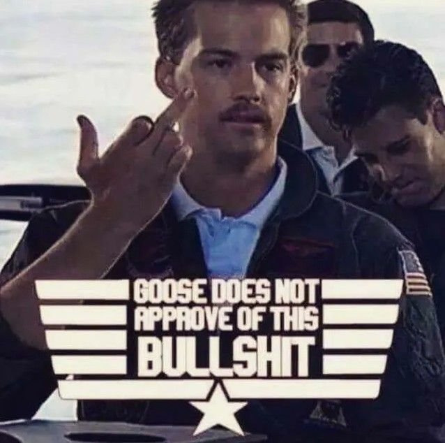

# 更适合中国宝宝体质的 TOP GUN | 抬杠工程

构思这个主题的时候我就感觉可能会招惹一些毒流量，但我的表达欲又让我不吐不快，于是我只好当一回谜语人，某些名词我就直接隐去或者翻译了

如果标题你都没看懂请直接关闭吧，看下去没有意义

如果你最近没有进过电影院或者没有看某部电影，也请不要继续阅读了，大量剧透警告

确定要继续阅读是吧，那别怪我没警告过了，下面正文开始：

先挂个免战牌，书接上条我的畸形爱之深责之切态度，其实我对这部电影是持正向评价的，愿意为它鼓掌喝彩那种，甚至认为它比TOP GUN两部都更好， 具体理由我后面再说，先让我吐槽一波先

有这么一个故事，其中包含了如下要素：

✅ 飞行员倒飞途中与另一飞行员用手势进行文化交流

✅ 主角在疾驰的交通工具中望向远方正在起降的战斗机

✅ 主角有着刺头的性格

✅ 有一名最大的竞争对手，成绩永远压主角一头

✅ 主角有感情戏份

✅ 发动机失火，尾旋，鸟击

✅ 主角坠机

✅ 一名有老婆孩子的角色牺牲

✅ 主角产生了退出的念头，但最后还是选择了回来

✅ 在故事高潮中主角拯救了竞争对手

✅ 竞争对手最后跟主角握手言和甚至成为亲密战友

✅ 跨代战斗机空中狗斗

✅ 朝霞/夕阳中，橙黄大荧幕中的战斗机剪影落幕

知道我说的哪个故事了吧，当然是由阿汤哥主演的 TOP GUN ，连带去年上映的 TOP GUN Maverick。

哈哈哈哈差不多了，我要吐槽的点大概就是这些，下面开始真的黑。

为什么我觉得现在这部电影比TOP GUN两部更好？首先一定要提的就是立意。中学语文老师都教过我们，命题作文，扣住题基本的分数就有了。这部电影的片尾放出的真实录音就把主题点上了，保家卫国，抵御霸权，不惜牺牲，如此高尚，无论在哪个时代，哪个文化，都能让观众流下热泪。再看看你TOP GUN，第一部泡吧喝酒追妹子，但我是个好人，最终大战好歹还是去救人，算说得过去，第二部整的啥玩意，泡吧喝酒追妹子一个不落，最终大战直接说入侵伊朗就行了，甚至最后给还变成抗伊神剧了，从敌方被毁的机场里偷开出一架F14，还能打掉两架苏57，当然最后这点我看在网上也有人争论，能不能赢我就不作为槽点了。可你们这是在入侵他国领土诶。又想起了那句著名的说法，当美国人说你有大规模杀伤性武器的时候，你最好有，否则电影里面打的就是你 所以两者一对比，是保家卫国立意更高呢，还是泡吧喝酒追妹子，然后不远万里把不服本国霸权的人全部炸飞立意高呢？

当然虽然立意方面高了一大截，最终写出来的文章只能说马马虎虎。看飞机是挺爽的，但是看故事吧，上面那一堆勾已经说明我的态度了，说难听点就是照猫画虎，说好听点叫创作和商业之间的妥协，这部分就不再深入展开了

当然还有个夸的角度，那就是全世界能拍出TOP GUN的国家，能有几家？咱家是其中一家噢，这部电影能拍出来其实只是冰山一角，真正牛逼的东西其实在冰山之下，银幕以外，这部电影的存在就是值得夸的点。重点不是拍出了什么，而是能拍这种东西。

就看影片结尾的这个画面，一样的色调，一样的物象，你们有，我们也有了，屌不屌！也别说什么致敬了，致敬你个鬼，这叫回击！

本来想着随便扯两句结果又一千字了，收工.jpg
