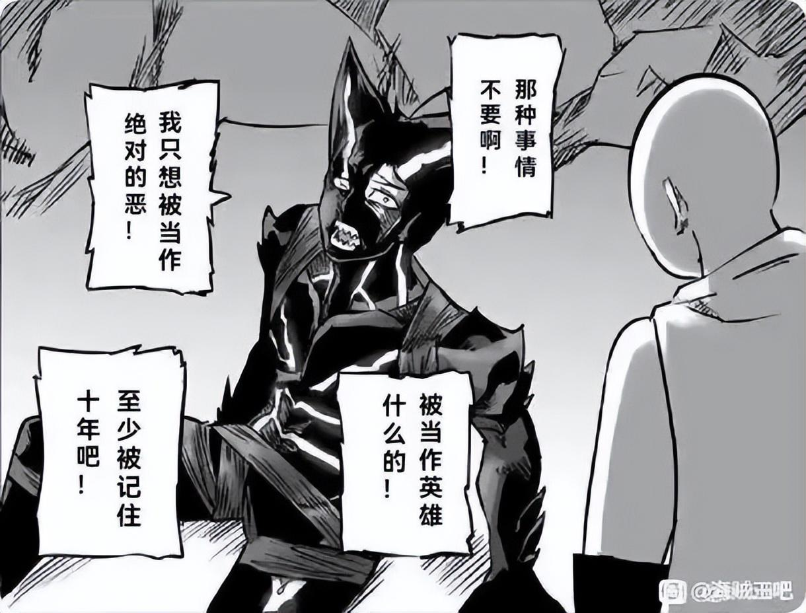

# 艾尔迪亚人，马莱，戴巴家族 | 抬杠工程

作为一个键政圈观察员和一个进击的巨人粉，最近突然联想到了一些东西：

进击的巨人世界观里，艾尔迪亚人能变成巨人，被世界其他种族的人类所讨厌，称之为“恶魔的子民”。除了岛上那些墙内的人，其他人生活在军事国家马莱的收容所里，经常被派去执行军事任务，跟“中东联合军”作战，死伤惨重。可谁能想到这个国家的实权人，居然也是“恶魔的子民”——战锤巨人的持有者，戴巴家族。对待这个贵族，世界各国权贵无不以礼相待，完全不是对待艾尔迪亚人的态度。这让我想起了……

犹太人，美国，犹太财阀

我们来映射一下，以色列，作为犹太人的收容所，兼西方国家埋在中东地区的搅屎棍，时不时就要执行军事任务，打一下身边的邻居。他们的背后也是军事帝国……美国，美国人对犹太人的态度虽然没到要给他们袖章，过街人人喊打的程度，但西方世界对犹太人的憎恶由来已久，从《威尼斯商人》到奥斯维辛，现在网络粪坑中的大鼻子犹太人梗图。然后最有意思的来了，美国的统治阶层正好就有犹太财阀集团。芜湖，连上了。

看漫画的时候一开始还有点绕不过弯，为什么同样的民族，尤其是统治阶级还是这个民族的人，会放任不管同族的百姓被外族关进集中营并送去当炮灰，但一想现实不也是这样吗？套上这个对应关系就清楚的很。

写完上面的文字后随手搜了一下，发现拿艾尔迪亚人类比犹太人的解释文章已经有很多了，包括点名了区分身份的袖章，以及二战时犹太科学家在发明原子弹时做出的贡献（地鸣），但的确没看到中东搅屎棍、美国和戴巴家族相关的讨论，看来这篇东西算是提供了另一个影射现实的证据吧。

最后放一个贴吧网友做的沙雕图，真的爆杀我这个巨人和一拳粉：

