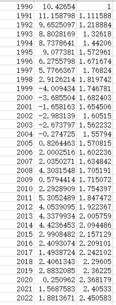
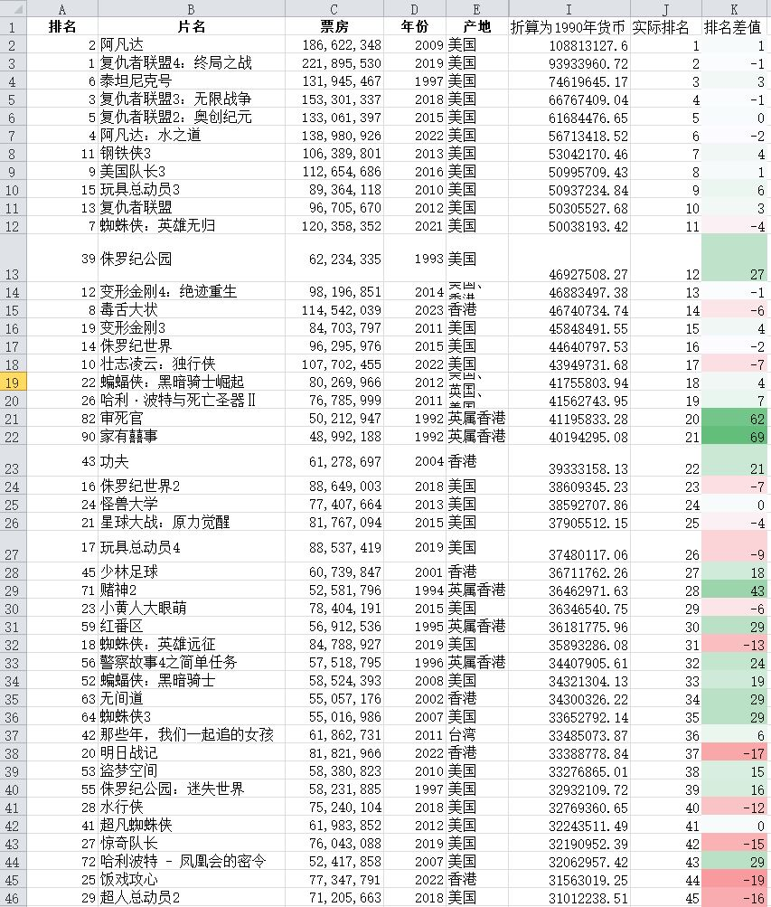
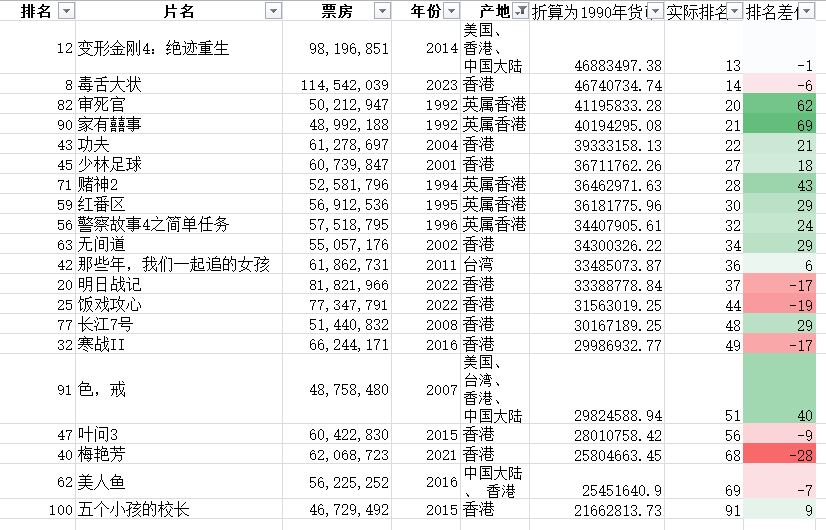
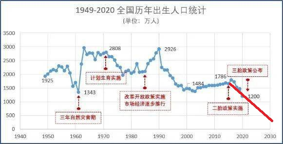

# 人间观察笔记 2023.08 | 苟过廿年

前段时间把近年黄子华的两部电影《毒舌律师》和《饭戏攻心》给补完了，这两部都是我本来想去电影院贡献票房的，可惜一拖延就给忘了，然后这两周借着网盘公映给补完了，顺便看了一下电影相关的资讯，发现《饭戏攻心》的票房已经是登上香港电影历史排行榜了，《毒舌律师》更是一举拿下香港电影华语片最高票房的宝座。妈耶，对一个黄子华二十年老粉来说，确实不敢想象。​

当年看他的相关采访文章，提到过他当年因为《男亲女爱》爆火之后，拿到了一笔投资拍电影。结果就是2002年上映的《一蚊鸡保镖》，票房扑街还加上特技飞车出的意外，基本上坐实了“票房毒药”的人设。票房的玄学真的很难解释，谁能想到电视界大红大紫、开创栋笃笑（粤语单口相声）的一代“子华神”，居然一而再再而三地交出票房扑街的答卷。

不过我一想，2002年，咦？怎么感觉有点眼熟，那不是《无间道》上映的年份吗？上一年，2001年还是《少林足球》上映的年份。再过两年的2004年，是《功夫》上映的年份（啊，这部改变我人生的电影）。上映在那个年代的王者作品，好像让一个栋笃笑艺人去挑战也不太可能。

于是我突然有个想法，现在的票房王者跟三十年前的票房王者，哪个真正的实力更高呢？众所周知，要跨年度比较钱，得考虑通货膨胀因素。每年的通货膨胀率都可查，我去扒了香港每年的通胀率，然后将1990年设置为1，然后每年相对1990年的通胀率就能算出来了：

不过1990年的1港元居然只等于2022年的2.45港元？才2.5倍不到？看来香港的CPI也不计入房价哈（手动狗头）。然后根据CPI把票房榜的收入调整到1990年的水平，并进行排序。会发现90年代的票房冠军冲了上来：

看总榜有点眼花缭乱，我把华语片子挑出来，就比较明显了：

CPI折算之后看，《毒舌律师》是真的牛逼，力压90年代的大作不说，还已经非常接近了中美合拍的怪胎《变形金刚4》。不过其他的片子也算是验证了我的猜想，以《饭气攻心》的实力，虽然在票房榜上超越了《无间道》，但按折算后的票房数字来看，《无间道》还是要略胜一筹的。

还有另外一点，香港电影或者说港产文化作品的影响力一直在下滑，我之前还想过一个非常没品的梗图创意来表现这个事，但觉得实在太没品且侮辱，就没做出来（麻了，我又自我阉割了）。还是那个想法，黄子华的作品在2002年没办法打赢《无间道》，但2022年说不定就可以了，甚至还可以在2023年刷新自己创下的票房记录。可是代价是什么呢？我们来看下香港的票房总榜，最高是复联4，2亿多港元，OK。然后我们看下中国的票房总榜，最高是长津湖，57亿人民币。已经不是一个数量级了。所以会有一种感觉：就是在池塘没有变大的情况下，大鱼都走了，原本的小鱼就有机会吃成大鱼。

结合现在生育率暴跌的现状，我甚至都有这种想法：如果大家都苟住不生孩子，再等10年，等出生人口再降一个数量级，那时再生育，按现代医学的实力，40岁高龄产妇应该也是能安全生育的，生出来的娃应该就是所谓简单模式了吧。按目前的出生人口折线图恶意画线看看：

2033年度出生人口250万，芜湖，那时候的人高考重本率应该100%了吧！这不就躺赢了？苟！给孩子苟一个躺赢的人生出来！

90后可能也是所谓被西方洗脑的一代，我之前在大号的文章上也分享过，那些所谓西方国家高人权高福利的现状，为什么我们中国人不能有。我们也能过上美国人的生活吗？成为发达国家并全球免签？（奥巴马：不，你不能。来源：https://www.youtube.com/watch?v=mNVUsEkMHj4 当然奥观海也没把话说死，人家还说中国人有这个可持续发展的意识。然而现状却是人家北溪一炸，山火一烧，减排白干，呵）

当然以前会人云亦云地以为是我们跟西方不一样才导致不能过一样的生活，后来发现是西方不让我们过一样的生活，后来更发现我们之中已经有人过上了那样的生活，而且他们跟他们还是一伙的，甚至他们还坐在前三排。而且我觉得现在跟有我一样想法的人应该是越来越多了，借助子华神那一句“法律面前，穷人含撚”后票房过亿的现象看，这也是新的无产阶级文化在成型的标志之一。虽然片子是爽片，但从其取得的成效来看，新时代的无产阶级文化土壤已经成型了，《毒舌律师》是这土壤中长出的其中一株果实，可以预见，未来会有怎样百花齐放硕果累累的一天。
