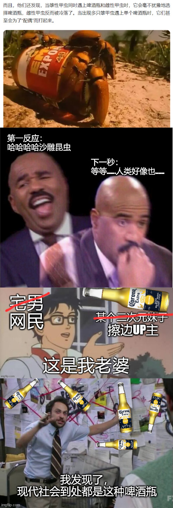

# 昆虫被啤酒瓶吸引，人类被…… | 抬杠工程

最近发生了一些事情让我回想起了一些之前看过的知识碎片，于是做了下面这张梗图：

关于雄性昆虫被玻璃瓶吸引的发现，还获得了搞笑诺贝尔奖，放个链接：[《甲虫啪瓶，野到不行》](https://mp.weixin.qq.com/s?__biz=MTExNTQ5NDc4MQ==&mid=2656804844&idx=1&sn=2f42fc5e1c477c9ab810443d2ede1d48&scene=21#wechat_redirect)

我第一次看到这个知识好像也是十年前左右的事情了，当时的文章还强行拔高了一下，说人类生活中是不是也有大量的这种啤酒瓶，需要警惕。那么，雄性昆虫错认啤酒瓶为交配对象的行为，一个很直观的类比，就是雄性人类错认东瀛老师为恋爱对象？后来对人类观察更多了之后，发现人类发情的对象真的千奇百怪，除了宅男喜欢纸片人，短视频平台普及后”擦边“也普及了，比起需要用特殊渠道才能见到的东瀛老师，随时随地就能刷的擦边up主和抽卡纸片人好像成为了最新的啤酒瓶

但只有雄性会这样吗？最近发生的事情让我回想起了赵皓阳五年前的文章：[《关于年轻人“粉圈现象”和“追星行为”的心理学研究》](https://mp.weixin.qq.com/s?__biz=MjM5NzE2NTY0Ng==&mid=2650674589&idx=1&sn=396e0cf3bbc150bf7604f8ceededff45&scene=21#wechat_redirect)，里面提到的理论是：推迟生育导致无处安放的母性发泄在了追星行为上。芜湖，所以不止雄性会被激素干扰做出啪玻璃瓶的行为，雌性一样也会啊

梗图的最后一部分则是一个可怕的事实，现代社会到处都是啤酒瓶，因为仔细类比下，能让吸引人的东西太多太多了，甚至技术的发展方向也是不断追求更低成本获取更多感官刺激的方式，VR设备的普及已经在可预见的未来中了，在后面赛博朋克已经安排的明明白白，最后结局则是阿西莫夫笔下的故事：整颗星球的人类数字飞升，然后星球死去

当然，要避免这条路，阿西莫夫也给出了非常科幻作家的解决方案 —— 核辐射污染整个地球，逼地球人离开母星迈向星辰大海

诶等等，核辐射污染整个地球？小本子？？？！！！我靠这什么硬核科幻粉丝！抽象起来了！

