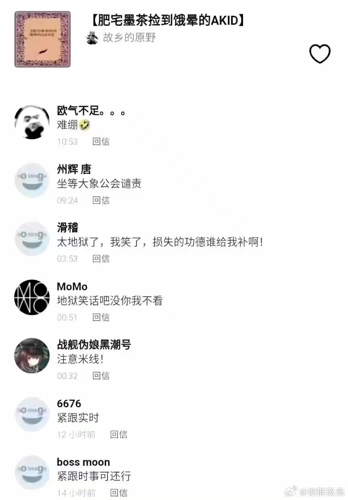
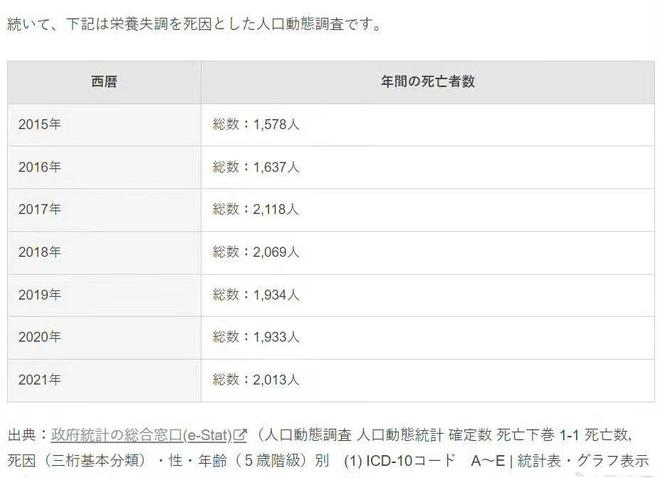
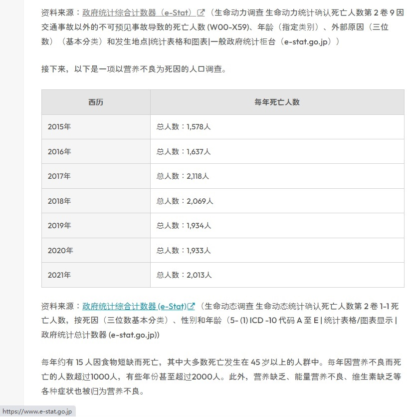
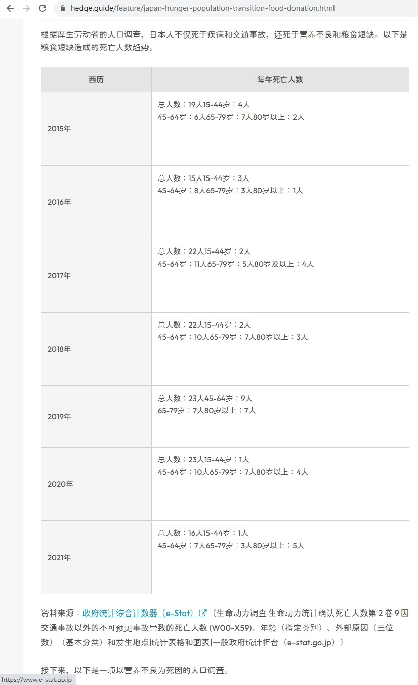
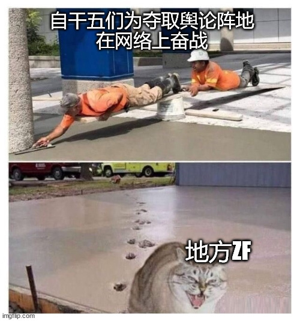

# 人间观察笔记 2023.09 | 肥宅墨茶捡到饿晕的AKID

月初看到AKID在日本饿死的新闻的时候，有个公众号文章里还说饿死在国内已经是不会发生的事情了，随便一个扶贫干部都会给他安排的明明白白，我当时看完就一个想法：你们是不是忘了墨茶。后来在网上看到这张图，表示还真的没有人忘记。

好了我这算是人血馒头和人学寿司混着吃了吗？首先我又不赚这个流量钱，其次这是在写日记（虽然正经人不写日记），当然不算

我在之前的文章里还写过，拿中国跟其他“发达国家”比较就已经算是一种进步。毕竟“第三世界国家饿死人不是很正常吗”。这还真是带血的残忍比较。让我来先左右互博一下，说墨茶是个例，那别忘了那位辣椒拌饭吃的女大学生吴花燕。再看日本，每年饿死的人数可是有统计记录的上千人

免得有人说我这是开句一张图剩下全靠编，我特意找了一下这张图的原网址，然后整页翻译了一下

<https://hedge.guide/feature/japan-hunger-population-transition-food-donation.html>

看完翻译才发现还真是国内媒体全靠编，这个数据表统计的是营养不良，还包括了缺乏维生素，不是饿死，饿死是上面那张图表：

每年饿死的人数应该是十几二十人的样子，当然不如下面这个营养不良的图表每年一两千人来的惊悚（麻了，国内自媒体吃人血寿司被我抓到了）然后反贼可能还会来一句那国内的统计数据呢？拿不出来了吧？那就是瞒报不报，千蟑定律，国内早就饿殍遍野了吧balabala……

到这里基本上就没啥好讲的了，反贼和自干五的隔空互掐其实真没啥意义，真正给人心灵震撼的还是那些以身犯险到国外亲眼看世界的所谓电子宠物（这下子人血汉堡人血泡菜人血法棍人血薯条齐活了）自干五们都能省下好多口水，直接转发他们那些不利于润的话就行了，而且还是第一手资料，保真，教育程度拉满

写到这里我觉得是时候阶段性总结一下我这几年一直在五毛和美分之间反复横跳的原因了，不是因为我精神分裂，而是世界本身就不是单纯的五毛和美分泾渭分明的。直接上大活：

> “我国社会主要矛盾已经转化为人民日益增长的美好生活需要和不平衡不充分的发展之间的矛盾”
>
> —— 最新的政治课本

解释解释啥叫人民日益增长的美好生活需要？我，一介屁民，想住大豪斯，开豪车，每天工作生活平衡，心里身体健康，冲击一下一百大寿。那啥又叫不平衡不充分的发展啊，那就是一介屁民在想屁吃，这种生活只有天龙婆罗门鲶鱼和发达国家的人民配，黄皮小儿是不懂自己的历史定位吗？那这么一对撞不就矛盾了，还是主要矛盾。

我反正已经找准定位了，我就是美好生活需要没有被满足的屁民，凡是造成不平衡不充分发展的因素就是我的斗争对象。这包括了妄图锁住中国产业升级的以美国为首的西方国家政客，也包括窃取劳动人民成果破坏社会主义建设的那些肉食者。外御强敌，内防家贼，就是目前的状态。我相信网上的有头脑的自干五们应该早就先于我得出了这个结论，并且现在外敌和家贼颇有合流之势，他们早就团结在了一起，所以自干五们才会挺身而出，在舆论场上奋勇作战，防止大部分人被当枪使了还不知道。现代社会的斗争其实还是跟当年殖民时代差不多，只不过从物理殖民换成了金融殖民、产业殖民、思想殖民等等等等，再加上那些封建残留。半封建半殖民时代不就是一边被买办剥削一边被地主剥削吗，现在不也差不多？

> 抗日战争急不得
>
> —— 啊，还有人不知道出处吗

自干五们的斗争策略现在应该也是类似的，目前还处于抗日战争阶段，团结一切可以团结的力量，先让墙建立在每一个人的心中，从对西方发达国家祛魅开始。当然我也不排除现在的自干五群体存在很多不理智的现象，包括群起攻之这种网暴行为。虽然要思想改造敌人而不能物理消灭敌人，但网暴恰是适得其反的行为。再加上层出不穷的给敌人送子弹的行为，只能说目前的形势的确还不是很乐观

这篇总结虽然是9月总结但其实是10月1号才开始码的，正好又是一年国庆节。其实自从2020年开始好几个自干五博主冒出来我就觉得事情好像的确在起变化。当然顾子明在2018年已经用持久战剧本来套中美博弈了。能看到更远的人不少，但现在自干五群体应该也是在走抗日战争的剧本，解放战争还在更后面，现在先团结一切可团结的力量吧
