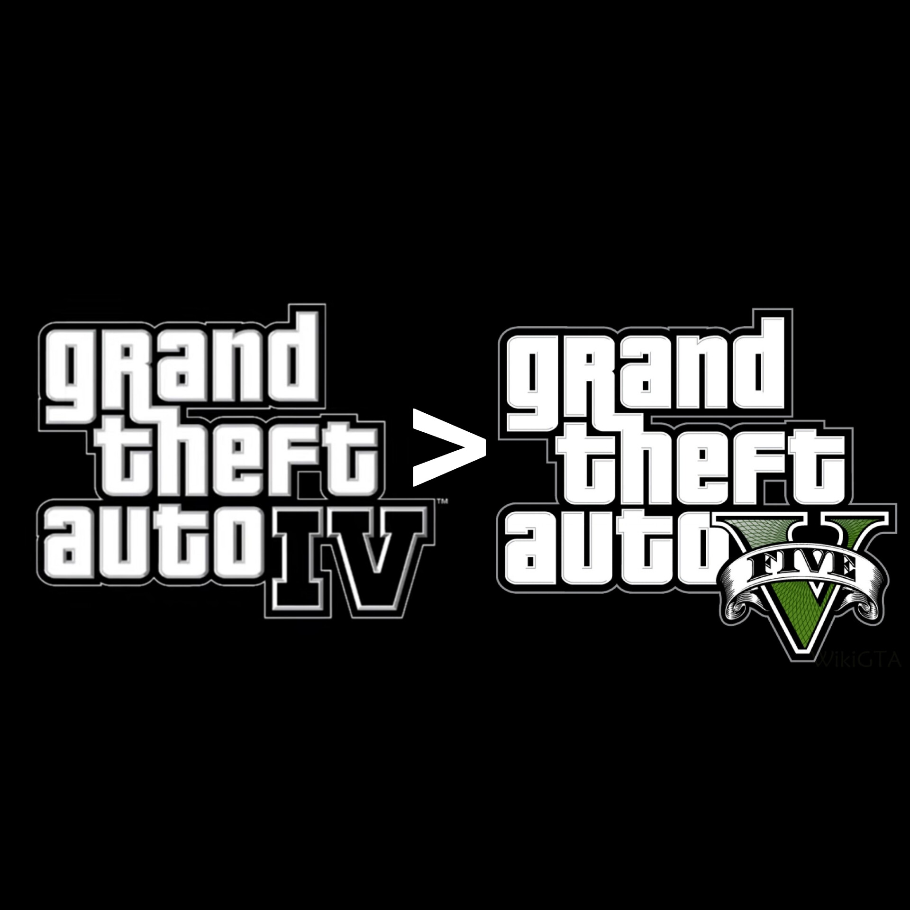

# 又菜又爱玩 004 | GTA5

本来想写一篇巫师3的文，突然想起来我对巫师3的好感有一大部分是建立在对GTA5失望的基础上的，凡事讲究先来后到，于是先给GTA5安排上

**以下严重剧透警告！！！**

**以下严重剧透警告！！！**

**以下严重剧透警告！！！**

说起GTA5又不得不提我的个人最爱GTA4，当然最爱GTA4可能有一些童年滤镜，因为初中毕业后疯玩了一整个暑假GTA4，高中毕业又疯玩了一暑假GTA4 DLC，当然GTA4就不多夸了，总之就是非常的喜欢。后来GTA5上市后自然是非常期待，然而这一期待就是五年……我到2018年才组了一台能跑GTA5的PC（对，就是现在这台，到现在缝缝补补也扛了五年），玩的第一款游戏就是GTA5。但也许是期望越大失望越大的道理，GTA5通关后，并没有体会到当年GTA4结束后的那种感觉，当然这也跟GTA4三部曲在叙事上的特殊性有关系，而且要跟GTA4对比的话，这篇文章就有点跑题了，我先继续集中火力在GTA5上。

毫无疑问GTA5的确是一款划时代的游戏，就有点像毫无疑问《星球大战4：新希望》是一部划时代的电影。既然提到了划时代，评价时就不得不越过作品本身，去看看那个时代的样子。我拿星球大战做类比应该很好理解了，毕竟GTA5可是超越了自己的前作GTA4，在十年前的2013年，当年有限的计算机硬件性能条件下，实现了超大开放世界地图、更真实的画面和物理、一次控制三个主角、超长的主线流程、丰富的支线任务、一应俱全的武器载具系统、还有最后成为R星摇钱树的在线模式……随便一个拿出来放到今天都是可圈可点的作品，但人家在十年前就搞出来了。就好像星球大战新希望放在现在看是一部不错的太空歌剧式科幻电影，但人家是1977年上映的，半个世纪前了。总之GTA5的好我基本上不用赘述了，吐槽下我觉得他不满足我的期待的部分

作为一个剧情向玩家，我享受的是跟随主角一起经历游戏中的故事，但就跟读小说看漫画一样，读者/观众是可以弃坑的，所以游戏也要提供玩家足够的吸引力，来维持玩家的时间投入。GTA5玩到一半，该出场的人物基本上都出来了，但我却发现除了主角三人组，基本上没有讨人喜欢的配角，老麦一家三个全都是人间极品，老婆出轨导致金盆洗手的老麦不得不再次犯案，女儿急着卖身进入娱乐行业，儿子，哈，就是你我宅男。再说小富，完全不知道为什么要对拉玛这个坑货掏心掏肺，尤其是这人差点害死过小富，门口的支线任务姐也是个大坑货。老崔身边一个弱智一个阴谋论红脖子，唯一还算正常的弱鸡表哥还被他手刃了，更不必说老崔还直接踩爆了GTA4其中一个主角的头。这一群人基本上没有能让人喜欢的，全都是坑货中的坑货，我都怀疑编剧把所有配角都按反派来写了，主角身边的人跟反派一样讨厌还可行？而且主角还要给反派打工还可行？GTA4老玩家可憋不下这气，GTA4那讲究一个神挡杀神佛挡杀佛，什么黑帮大佬，什么州立监狱，什么俄国毒枭，全部杀穿，上山下海都能杀光，到GTA5里面还得一直憋着，到最后摊牌了，才随便整点，额，好像也没多难的任务，让主角一次性搞完所有的死对头。然后各自又回到自己不那么憋屈的生活中（当然，除了小富，唯一实现逆天改命的人）

后续就是GTA online了，我本来以为在线模式还有些后续剧情能看……好吧，也为数不多，可能是能请回来的演员不多了，完全没有为了那一点点剧情玩下去的动力，我云玩不好吗？尤其是看莱斯利谈恋爱那段有点emmmmmmmmmmmm 跟老友玩了几个月，赌场上岛做了好多次，然后把地堡玩了一遍，就玩腻了

所以简单总结来说就是，玩过GTA4后，我期待GTA5也能写出类似的深刻剧情，甚至包含情理之中意料之外的两难选择，在叙事手法上有GTA4那种穿插多线的方式，让玩家最终拼成一个完整的故事。但，完全没有，我得到了一款基本上13岁小孩都能玩的游戏，但我已经不是13岁了

写到这里突然觉得GTA5的整体故事风格很像GTA-SA，这款游戏是我在留学期间百无聊赖的时候打通关的，可能是SA不那么写实，而且CJ自带一股喜剧风格，所以我也不觉得SA有啥大毛病，而且GTA5如果是继承自GTA-SA那我可能真不会有期待的落差，可能就只剩GTA5主角团身边全是坑货这段吐槽了。但没办法，GTA4三部曲毕竟摆在中间，就跟2077发售时遭遇的滑铁卢一样，工作室上一作巫师3实在太优秀了，玩家给出了过高的期待。

好了大概收个尾，在对略带失望地通关GTA5后，我又玩了瞎玩了几款游戏，直到2019年末，点开巫师3的时候，小时候沉迷游戏的辣种感觉又回来了……（虽然是下集预告，但下集不知道什么时候能酝酿出来）

