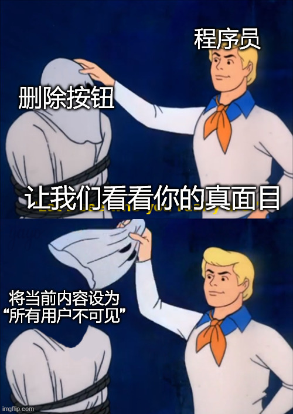

# 通往赛博朋克之路 001 | 假删除

> 开幕叠甲：作者是一个半桶水程序员，喜欢瞎BB，以下内容全都是胡说八道

麻了，在这个环境下我不能用任何一家公司的任何一种业务来做比喻。只能生造出一个不存在的APP……

鉴于有人喜欢屎尿屁笑话，我们想象有一个APP叫“拉了吗”，用户开启定位后，可以查询距离最近的公共厕所，还可以对用过的厕所进行评论。

比如我用这个APP搜索到一个附近的公厕，火速前往，并酣畅淋漓地解放完毕，一摸发现没有卫生纸供应，于是我大怒，直接在这个APP上给这个厕所怒喷了十五字并配图一星差评。

好的，当我准备提裤子走人时，再一看发现不是没有厕纸，而是我没摸对地方，于是我良心发现，打算撤回这个差评，长按我刚才怒喷的内容，点击删除，呼，无事发生。

事实真的如此吗？很可能并不是，从程序猿角度来看，很可能只是把那条评论设置为“已删除”状态，这个状态表示“在APP中对所有用户不可见，且不参与评分统计”。我刚刚怒喷的十五字和配图，还是会继续留存在“拉了吗”的数据库中，甚至被容灾备份到不同的机房中持久保存下来。

这种删除的逻辑在业界一般叫做“假删除”。为什么互联网应用愿意留存这些无用的数据呢？随便举几个理由：
1. 数据存储真的很便宜，一段文字几张图，十几秒的短视频，真的不费钱
2. 将数据留存下来的逻辑，开发起来，比真正删除要简单的多
3. 互联网公司有留存数据的需要，至于这个需要可能是纯业务要求，也有可能是合规需求（呈堂证供.jpg）

不过，信息被用户删除后，肯定也不会无限的保存下去，但具体的清理时间各个APP都不一样，可能是十天半个月、一年半载，甚至是这家APP停止运营的时候……

好的，大概用一张梗图总结本篇内容：

