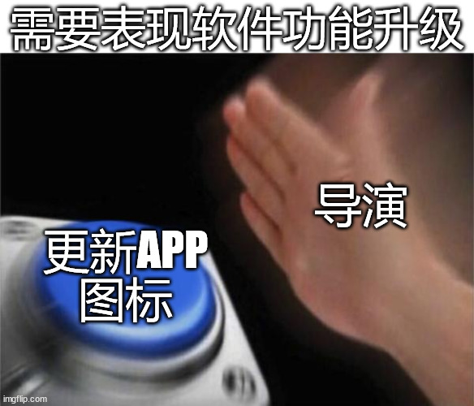

# 通往赛博朋克之路 007 | 别照着电影逆行

> 开幕叠甲：作者是一个半桶水程序员，喜欢瞎BB，以下内容全都是胡说八道

这个月跟朋友去看了《逆行人生》，之前就刷到了一些文章说这是个大龄程序员失业的故事，我还想说作为同行会不会看完破大防

**以下内容大量剧透警告**

**以下内容大量剧透警告**

**以下内容大量剧透警告**

结果还行，没破大防，倒是槽点有一大堆，后来觉得应该整理一下，因为这整个电影其实就是通往赛博朋客之路的最好说明，而且电影有着和谐的需求，但一个网络喷子没有，我可以写一点有用的（和做一点梗图）

故事的起源是裁员+被克扣的离职补偿，电影在裁员通知这场戏就做了个不良示范，毁损公司财物绝对不是明智行为，主角砸完玻璃公司居然没报警算是不错了，一个邪恶的反派公司就应该直接把人送进局子，这样解除劳动关系甚至都不用给钱。再者主角没拿到文件就不上班也是个隐患，网上一搜劳动仲裁经验帖都有提过没签过文件就缺勤，公司可以用旷工方式来炒人，此时打工人就百口莫辩。因此各位打工仔可以随便搜搜劳动仲裁攻略啥的，备一些经验，不要以电影中呈现的方式来应对裁员。

（我随便放一篇文章在这里，可以顺着找其他的）
> 仲裁完胜！拿着20年2N，违约金 换车，前老板人麻了！历时6个月全过程（堪称对抗违法裁员的教科书）

后面那些基本上没啥建议好说的了，我就开始图文吐槽吧

魔幻现实的故事是，电影中主角搞出来的骑手地图小程序，现实中也存在，只不过就在影片上映前没多久因为恶意标注内容被封禁了，然后马上换了个壳又上线了（突然觉得这其实是另一篇赛博朋克之路的选题，风控佬101——总有用户是混乱邪恶的）

> 原本是为方便外卖骑手快速查找小区楼号的工具，却因缺乏监管而出现了暴露住户隐私、 脏话标记顾客甚至造黄谣的现象。该小程序在遭到投诉后已于8月1日暂停服务。
> 
> 《泄露密码、造黄谣、标记脏话……外卖骑手地图令人细思极恐》

关于这个小程序最后的结局，是被送到某个高管办公桌上，好像看来要把主角收编的情节，我只能说笑死个人。首先公司没有任何动力去主动维护一个信息系统，因为只要把人困在算法里，配送时间就能不断被减少：

> 他在北京跑外卖两年，此前，相同距离最短的配送时间是32分钟，但从那一天起，那两分钟不见了。
> 
> 《外卖骑手，困在系统里》

关于被困在系统中的骑手，我也推荐一批牛逼的人，导演要真的愿意可以用这个剧本拍个逆行人生2：

> 外卖系统里不仅仅有算法，还藏匿了许许多多的公司，而这些公司错综复杂交汇而成的法律关系网络，正把骑手死死地捆住。
> 
> 《我们应聘过骑手，打过卧底电话，看了1907份判决，最后拼出了这部外卖平台进化史 | 徐淼、陈欣怡 一席第890位讲者》

当然我们假设这个公司真的想通过骑手地图来达到提升配送速度，击败竞争对手的效果。那也轮不到收编主角，大概率会发生的事情是：该公司研发部收到需求，两个月内把这个地图集成到自家的骑手端APP中，因为这玩意不需要啥硬核算法，普通的搜索+推荐就管用，最核心的东西是数据，也就是大黑笔记本里的那些信息，直接搞个爬虫扒下来，完全用不到把人招来上班，依赖硬核算法的可能是要最优路径规划这种功能，但影片中也没有表现主角实现了这个。主角被收编最大可能的理由是：辣手摧花哥凭借做这个小程序火了，公司为了体现一些社会责任和企业形象，稍微实现一点双赢

能扯的扯得差不多了，不能扯的我也不多说了，搞个梗图收尾吧

