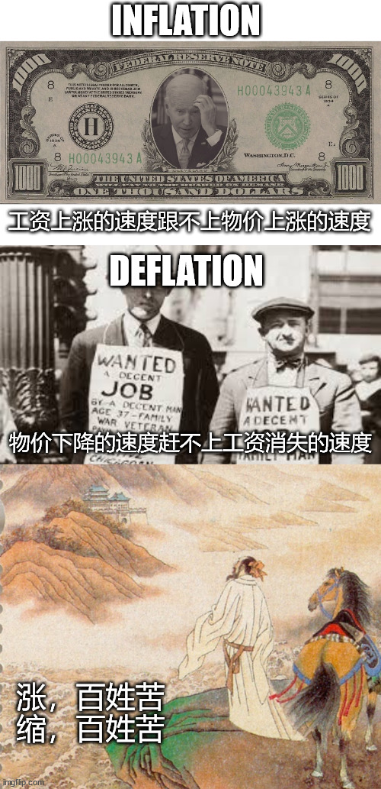

# 人间观察笔记 2024.09 | 终年危机

这个标题是从一个梗图里看到的，大概是说我以为我的人生是欢乐的童年青年→一小段中年危机→安稳的老年，但实际上是从小一直艰难到老，是所谓终年危机

今年我的年龄也跨入三字头了，打工也打了六年多，现在也算是刚刚摸到了所谓中层的边缘，稍微能带个小小的团队，但我并不是很乐观，目前依然认为码农生涯到35大概就要结束了，因为就算我的能力还可以，万一整个团队解散，依然会面临失业。

顺带结合这个月的时事来看，最近几年是真的各种见证历史，这个月做了一张梗图，通胀：工资上涨的速度跟不上物价上涨的速度；通缩：物价下跌的速度追不上工资消失的速度。涨，百姓苦，缩，百姓苦。我甚至悲观的认为人类经过这近百年来被经济危机的洗礼，现在已经掌握了应对经济危机的办法：那就是印钱，不断的印钱，相当于赖账，没有任何一个理由不赖帐，因为还钱是还不起的，印钱反而可以让之前的欠账变少到不值一提，所以现在的物价是我们爷爷辈的上百倍，是我们父辈的十倍，那么再过一代人，物价还会再翻十倍吗？看着样子，估计是会的

月底见证了一波夸张的政策+股市暴涨，接着看还能见证啥历史吧……
