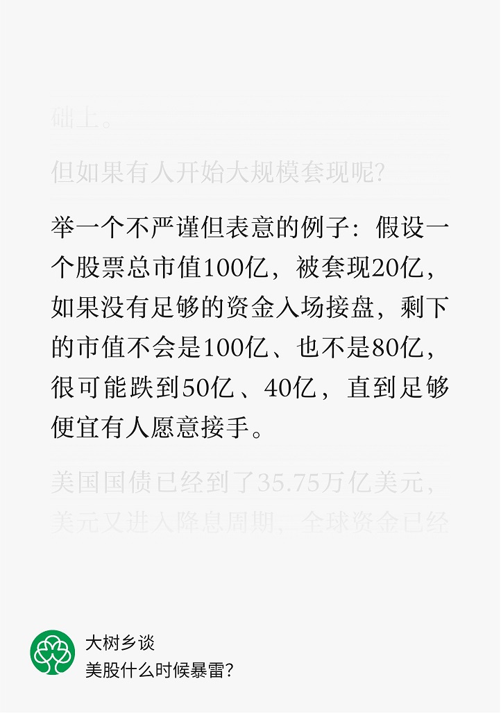

# 人间观察笔记 2024.10 | 一忘皆空

9月底算是见证历史看到所谓“史诗级大涨”，十一假期开始跟中介去看房，真就是心态局，说是二手房现在已经基本砍不了价，而且业主还要涨价，新房还玩了一出假期结束就收回折扣点数这种逼单策略……真的麻，开了几个发布会，股市涨了几天，就好像一切都要反转了一样，我搞不懂

按之前几年的经验，房价暴涨的时候限购缩紧，还是涨了一两年，那现在限购放松意味着还在跌，二手房东这个反价是真的看不懂，我都有点怀疑中介在中间两头吃，让卖家反价，让买家看新房，毕竟新房才是中介利润的大头，开发商拿到了回款，政府降低了库存又能继续卖地，最终只有二手房市场的买卖双方利益受损

这波政策让我想起之前看到过的“希望实验”，搜了一下还真有此事，大意是说实验鼠丢水里几分钟就淹死了，但是曾经体验过被抓然后释放的小鼠，能坚持几小时甚至几天。我感觉有点这个意思，在大家都在为生计发愁的时候，给一点希望，再坚持一下，不要进化成无敌之人

上个月做了一张梗图讽刺“认为美国降息后经济就会变好”的观点，理论上正是因为经济不好才降息，而且历史上每一次美国降息后都会跟着一次经济衰退，上一次是2019年，再上一次是2008年，现在刚刚开始降息，好像还没报道要开始衰退或者搞出经济危机，就开始出放水政策救市，从常识来看难道不是实际上经济危机已经在发生了吗？怎么社会舆论一下子无比乐观了呢？

9月底的史诗级暴涨也是，普通散户在股市里有10万就不错了，涨10%也就1万块，大佬在故事里有几百万，同样10%的涨幅，就是散户的全部本金。这种马太效应式的发钱方法也太资本主义了，按货币差值来看贫富差距明显变得更大了（100-10=90，110-11=99），这就是先富带后富吗，我反正看不太懂，最近还看到一篇公众号文章，提出了我几年前就想问的问题：

当初稍微接触一点金融相关知识的时候就有这种疑惑，用当前成交价格直接做简单乘法来衡量总价的做法，其实并不符合常理，但是似乎大家就认了，还有银行留准备金然后借贷这种凭空变钱手段，面对挤兑会直接崩溃，但社会也已经接受这个设定并持续运行了很久

感觉我有点杞人忧天，但似乎人类历史的周期性就想三体的恒纪元和乱纪元一样，虽然不太可以预测，但就是会往复出现，乱纪元可能确实已经开始了，2022开始的俄乌和2023年开始的中东，然后就是2024年11月就要迎来四年一度的年度大戏美国大选，黄金价格的暴冲似乎预示着乱纪元还会再演绎一阵子

2020年1月开始写人间观察笔记，开篇就提到这个世界在比烂，到现在比烂也在向底线竞赛，世界各地还有战火，周边还在堆火药桶，倒是我们这还在继续搞经济，已经算是难能可贵了

这个月还有些让我感到烦躁的事，真的就不能新闻连连看，说是网络不是法外之地，可是一旦人加入了资本，自然有人帮你摆平，没错我说的就是黑吗喽主创之一，这就是资本和权力的力量吗，当然我也反对无限上纲上线和因言获罪，但为什么有些讨论就能被抹掉，有些讨论就能继续下去引发更大的舆情？假如我们相信一切能看到的都是他们让我们看到的（不限中外），那结论很清楚了，只要抱上大腿就能被保住，不管之前说过啥干过啥，就能享受故宫大G全网一忘皆空咒的待遇

这个月又做了一个梗图，感觉最近半个世纪以来货币贬值的速度越来越快，似乎所有人都希望货币贬值，这又让我想起来2022年的时候，所有人都希望脱口罩，实际上不带感情的去想，意大利前车之鉴，疫情两年养老金都出现盈余了，我们这里是不是也想盈余，普通人想出门，地方免了压力，所有人都赢了，除了死掉的那些，当然还有长新冠受害者，当然他们的声音不仔细听也是听不到的。总而言之就是上个月的情绪这个月再放大了一波，生气
