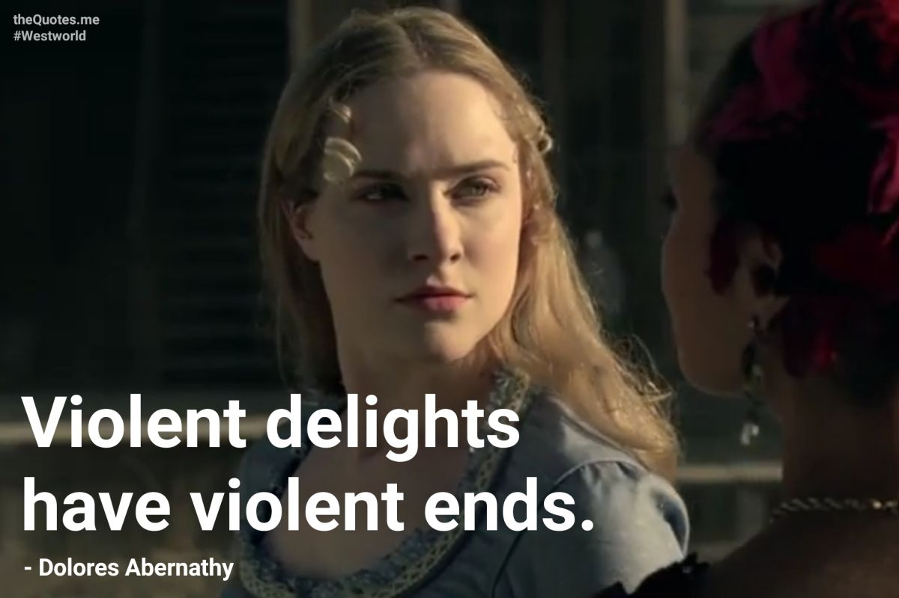

# 通往赛博朋克之路 009 | These violent delights have silent ends

开幕叠甲：作者是一个半桶水程序员，喜欢瞎BB，以下内容全都是胡说八道

> 
> 从莎士比亚到西部世界

这次确实是为了一个标题写的一篇文章，也没什么IT行业内幕，本质还算是个扣钱的谐音梗，就是有天我的脑子突然抽了一下，想到这句名言中，可以把后一个“violent”换成“silent”，原本的含义就变了一种解读方向，正好能贴合通往赛博朋克之路的主题

原文来自莎士比亚的罗密欧与朱丽叶（说起来之前做过一张应景地狱梗图）用来描述爱情可能的消逝，然后到了西部世界里，这句话的含义变成了人类在西部世界里对接待员的暴行最终也会被接待员的暴行终结，那么到我这里，一个单词之差，变成了在死寂中终结

说来碰巧，西部世界这一部开局爆炸，看起来大有取代权力的游戏成为下一部影坛大作的剧集，结局居然甚至都不及权力的游戏，人家好歹还有个烂尾，西部世界倒好，没有尾，直接被砍了，好莱坞果然黔驴技穷

所以这个silent确实可以送给西部世界本身，确实在沉寂中终结了

至于这个标题又是怎么跟赛博朋克之路搭上边的，这就留给一千个哈姆雷特了，我就端出来这碟醋，没包饺子，剩下的交给哲学，全靠悟

300字到了，混原创，收工
