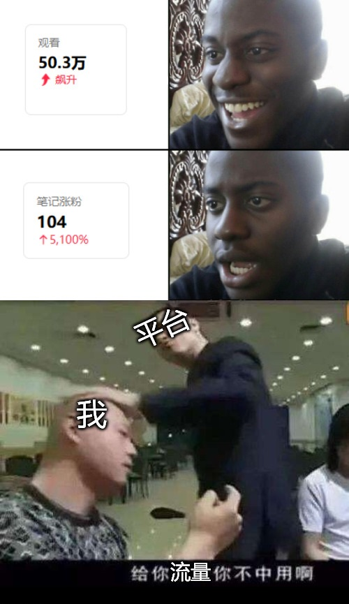
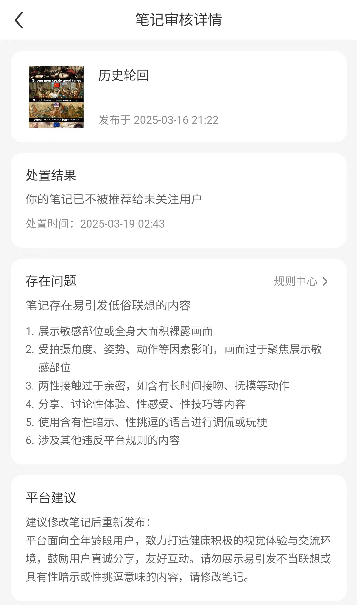
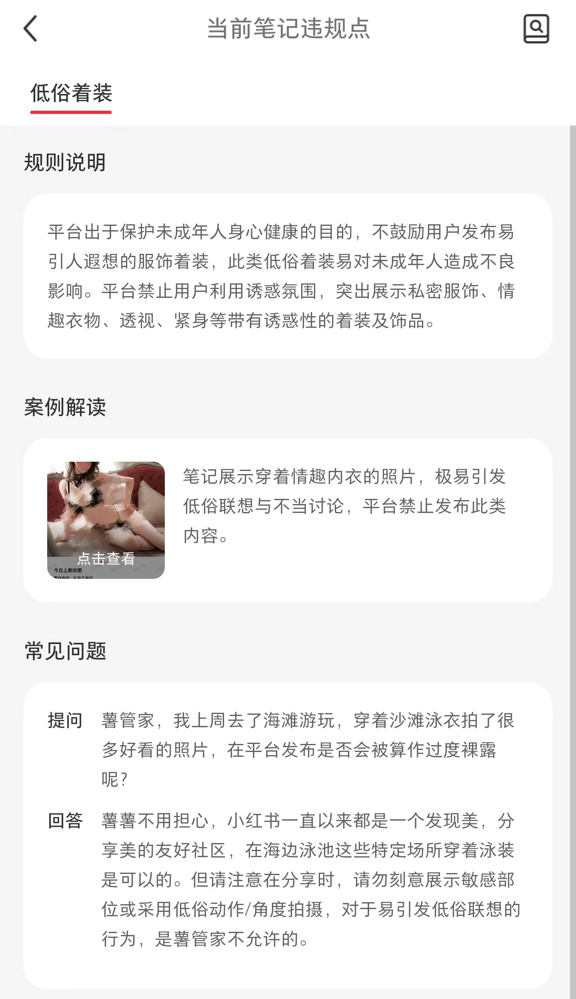

# 通往赛博朋克之路 010 | 随便扯扯审核机制

这个号去年直接冲了两波审核机制之后就再也没拿到过流量推荐了，我估计也是被审核规则处罚了。然后这个月我本着此处不留爷的想法，跑去大绿本上开了个号，把前几年攒下来的梗图随便发了一些，结果是收到了开公众号这么多年来都没见过的流量（之前跟学校合作搓出来过百万阅读，但自己发的文章最多就几万阅读，现在单篇笔记都能上十万），但涨粉数与之相比却少的可怜，妥妥的给你流量你不中用.jpg

然后又遇到了我们的老朋友——审核，有明确违规提示的遇到了两三篇，但是应该算比较轻的，处罚是不被推荐，没到封禁那一档。给大家看看我收到的违规提示：

看这个违规说明我还以为我发了什么擦边图，也不知道是不是这个平台应对低俗/涉政文案的材料不够，先用一个低俗图文的罪名顶上

这就引发了我对审核机制的表达欲了，我之前就搞过这方面工作，转头一想对哦我还没正经写过审核相关的文章，正好可以来一篇。先丢一张我之前做过的梗图：

要正经解释一下这张梗图了，大家以为审核员面对的都是涩涩的东西，以为审核员就是所谓鉴黄师，实际上是有些片面的，真正的审核天启四骑士：血腥、政治、暴恐、瑟琴它排最后，前几个都是能造成更大精神伤害的东西，之前也有调查文章深入报道过审核员工的日常，感兴趣的可以自行搜一下。在此也对这些奋战在守卫互联网安全一线的普通人表达一点敬意

打个岔，我猜现在机器审核大概鸟枪换炮了，我估计发点啥都会被什么文字识别转机器学习，说不定还有别的科技加成来初步定一个结论，然后才导给人工审核，大大降低了人力的使用，这应该能减少一点对审核员的精神污染……吧

审核结果其实也是分级别的，遇到刚刚说的天启四骑士基本上就是封号套餐。但群众的智慧也是无限的，总不能一点违规也要带走吧，于是就有了不同级别的违规和对应的处理手段，从限时禁言到不被推荐都有。这部分我就没啥好讲的了，直接跳到我的案例吧：有个涉及到国际时政的图吃了一个低俗文案判罚，估计是受到年初中美对账影响，审核开始关注国际影响，但是整体的判罚系统没来得及更新，于是先给我判一个低俗内容不予推荐，具体原因大家就当心照不宣。另外两条低俗内容其实我也认，但还是感慨一下各个平台上能看海量的丰乳肥臀大长腿，这些内容不搞出太大热点就依然能刷流量，然而却不能明着说出字来，好像人类本能并不存在一样，这也算是这个时代独有的抽象吧

最后再讲个小故事，当年做内容安全业务的时候，就看到过这样一个直播，五六个看上去十岁左右的小学男生，拿一部手机播涩涩小电影，在教室里追着女同学给她们看，女生看见都跑开了。这种行为应该现实中实锤性骚扰了吧，但平台是鞭长莫及的，只能送一个封号套餐。类似的例子还有一些我就不赘述了，我还是保持之前的观点，审核确实有必要。只不过除了必吃封号套餐的那些内容，其他内容的处置确实就有刑不可知威不可测的感觉了，这部分平台内部有很大的自由裁量空间，一方面需要维护公序良俗，另一方面又要维持流量吃饭，这两边的拉扯就引发了这些抽象表现，我反正是见的多了

好的审核相关的吐槽就到这里，其他的感想等我下期梗图更新再聊

