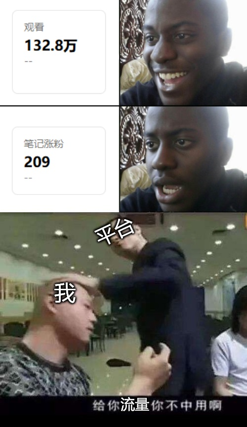
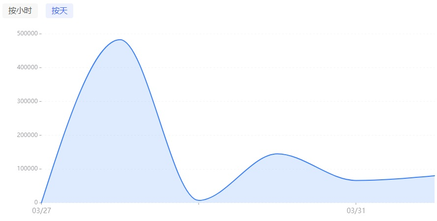

# 通往赛博朋克之路 011 | 给你流量你不中用啊

本来这一篇是想放到梗图自产计划里顺带瞎扯两句的，然而掂量了一下篇幅，估计能单拆出一篇来，那就继续通往赛博朋客之路吧

**开幕叠甲：作者是一个半桶水程序员，喜欢瞎BB，以下内容全都是胡说八道**

上期开篇忘记叠甲了，本期补上，而且这一期的内容确实也不是很保真，我是用之前的工作经历加一点点推论才拼出来的内容，如果有懂行的可以补充下意见

书接上文，感觉微信不会再给我推荐流量之后，我跑去大绿本开了个号，感觉那边图文的形式比较适合承载梗图，然后我也改每期十几张图发布的策略，改成一张图一篇，到现在发了一年半多的库存，以下是成果：

关于我这十几年自媒体生涯错过一波波流量的话题我也不是第一次说了，这次算是增加了一篇新的故事，那就是我确实拿到了比微信公众号上多得多的流量，至少从点击率上看已经是10倍了（所有阅读量加起来最多也就10万），但粉丝数量却只有两百，转化率六千五百分之一。所以一个简单的结论是……我的梗图作品应该……有几张还是有点质量的？绝大部分的图都不行

以我对内容平台的认知，一篇新作品在发布后，会由算法进行个初步评估，先给少量用户（百量级）推过去，以之作为小型测试（启动流量），根据这批用户行为数据（点击、浏览时长、转评赞等）给这个作品打分。如果达到下一个级别的流量（千级别/万级别）那就继续推荐，再收集一波用户行为，不断循环……

但是对这个平台的观察过程中我好像发现了点不太一样的现象，我目前浏览量最高的一篇梗图，浏览量走出了一条奇怪的曲线：

按我最初的认知，作品一旦被判定为到此为止，新增的浏览就会从峰值回落直到归零。但这个曲线奇怪在即将归零之后的第二天又有追加了流量。于是我产生了新的猜想……可能里面有运营的介入，可能是人工或者自动，比如2天给我50万阅读，没想到点击率超标，1天就把流量用完了，然后2天后的补充流量才到，不然这个曲线完全不符合自然传播的轨迹

还有一个案例是和阅读量不成比例的评论量，两万阅读只有个位数的评论，也很奇怪

那么，一个楚门的世界就展开了，什么东西火全是平台推荐机制决定的，除了少数出类拔萃的可以获得自发传播之外，大部分的流量都是平台决定的，所以这一百多万的阅读真的是因为我的作品好才有的流量吗？这就要打个问号了。这里需要破除一点算法迷信，看的人多/火了并不代表它的质量好，可能就只是用来填充用户无所事事的碎片时间的一些占位内容而已

所以回到我最初去大绿本开号的原因，就是想看看换个平台会不会更多的流量，能不能看到不同的反馈。现在也有个初步的结论了，就是流量确实有，反馈是我的作品确实也质量一般，不然这个转化率也不至于那么差。可能有些哗众取宠语不惊人死不休的图能稍微引发一点讨论，其他都的石沉大海。引发讨论的其实也没有那么正面，有些确实我也该骂，毕竟要语不惊人死不休的后果就是呈现的观点可能比较偏激和片面，然后会被零帧起手带走🐎顺便补一个唐氏诊断。不过这个我也算是预料之中了，毕竟之前写过疫苗人。但我也看到了我想象中的互动场面，比如有篇我自认非常精辟总结王小波全集的梗图（这篇也被审核判定违规了，麻），评论区里大家就在讨论小说情节并且表示我的吐槽非常精准，确实是我想象中获得了共鸣的样子

不过无所谓了，我也不会因为没人看就不发了，这就是我的天赋也是我的诅咒。让我们继续看是这个号还是那边的号先没吧
