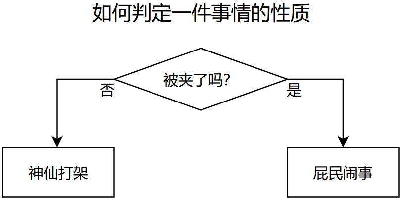
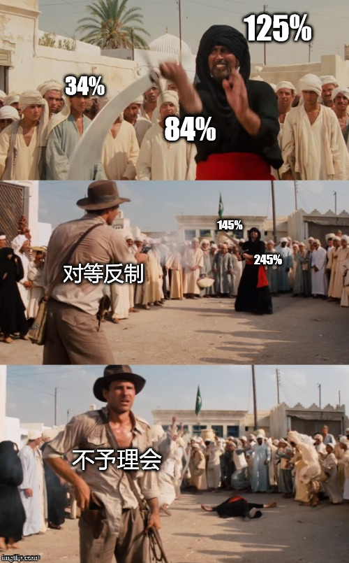
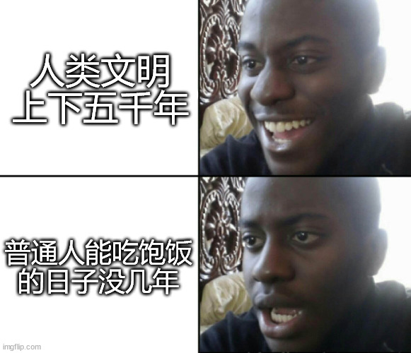

# 人间观察笔记 2025.04 | 神仙打架

这个月因为小红书那边收获了一些流量，久违地体会到了创作被人认可的快乐，我这个性格也有点奇怪的，会按照自己的喜好搞创作，做出来就算了，得到认可是副作用，我不会因为想得到认可而搞创作。这可能也是我一直以来没流量的原因吧，毕竟大网红满足的是观众的需求，我这种人满足的是自己的需求，活该我没流量。

本来想偷懒直接把这个月公众号更新的部分复制过来，不过转念一想这就没有狡兔三窟的作用了。既然这里是日记本就不用收着了，接着梗图解析展开：

最近吃瓜吃的很爽对不对，怎么还没被夹，ok，那就是神仙打架嘛。天龙人还是能讨论的，所以天龙人之上还有一层，不可言说的克苏鲁古神级别，不是作为一个群体，而是个人的不可言说。那既然可以言说，作为吃瓜群众自然乐见神仙流血。这瓜确实好啊，我吃吃吃

另外一个层次的神仙打架就是月初掀起腥风血雨的关税站，现在看起来虽然有偃旗息鼓之势，但都说了持久战，一定会陆续有来，这个国际大瓜我们也一起吃吃吃

最后是把最近在网上看到的观点做成梗图了，能吃饱饭的日子真的没有几年，把这个想法推广出去：凡人能看到神仙打架流血的日子也没有几年，确实应该认识到客观上的进步，所以一边吃饱肚子一边能吃瓜已经很不错了
