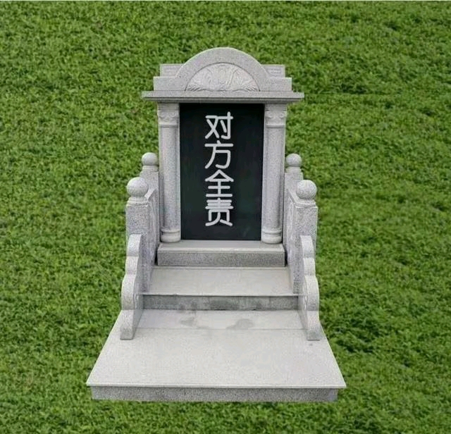

# 人间观察笔记 2025.07 | 对方全责，但你死了

最近看到这个梗图，确实搞笑了，是之前一个“对方全责你怕什么”的二创，这下好了直接盖棺定论当墓志铭了。

说回来这个梗图，我觉得这也是当代人活着的不安全感来源吧，明明是对方的问题，但自己却死掉了，或者说要为这种飞来横祸承受痛苦，而对方有全险或者说有逃避手段。就算是受到了法律应得的制裁，但我认为肉体和精神的痛苦，对比徒刑应该是不可比拟的。肉体和精神的伤害是永久的，而服刑消耗的仅仅是时间，应该给与对等的伤害。我没有法律相关背景知识，但我有朴素的公平意识。

突然觉得这还是各可以拿出来扯的点，我提倡法律恢复肉刑，肯定有人说不行啊要跟西方发达国家文明接轨，那我就问了，新加坡是不是发达国家，请接轨鞭刑

扯远了，刑不上大夫是另外的话题，这里也懒得扯了

我发现我这两年表达欲还真的是弱了好多，从写这些垃圾文字，到搞创作，都没有之前那么高产了，这是什么创作阳痿……

反过来想，可能我的现实生活可能真的充实了吧……啊，聊以自慰
