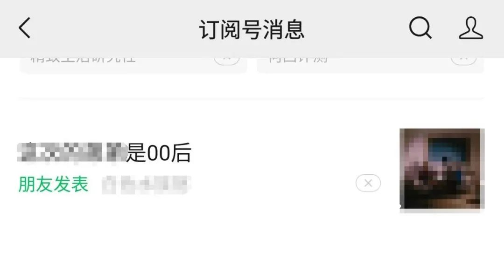

# 通往赛博朋克之路 012 | 恭喜我朋友成功拿下00后

这个标题有可能是标题党，也有可能不是，因为我也不知道这是我哪位朋友、是真实日记还是艺术创作。至于你问我这是神马情况？那是因为最近我在微信推送列表里面发现了一个新的标签：【朋友发表】

而且被我看见的文章都取了非常香艳的标题：（为保护我不知名朋友隐私，厚码了）

朋友发表是吧，行，让我们先恭喜这位朋友喜提00后，然后进正题

**开幕叠甲：作者是一个半桶水程序员，喜欢瞎BB，以下内容全都是胡说八道**

我觉得这个是又一个经典亖🐎功能，十分符合通往赛博朋克之路的主题

我自己也是写公众号文章的，我就问什么时候开启平台推荐会带【朋友发表】这个标签的，而且是否有告知作者会推荐给好友？明显是没有的。我现在就对公众号后台截图：

根本没有说明可能被推送到自己的微信好友的信息流中，并打上【朋友发表】标签

也就是说我现在发的这些地狱梗图，是有可能推到我朋友的推荐流里的，也就是说有些微信好友能发现我在网上发的这些不是很正能量的地狱梗图，好像也没啥？他们会主动远离我这个负能量沙雕？那要是我也发了篇喜提00后的文章，那是不是我的朋友也都能知道我喜提00后了？

而且微信到底是怎么定义【朋友发表】的呢？开过公众号的人都知道，一个公众号可以有不同的微信账号来运营，有可能我点击发表的推文，全都是我另一个朋友的创作，我只是代他点了推送（比如之前发过的红包封面），然后喜提00后的帽子就扣到我的头上来了？

所以要给所有在写公众号的朋友一个提醒，推荐列表现在会出现【朋友发表】这个标签了，介意的请慎重发文！！！

